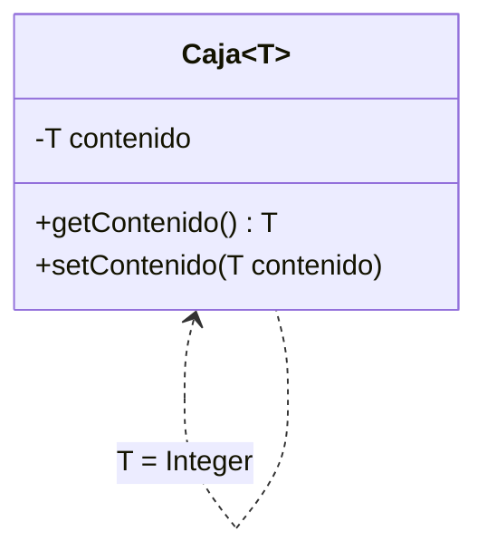

# 💡 Ejemplo 10 — Clases genéricas

## 🌍 Contexto

Una clase genérica declara un **parámetro de tipo** (`T`, por convención) en vez de fijar de antemano
el tipo de uno de sus atributos. La misma clase sirve entonces para guardar `String`, `Integer`, o
cualquier otro tipo de referencia, sin duplicar código ni usar *casts*.

**Qué busca demostrar este ejemplo**: una clase genérica de un solo parámetro de tipo, instanciada con
dos tipos distintos en el mismo programa, y el error real que produce pasarle un tipo incompatible.

## 🏥 Caso de estudio

**MediSalud** necesita una "caja" genérica que pueda guardar un solo dato de cualquier tipo: el nombre
de un paciente (`String`) en un caso, su edad (`Integer`) en otro, sin escribir una clase distinta para
cada tipo.

## 🌳 Árbol de archivos (como se vería en VS Code)

```text
Modulo08ArreglosListasGenericas
└── src
    ├── Caja.java   ← nuevo en este ejemplo
    └── Demo.java   ← nuevo en este ejemplo
```

## 💻 Archivo: Caja.java

```java
public class Caja<T> {
    private T contenido;

    public T getContenido() {
        return contenido;
    }

    public void setContenido(T contenido) {
        this.contenido = contenido;
    }
}
```

## 💻 Archivo: Demo.java

```java
public class Demo {
    public static void main(String[] args) {
        Caja<String> cajaTexto = new Caja<>();
        cajaTexto.setContenido("Ana Torres");
        System.out.println(cajaTexto.getContenido());

        Caja<Integer> cajaNumero = new Caja<>();
        cajaNumero.setContenido(34);
        System.out.println(cajaNumero.getContenido());
    }
}
```

## 🗺️ Diagrama



## 🧭 Explicación paso a paso

1. `class Caja<T>` declara la clase con un parámetro de tipo `T`, usado en vez de un tipo concreto para
   el atributo `contenido`.
2. `getContenido()` devuelve `T`; `setContenido(T contenido)` recibe `T`: ambos usan el mismo parámetro
   de tipo que la clase, sin *casts*.
3. `new Caja<String>()` instancia `Caja` con `T = String`; `cajaTexto.setContenido("Ana Torres")` y
   `cajaTexto.getContenido()` quedan fijados a `String` para esa instancia.
4. `new Caja<Integer>()` instancia la **misma clase** con `T = Integer`; conviven ambas instancias en el
   mismo programa, cada una con su propio tipo, sin necesidad de dos clases distintas.

## ✅ Resultado esperado

```text
Ana Torres
34
```

## 🧪 Casos de prueba

| Operación | Resultado |
|---|---|
| `cajaTexto.getContenido()` (tras `setContenido("Ana Torres")`) | `"Ana Torres"` |
| `cajaNumero.getContenido()` (tras `setContenido(34)`) | `34` |

## 🔍 Análisis: errores frecuentes

**Error — Pasar un tipo incompatible al método de una clase genérica (compilación).**

```java no-compila
public class Demo {
    public static void main(String[] args) {
        Caja<String> cajaTexto = new Caja<>();
        cajaTexto.setContenido(42);
    }
}
```

```text
✖ The method setContenido(String) in the type Caja<String> is not applicable for the arguments (int) Java(67108979) [Ln 4, Col 19]
```

## ❓ Preguntas de repaso

**1. [Selección]** **Pregunta:** ¿qué representa `T` en `class Caja<T>`?

- **A.** El nombre de un atributo.
- **B.** Un parámetro de tipo: se reemplaza por un tipo concreto al instanciar la clase.
- **C.** Una palabra reservada de Java.
- **D.** El tipo `T` de la librería estándar.

<details>
<summary>🔑 Ver respuesta</summary>

**Respuesta correcta: B.** `T` es un parámetro de tipo: al escribir `new Caja<String>()`, `T` se
reemplaza por `String` para esa instancia.

</details>

**2. [Selección múltiple]** **Pregunta:** ¿cuáles afirmaciones sobre `Caja<T>` son verdaderas?

- **A.** `Caja<String>` y `Caja<Integer>` pueden convivir en el mismo programa.
- **B.** `setContenido(T contenido)` acepta cualquier tipo, sin importar cómo se instanció la clase.
- **C.** Instanciar `Caja` con un tipo distinto no requiere escribir una clase nueva.
- **D.** `getContenido()` siempre devuelve `Object`.

<details>
<summary>🔑 Ver respuesta</summary>

**Respuestas correctas: A y C.** B es falsa: una vez instanciada con un tipo (`Caja<String>`),
`setContenido` solo acepta ese tipo. D es falsa: `getContenido()` devuelve `T`, que el compilador conoce
como el tipo concreto de esa instancia.

</details>

**3. [Abierta]** ¿Qué problema evita una clase genérica frente a escribir una clase distinta por cada
tipo que se necesita guardar?

<details>
<summary>🔑 Ver respuesta modelo</summary>

Evita duplicar la misma lógica (los mismos atributos y métodos) una vez por cada tipo concreto. Una sola
clase genérica, con un parámetro de tipo, sirve para cualquier tipo de referencia, y el compilador se
encarga de verificar que cada instancia use consistentemente su propio tipo.

</details>
