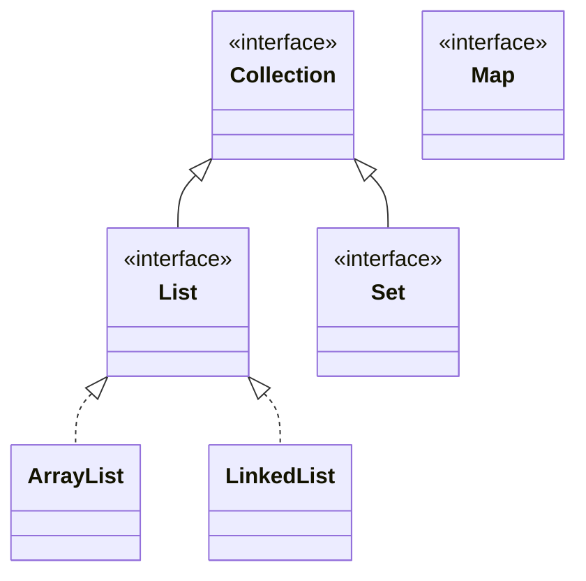

# 🟢 Básico 06 — Leer la jerarquía y .length frente a .size()

## 🧩 Problema

Repasa el diagrama de la jerarquía del framework de colecciones (Ejemplo 07).

## 🗺️ Diagrama



**Pregunta**: responde, sin ejecutar nada todavía:

1. ¿Qué interfaz implementan `ArrayList` y `LinkedList`?
2. ¿Qué otras dos familias existen además de `List`, según el diagrama?
3. ¿Compilan estas dos líneas?

```java
List<String> nombres = new ArrayList<>();
nombres.length();
```

```java
int[] edades = {34, 41, 29};
edades.size();
```

## 🧪 Casos de prueba

| Expresión | ¿Compila? |
|---|---|
| `nombres.length()` (sobre una `List`) | ? |
| `edades.size()` (sobre un arreglo) | ? |

## 📏 Criterios de evaluación de la solución

- Identifica `List` como la interfaz común de `ArrayList` y `LinkedList`.
- Identifica `Set` y `Map` como las otras dos familias.
- Predice correctamente que **ninguna** de las dos líneas compila.

## 🚧 Restricciones

- No hace falta escribir código: es un ejercicio de lectura y predicción.

## 📊 Dificultad

Básico

## 🎓 Resultados de aprendizaje

- **RA-7**: explicar qué es el framework de colecciones.
- **RA-8**: ubicar `List` en la jerarquía del framework de colecciones.
- **RA-16**: distinguir `.length` de `.size()`.
