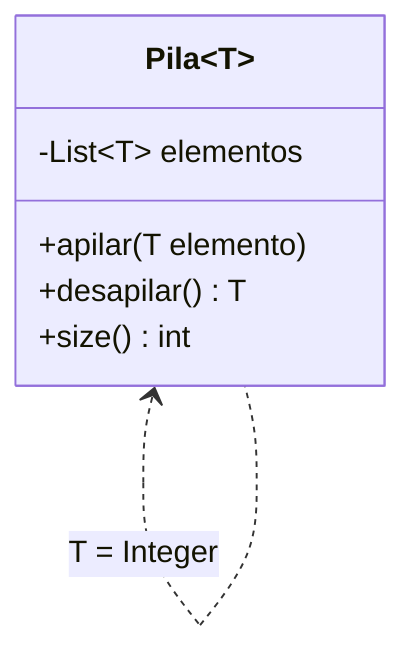

# 🏆 Desafío 01 — Diseñar una clase genérica nueva

## 🧩 Problema

**Biblioteca Universitaria** necesita una **pila** (estructura "último en entrar, primero en salir")
genérica, que pueda guardar títulos, cantidades, o cualquier otro tipo de dato, sin escribir una clase
distinta por cada uno.

Diseña una clase genérica completa (no usada en los ejemplos del módulo) que incluya:

1. `class Pila<T>` con un solo parámetro de tipo `T`, respaldada internamente por un arreglo o una
   `List` (a elección).
2. `apilar(T elemento)`, que agrega un elemento al **tope** de la pila.
3. `desapilar()`, que quita y devuelve el elemento del tope (el último agregado).
4. `size()`, que devuelve la cantidad actual de elementos.
5. Una prueba con al menos dos tipos concretos distintos (por ejemplo, `Pila<String>` y
   `Pila<Integer>`) en el mismo `main`.

## 🗺️ Diagrama



## ✅ Salida esperada al ejecutar

```text
El principito
1
30
2
```

(Con una `Pila<String>` a la que se le apilan `"Rayuela"` y `"El principito"`, y una `Pila<Integer>` a
la que se le apilan `10`, `20` y `30`, desapilando una vez de cada una.)

## 📏 Criterios de evaluación de la solución

- `Pila<T>` tiene un solo parámetro de tipo `T`.
- `desapilar()` siempre devuelve el **último** elemento agregado (comportamiento de pila, no de cola).
- `Pila<String>` y `Pila<Integer>` conviven en el mismo programa, sin *casts*.
- `size()` refleja correctamente la cantidad de elementos después de cada `apilar`/`desapilar`.

## 🚧 Restricciones

- No reutilices `Caja` ni `Registro` de los ejemplos/ejercicios anteriores: esta clase es nueva.
- No uses `Set`, `Map`, `Deque` ni ninguna clase del framework de colecciones distinta de `ArrayList` o
  `LinkedList` para la implementación interna.

## 📊 Dificultad

Desafío

## 🎓 Resultados de aprendizaje

- **RA-13**: explicar qué problema resuelve una clase genérica.
- **RA-14**: declarar una clase genérica de un parámetro de tipo e instanciarla con distintos tipos.
