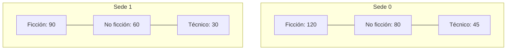

# 🟡 Intermedio 02 — Declarar y recorrer una matriz

## 🧩 Problema

**Biblioteca Universitaria** tiene 2 sedes, cada una con ejemplares de 3 categorías (Ficción, No
ficción, Técnico).

## 🗺️ Diagrama

**Tarea**: declara `int[][] ejemplaresPorSedeYCategoria` con los valores del diagrama, y calcula el
total de ejemplares de ambas sedes con bucles anidados.

## 🧪 Casos de prueba

| Expresión | Resultado esperado |
|---|---|
| Total de ejemplares | `425` |

## 📏 Criterios de evaluación de la solución

- La matriz tiene 2 filas (sedes) y 3 columnas (categorías) cada una, con los valores del diagrama.
- El total se calcula recorriendo la matriz con dos bucles anidados.
- El programa imprime `425`.

## 🚧 Restricciones

- No sumes los valores a mano: el programa debe calcular el total recorriendo la matriz.

## 📊 Dificultad

Intermedio

## 🎓 Resultados de aprendizaje

- **RA-6**: declarar y recorrer un arreglo multidimensional.
