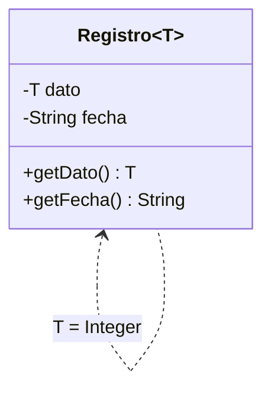

# 🟡 Intermedio 05 — Declarar una clase genérica

## 🧩 Problema

**Biblioteca Universitaria** quiere guardar un dato junto con la fecha en la que se registró, sin
importar de qué tipo sea ese dato (un título, una cantidad de ejemplares, etc.).

## 🗺️ Diagrama

**Tarea**: declara `class Registro<T>` con los atributos `dato` (de tipo `T`) y `fecha` (`String`), un
constructor que reciba ambos, y `getDato()`/`getFecha()`. Pruébala con un `Registro<String>` (un
título) y un `Registro<Integer>` (una cantidad de ejemplares) en el mismo `main`.

## 🧪 Casos de prueba

| Expresión | Resultado esperado |
|---|---|
| `registroTitulo.getDato()` | `"Rayuela"` |
| `registroTitulo.getFecha()` | `"2026-03-01"` |
| `registroEjemplares.getDato()` | `5` |
| `registroEjemplares.getFecha()` | `"2026-03-02"` |

## 📏 Criterios de evaluación de la solución

- `Registro<T>` tiene un solo parámetro de tipo `T`, usado para el atributo `dato`.
- `fecha` es siempre `String`, sin importar el tipo con el que se instancie `Registro`.
- `Registro<String>` y `Registro<Integer>` conviven en el mismo programa, sin *casts*.

## 🚧 Restricciones

- No declares una clase distinta por cada tipo de dato.

## 📊 Dificultad

Intermedio

## 🎓 Resultados de aprendizaje

- **RA-14**: declarar una clase genérica de un parámetro de tipo e instanciarla con distintos tipos.
