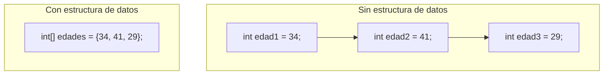
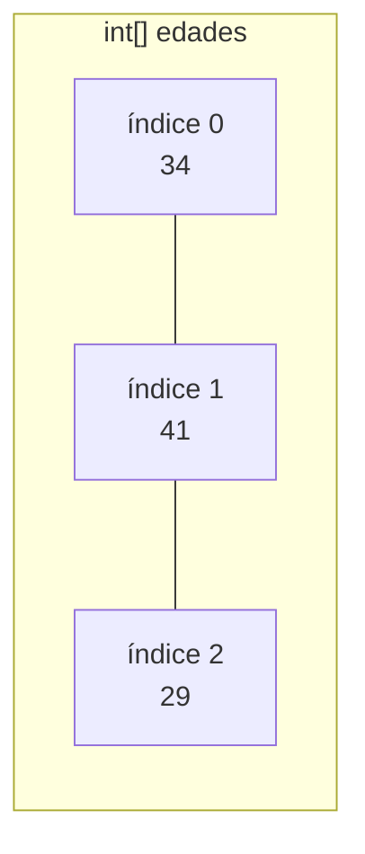
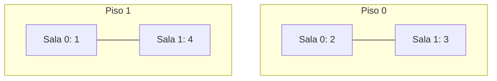
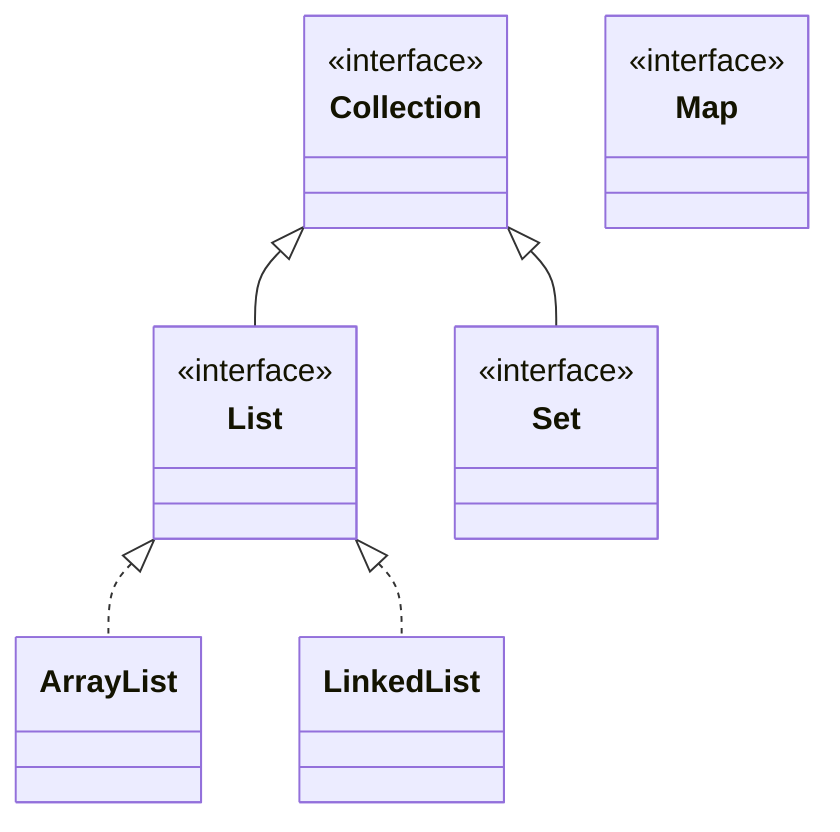
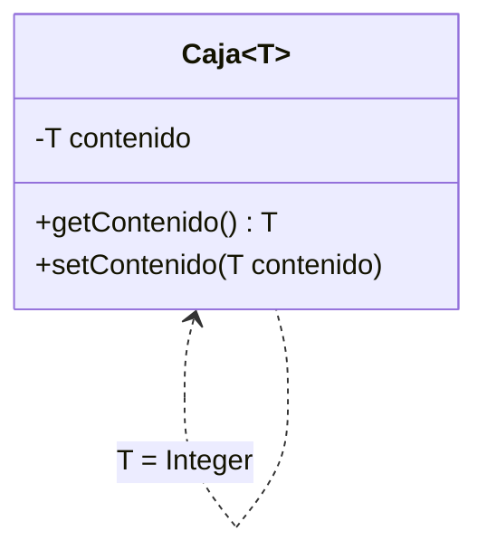

# 📘 Módulo 8 — Arreglos, Listas y Clases Genéricas

Curso de Java

---

## 🎯 Objetivos del módulo

- Declarar y recorrer arreglos, incluidos los multidimensionales.
- Ubicar `List`, `ArrayList` y `LinkedList` en la jerarquía de colecciones, y usarlas.
- Migrar de un arreglo a una `ArrayList` cuando el tamaño deja de ser fijo.
- Declarar una clase genérica de un parámetro de tipo.

---

## 🗺️ Ruta de la sesión

1. Estructuras de datos.
2. Arreglos: declaración, acceso, tamaño, iteración, multidimensionales.
3. Colecciones en Java: la jerarquía.
4. `List`: `ArrayList` y `LinkedList`.
5. Clases genéricas.

---

## 🧠 ¿Por qué una estructura de datos?

Cuando varios valores relacionados son del mismo tipo, declarar una variable distinta por cada uno
obliga a repetir código y no escala si la cantidad de datos crece.

---

## 🧠 Variables sueltas vs. estructura de datos



---

## 🧠 Lo que viene

Dos formas de agrupar datos relacionados: el **arreglo** (tamaño fijo) y, más adelante, la **`List`**
(tamaño dinámico).

---

## 🧠 Declarar un arreglo con un literal

```java
int[] edades = {34, 41, 29};
```

El literal entre llaves declara el arreglo y le asigna todos sus valores en la misma línea.

---

## 🧠 Diagrama de memoria de un arreglo



Cada posición tiene un índice fijo, empezando en `0`.

---

## 🧠 Declarar un arreglo con new

```java
int[] otrasEdades = new int[3];
otrasEdades[0] = 34;
otrasEdades[1] = 41;
otrasEdades[2] = 29;
```

`new int[3]` reserva espacio para 3 elementos, inicializados en `0`, sin asignarles todavía un valor
útil.

---

## 🧠 ¿Cuándo usar cada forma?

- Literal: cuando los valores se conocen de antemano.
- `new` + asignación por índice: cuando los valores se conocen después (por ejemplo, dentro de un
  bucle).

---

## 🧠 Acceso a elementos por índice

```java
System.out.println(edades[0]); // 34
System.out.println(edades[2]); // 29
```

El primer elemento está en el índice `0`; el último, en `.length - 1`.

---

## 🧠 Error: índice fuera de rango

```java
System.out.println(edades[5]);
```

```text
Exception in thread "main" java.lang.ArrayIndexOutOfBoundsException: Index 5 out of bounds for length 3
```

---

## 🧠 El panel no detecta este error

Ni el compilador ni el panel Problems marcan un índice fuera de rango, aunque sea un literal conocido en
tiempo de compilación: el error solo aparece **al ejecutar**.

---

## 🧠 Obtener el tamaño con .length

```java
System.out.println(edades.length); // 3
System.out.println(edades[edades.length - 1]); // 29
```

`.length` es un **atributo** (sin paréntesis), fijo desde que el arreglo se crea.

---

## 🧠 .length no es .length()

`.length` (arreglo, atributo) no es lo mismo que `.length()` (`String`, método) ni que `.size()`
(`List`, método): tres formas distintas de "cantidad", en tres tipos distintos.

---

## 🧠 Iteración con for indexado

```java
for (int i = 0; i < edades.length; i++) {
    System.out.println(edades[i]);
}
```

Usa `.length` como límite, nunca `<=`.

---

## 🧠 Iteración con for-each

```java
for (int edad : edades) {
    System.out.println(edad);
}
```

Recorre los elementos directamente, sin manejar un índice; visita los mismos elementos, en el mismo
orden, que el `for` indexado.

---

## 🧠 Arreglos multidimensionales



Un arreglo multidimensional es un arreglo cuyos elementos son, a su vez, arreglos.

---

## 🧠 Acceso en una matriz

```java
int[][] camasOcupadas = {{2, 3}, {1, 4}, {0, 2}};
System.out.println(camasOcupadas[0][1]); // 3
```

`matriz[fila][columna]`: el primer índice es la fila, el segundo la columna.

---

## 🧠 Recorrer una matriz completa

```java
for (int fila = 0; fila < matriz.length; fila++) {
    for (int columna = 0; columna < matriz[fila].length; columna++) {
        // usar matriz[fila][columna]
    }
}
```

Dos bucles anidados: uno para las filas, otro para las columnas de cada fila.

---

## 🧠 El arreglo es de tamaño fijo

Desde que se crea, un arreglo nunca cambia de tamaño: ni `.length` ni una asignación pueden agrandarlo.
Cuando la cantidad de elementos cambia con el tiempo, la alternativa es una `List`.

---

## 🧠 ¿Por qué el framework de colecciones?

Un arreglo tiene tamaño fijo desde su creación. El framework de colecciones (`java.util`) ofrece
estructuras de tamaño **dinámico**, alternativa cuando la cantidad de elementos cambia en tiempo de
ejecución.

---

## 🧠 La jerarquía de colecciones



`Map` no extiende `Collection` en Java; se muestra aquí solo para ubicar las tres grandes familias.

---

## 🧠 List es una interfaz

`List` no se puede instanciar directamente (`new List<>()` no compila); siempre se instancia una
implementación concreta: `ArrayList` o `LinkedList`.

---

## 🧠 Dos implementaciones, la misma interfaz

```java
List<String> a = new ArrayList<>();
List<String> b = new LinkedList<>();
```

Ambas ofrecen las mismas operaciones básicas; lo que cambia es qué tan eficiente es cada una según su
estructura interna.

---

## 🧠 Elegir entre arreglo y List

- Cantidad de elementos **fija y conocida**: un arreglo alcanza.
- Cantidad de elementos que **cambia en tiempo de ejecución**: una `List`.

---

## 🧠 Declarar un ArrayList

```java
List<String> titulos = new ArrayList<>();
titulos.add("Cien años de soledad");
titulos.add("El principito");
```

`ArrayList` está respaldada por un arreglo interno que crece automáticamente.

---

## 🧠 Operaciones básicas de List

```java
titulos.get(0);      // lee por índice
titulos.remove(0);   // elimina por índice
titulos.size();      // cantidad actual (método, con paréntesis)
```

---

## 🧠 Error: índice fuera de rango en una List

```java
System.out.println(titulos.get(5));
```

```text
Exception in thread "main" java.lang.IndexOutOfBoundsException: Index 5 out of bounds for length 2
```

Tampoco lo detecta el panel: es un error de ejecución, igual que en un arreglo.

---

## 🧠 Error: .length() sobre una List

```java
titulos.length();
```

| Fuente | Mensaje real |
|---|---|
| `javac` | `cannot find symbol; symbol: method length()` |
| Panel Problems | `The method length() is undefined for the type List<String>` |

---

## 🧠 Error: List\<int\>

```java
List<int> numeros;
```

| Fuente | Mensaje real |
|---|---|
| `javac` | `unexpected type; required: reference; found: int` |
| Panel Problems | `insert "Dimensions" to complete ReferenceType` |

Los argumentos de tipo genérico deben ser tipos de **referencia** (`Integer`, no `int`).

---

## 🧠 Error: .size() sobre un arreglo

```java
edades.size();
```

`javac`: `cannot find symbol; symbol: method size()`. `.size()` es de `List`; los arreglos usan
`.length`.

---

## 🧠 Declarar una LinkedList

```java
LinkedList<String> titulos = new LinkedList<>();
titulos.addFirst("Rayuela");
```

`LinkedList` está respaldada por nodos enlazados entre sí: `addFirst`/`removeFirst` insertan o eliminan
al principio sin desplazar el resto.

---

## 🧠 addFirst y removeFirst

```java
titulos.addFirst("Rayuela");   // al principio
titulos.removeFirst();         // quita el primero
```

`ArrayList` no ofrece estas operaciones de forma directamente eficiente; `LinkedList` sí.

---

## 🧠 Arreglo, ArrayList y LinkedList

| | Arreglo | `ArrayList` | `LinkedList` |
|---|---|---|---|
| Tamaño | Fijo | Dinámico | Dinámico |
| Acceso por índice | Eficiente | Eficiente | Menos eficiente |
| Insertar/eliminar en los extremos | No aplica | Menos eficiente | Eficiente |
| Tipos permitidos | Primitivos y de referencia | Solo de referencia | Solo de referencia |

---

## 🧠 Migrar un arreglo a ArrayList

Cuando un arreglo se queda sin espacio (`equipo[3] = ...` sobre un `Empleado[3]`), la salida no es
agrandar el arreglo: es migrar a `List<Empleado>` y usar `add(...)`.

---

## 🧠 Polimorfismo a través de una colección

```java
for (Empleado empleado : equipo) {
    total += empleado.calcularSueldo();
}
```

El mismo bucle `for-each` funciona igual sobre un arreglo `Empleado[]` o sobre un `List<Empleado>`: cada
elemento ejecuta su propia versión de `calcularSueldo()`.

---

## 🧠 Resumen de List

`List` es una interfaz con dos implementaciones (`ArrayList`, `LinkedList`), con las mismas operaciones
básicas (`add`, `get`, `remove`, `size`) y las mismas dos categorías de error que ya viste con los
arreglos: un índice fuera de rango falla al **ejecutar**; un método mal invocado falla al **compilar**.

---

## 🧠 ¿Qué es una clase genérica?

Una clase que declara un **parámetro de tipo** (`T`, por convención) en vez de fijar de antemano el
tipo de uno de sus atributos: la misma clase sirve para cualquier tipo de referencia.

---

## 🧠 Caja\<T\> con dos tipos



---

## 🧠 Error: tipo incompatible en una clase genérica

```java
Caja<String> cajaTexto = new Caja<>();
cajaTexto.setContenido(42);
```

Panel Problems: `The method setContenido(String) in the type Caja<String> is not applicable for the
arguments (int)`.

---

## 🧠 Errores frecuentes: compilación

| Error | Se detecta con |
|---|---|
| `List<int>` (primitivo como tipo genérico) | `javac` y el panel (redacción distinta entre sí) |
| `.length()` sobre una `List` | `javac` y el panel |
| `.size()` sobre un arreglo | `javac` |
| Tipo incompatible en una clase genérica | `javac` y el panel |

---

## 🧠 Errores frecuentes: ejecución

| Error | Se detecta con |
|---|---|
| Índice de arreglo fuera de rango | Solo al ejecutar (`ArrayIndexOutOfBoundsException`); el panel no lo marca |
| Índice de `List` fuera de rango | Solo al ejecutar (`IndexOutOfBoundsException`); el panel no lo marca |

---

## 📌 Resumen

- Un arreglo tiene tamaño fijo; una `List` (`ArrayList` o `LinkedList`) tiene tamaño dinámico.
- Un índice fuera de rango, en un arreglo o en una `List`, nunca lo detecta el panel: falla al ejecutar.
- `ArrayList` es eficiente por índice; `LinkedList` es eficiente al insertar/eliminar en los extremos.
- El taller migra una jerarquía de empleados de un arreglo `Empleado[]` a un `ArrayList<Empleado>`.
- Una clase genérica (`Caja<T>`) evita duplicar la misma clase por cada tipo que necesita guardar.

---

## 📝 Evaluación

Quiz de 18 preguntas (formato entrevista técnica) y los ejercicios del módulo.
