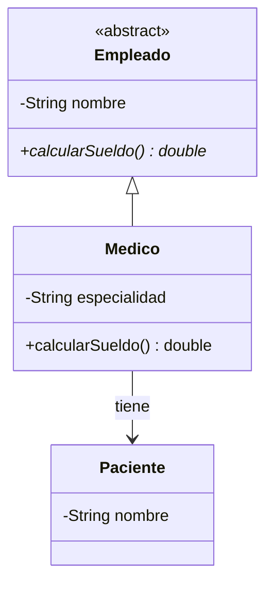

# 💡 Ejemplo 01 — Relaciones entre clases

## 🌍 Contexto

Desde el Módulo 7 conocés la herencia: una subclase **es un** tipo más específico de su superclase
(`Medico extends Empleado`). Pero no toda relación entre dos clases es herencia. Muchas veces, una clase
simplemente **tiene un** objeto de otra clase como parte de sus datos — sin heredar nada de ella. Por
ejemplo, un `Medico` no "es un" `Paciente`, pero sí puede "tener" una lista de pacientes asignados.

A partir de este módulo vas a trabajar con esa segunda familia de relaciones: asociación, agregación y
composición. Las tres son formas de "tiene un", y se diferencian por **quién crea** al objeto
relacionado y **si puede existir independientemente** de la clase que lo contiene (vas a ver el
criterio completo en la Explicación conceptual).

**Qué busca demostrar este ejemplo**: que "es un" (herencia) y "tiene un" (asociación) son relaciones
distintas entre las mismas clases pueden convivir, y que reconocerlas es el primer paso antes de
programar ninguna.

## 🗺️ Diagrama

`Empleado <|-- Medico` es herencia ("es un", vista en el Módulo 7): `Medico` extiende de `Empleado`.
`Medico --> Paciente` es asociación ("tiene un", el tema de este módulo): `Medico` guarda una referencia
a `Paciente`, sin heredar nada de él.

## 🧭 Explicación paso a paso

1. La jerarquía `Empleado`/`Medico` (Módulo 7) es un ejemplo ya conocido de "es un": `Medico` hereda los
   atributos y métodos de `Empleado`, y puede usarse en cualquier lugar donde se espere un `Empleado`.
2. La relación nueva de este módulo, `Medico --> Paciente`, es "tiene un": `Medico` guarda una
   referencia a `Paciente` como parte de sus propios datos, pero un `Medico` **no es** un `Paciente` ni
   viceversa.
3. La pregunta clave para distinguirlas: ¿la clase A **es un caso particular** de la clase B (herencia)
   o la clase A **tiene, usa o conoce** a un objeto de la clase B (asociación/agregación/composición)?
4. Las tres formas de "tiene un" (asociación, agregación, composición) se diferencian entre sí por quién
   crea al objeto relacionado y si puede existir independientemente — eso se desarrolla en los Ejemplos
   03 a 06.

## ✅ Resultado esperado

Dado el diagrama de arriba, el estudiante puede explicar que `Empleado <|-- Medico` es herencia (Medico
es un Empleado) y que `Medico --> Paciente` es asociación (Medico tiene un Paciente), sin confundir
ambas relaciones ni el sentido de la flecha.

## 🔍 Análisis: errores frecuentes

- Confundir "tiene un" con "es un": decir que "un `Medico` es un `Paciente`" en vez de "un `Medico`
  tiene pacientes asignados". La herencia y la asociación se escriben distinto en código (`extends`
  frente a un atributo) y se dibujan distinto en el diagrama (`<|--` frente a `-->`).

## ❓ Preguntas de repaso

**1. [Selección]** ¿Cuál de estas frases describe una relación "tiene un"?

- **A.** "Un `Enfermero` es un `Empleado`."
- **B.** "Un `Medico` tiene una lista de pacientes."
- **C.** "Un `Medico` es un tipo de `Persona`."
- **D.** "`Medico` extiende de `Empleado`."

🔑 Ver respuesta

**Respuesta correcta: B.** Las demás describen herencia ("es un"); B describe asociación ("tiene un").

**2. [Selección múltiple]** ¿Cuáles de estas relaciones son ejemplos de "tiene un"?

- **A.** Asociación.
- **B.** Herencia.
- **C.** Agregación.
- **D.** Composición.

🔑 Ver respuesta

**Respuestas correctas: A, C y D.** Asociación, agregación y composición son las tres formas de "tiene
un"; la herencia (B) es "es un".

**3. [Abierta]** ¿Por qué un `Medico` que hereda de `Empleado` y, además, tiene una lista de `Paciente`
no es una contradicción?

🔑 Ver respuesta

**Respuesta esperada:** porque "es un" y "tiene un" son relaciones independientes entre sí: una clase
puede heredar de otra (es un) y, al mismo tiempo, tener atributos que referencian a clases distintas
(tiene un). No son excluyentes.

