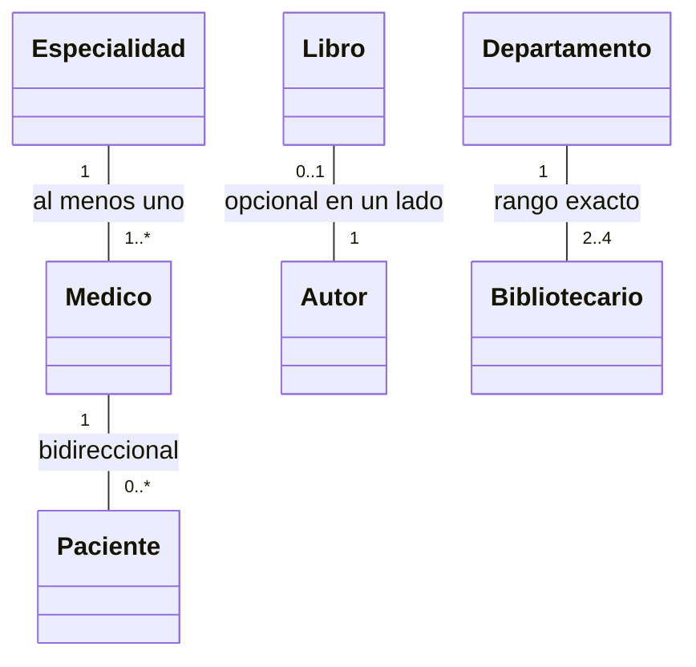

# 💡 Ejemplo 02 — Multiplicidad

## 🌍 Contexto

Antes de escribir una sola línea de código de asociación, agregación o composición, conviene poder leer
y dibujar la **multiplicidad**: cuántos objetos participan en cada extremo de una relación. Este
ejemplo no tiene código Java propio — es la base conceptual que vas a usar en los diagramas de los
Ejemplos 03 a 06.

**Qué busca demostrar este ejemplo**: cómo leer las cinco notaciones de multiplicidad más comunes en un
diagrama de clases UML.

## 🗺️ Diagrama

## 🧭 Explicación paso a paso

1. `Medico "1" -- "0..*" Paciente`: cada `Paciente` tiene exactamente **un** `Medico` (multiplicidad `1`
   del lado de `Medico`); cada `Medico` puede tener **cero o más** `Paciente` (multiplicidad `0..*` del
   lado de `Paciente`).
2. `Libro "0..1" -- "1" Autor`: cada `Autor` tiene siempre **un** `Libro` en este ejemplo hipotético
   (multiplicidad `1`); un `Libro` puede tener **cero o un** `Autor` (multiplicidad `0..1`, opcional).
3. `Especialidad "1" -- "1..*" Medico`: cada `Especialidad` tiene **uno o más** `Medico` asignados
   (multiplicidad `1..*`, nunca cero); cada `Medico` tiene exactamente **una** `Especialidad`.
4. `Departamento "1" -- "2..4" Bibliotecario`: cada `Departamento` tiene **entre 2 y 4**
   `Bibliotecario` (rango exacto `2..4`).
5. La multiplicidad se lee del lado **donde está escrita**, y describe cuántos objetos de esa clase
   participan del otro lado de la relación.

## ✅ Resultado esperado

Dado cualquiera de los cuatro diagramas de arriba, el estudiante puede decir en palabras, para cada
extremo, cuántos objetos participan (por ejemplo: "cada `Paciente` tiene exactamente un `Medico`; cada
`Medico` puede tener cero o más `Paciente`").

## 🔍 Análisis: errores frecuentes

- Leer la multiplicidad del lado equivocado: `Medico "1" -- "0..*" Paciente` NO significa "un `Medico`
  tiene un `Paciente`" — el `"1"` describe cuántos `Medico` tiene un `Paciente` (uno), y el `"0..*"`
  describe cuántos `Paciente` tiene un `Medico` (cero o más).
- Confundir `0..*` (cero o más, incluido ninguno) con `1..*` (uno o más, nunca cero): la diferencia
  importa para decidir si una colección puede empezar vacía o no.

## ❓ Preguntas de repaso

**1. [Selección]** En `Especialidad "1" -- "1..*" Medico`, ¿cuántos `Medico` puede tener, como mínimo,
una `Especialidad`?

- **A.** Cero.
- **B.** Uno.
- **C.** Dos.
- **D.** No tiene mínimo.

🔑 Ver respuesta

**Respuesta correcta: B.** `1..*` significa "uno o más": el mínimo es uno, nunca cero.

**2. [Selección múltiple]** ¿Cuáles de estas notaciones permiten que ese extremo tenga **cero**
participantes?

- **A.** `1`
- **B.** `0..1`
- **C.** `0..*`
- **D.** `1..*`

🔑 Ver respuesta

**Respuestas correctas: B y C.** Ambas empiezan en `0`. `1` y `1..*` exigen al menos un participante.

**3. [Abierta]** ¿Qué significa una multiplicidad de rango exacto, como `2..4`?

🔑 Ver respuesta

**Respuesta esperada:** que ese extremo debe tener entre 2 y 4 participantes, ni menos ni más — a
diferencia de `0..*` o `1..*`, que no tienen un límite superior fijo.

