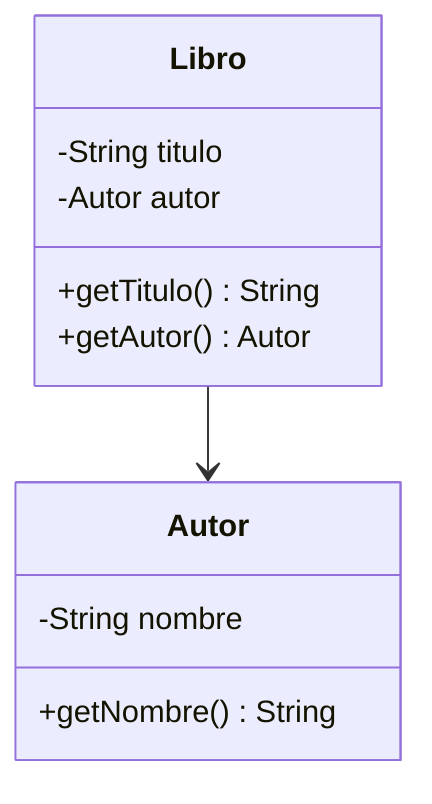

# 💡 Ejemplo 03 — Asociación unidireccional

## 🌍 Contexto

La forma más simple de "tiene un" es la **asociación unidireccional**: una clase guarda un atributo del
tipo de otra clase, pero la navegación solo funciona en un sentido. Un `Libro` conoce a su `Autor`, pero
el `Autor` no tiene ninguna forma de saber qué libros escribió — al menos no en este módulo.

**Qué busca demostrar este ejemplo**: cómo declarar una asociación unidireccional con un atributo de
tipo referencia recibido por constructor.

## 📚 Caso de estudio

Biblioteca Universitaria: un `Libro` de la colección tiene un `Autor`.

## 🗺️ Diagrama



## 🌳 Árbol de archivos (como se vería en VS Code)

```text
Modulo09RelacionesEntreClases/
└── src/
    └── com/
        └── biblioteca/
            ├── Autor.java
            ├── Libro.java
            └── Demo.java
```

## 💻 Archivo: Autor.java

```java
package com.biblioteca;

public class Autor {
    private String nombre;

    public Autor(String nombre) {
        this.nombre = nombre;
    }

    public String getNombre() {
        return nombre;
    }
}
```

## 💻 Archivo: Libro.java

```java
package com.biblioteca;

public class Libro {
    private String titulo;
    private Autor autor;

    public Libro(String titulo, Autor autor) {
        this.titulo = titulo;
        this.autor = autor;
    }

    public String getTitulo() {
        return titulo;
    }

    public Autor getAutor() {
        return autor;
    }
}
```

## 💻 Archivo: Demo.java

```java
package com.biblioteca;

public class Demo {
    public static void main(String[] args) {
        // Datos de entrada
        Autor autor = new Autor("Gabriel Garcia Marquez");
        Libro libro = new Libro("Cien anios de soledad", autor);

        System.out.println(libro.getTitulo() + " - " + libro.getAutor().getNombre());
    }
}
```

## 🧭 Explicación paso a paso

1. `Autor` no tiene ningún atributo ni método que referencie a `Libro`: no puede navegarse "hacia
   atrás".
2. `Libro` recibe su `Autor` ya creado, por constructor, y lo guarda en un atributo `autor`.
3. `libro.getAutor()` navega de `Libro` hacia `Autor`; no existe el camino inverso (`autor.getLibros()`
   no existe).

## ✅ Resultado esperado

```text
Cien anios de soledad - Gabriel Garcia Marquez
```

## 🧪 Casos de prueba

| Entrada | Operación | Salida esperada |
|---|---|---|
| `Autor("Gabriel Garcia Marquez")`, `Libro("Cien anios de soledad", autor)` | `libro.getAutor().getNombre()` | `Gabriel Garcia Marquez` |

## 🔍 Análisis: errores frecuentes

- Esperar que `autor.getLibros()` exista: en una asociación unidireccional, la clase referenciada
  (`Autor`) no tiene ningún método para navegar de vuelta. Si se necesitara esa navegación, habría que
  convertirla en una asociación **bidireccional** (Ejemplo 04).

## ❓ Preguntas de repaso

**1. [Selección]** ¿Qué método permite navegar de un `Libro` a su `Autor`?

- **A.** `autor.getLibro()`
- **B.** `libro.getAutor()`
- **C.** `Libro.autor()`
- **D.** No existe ningún método para eso.

<details>
<summary>🔑 Ver respuesta</summary>

**Respuesta correcta: B.** `libro.getAutor()` navega en el único sentido que existe: de `Libro` hacia
`Autor`.

</details>

**2. [Selección múltiple]** ¿Cuáles afirmaciones son verdaderas sobre la asociación del Ejemplo 03?

- **A.** `Libro` conoce a su `Autor`.
- **B.** `Autor` conoce a sus `Libro`.
- **C.** Es una asociación unidireccional.
- **D.** `Libro` crea internamente a su `Autor`.

<details>
<summary>🔑 Ver respuesta</summary>

**Respuestas correctas: A y C.** B es falsa (no hay camino de vuelta); D es falsa (`Autor` se recibe ya
creado por constructor, no se crea dentro de `Libro`).

</details>

**3. [Abierta]** Si más adelante quisieras que un `Autor` pudiera listar todos sus libros, ¿qué tipo de
relación necesitarías en vez de esta?

<details>
<summary>🔑 Ver respuesta</summary>

**Respuesta esperada:** una asociación **bidireccional**, donde `Autor` también guarde una referencia
(por ejemplo, una lista) a sus `Libro`, con un método que mantenga ambos extremos consistentes (tema del
Ejemplo 04).

</details>
