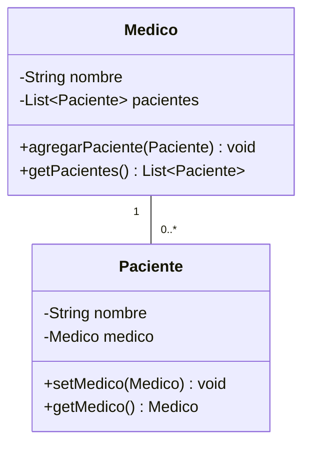

# 💡 Ejemplo 04 — Asociación bidireccional

## 🌍 Contexto

Una asociación **bidireccional** va en los dos sentidos: `Medico` conoce a sus `Paciente`, y cada
`Paciente` conoce a su `Medico`. Crear ese vínculo con un único método que actualice ambos extremos a la
vez evita el error más frecuente de esta relación: que un extremo quede desactualizado respecto del
otro.

**Qué busca demostrar este ejemplo**: cómo declarar una asociación bidireccional consistente, y qué pasa
—en una ejecución real— cuando se actualiza solo un extremo.

## 🏥 Caso de estudio

MediSalud: cada `Medico` tiene una lista de `Paciente` asignados, y cada `Paciente` conoce a su
`Medico` tratante.

## 🗺️ Diagrama



## 🌳 Árbol de archivos (como se vería en VS Code)

```text
Modulo09RelacionesEntreClases/
└── src/
    └── com/
        └── medisalud/
            ├── Medico.java
            ├── Paciente.java
            └── Demo.java
```

## 💻 Archivo: Medico.java

```java
package com.medisalud;

import java.util.ArrayList;
import java.util.List;

public class Medico {
    private String nombre;
    private List<Paciente> pacientes = new ArrayList<>();

    public Medico(String nombre) {
        this.nombre = nombre;
    }

    public void agregarPaciente(Paciente paciente) {
        pacientes.add(paciente);
        paciente.setMedico(this);
    }

    public String getNombre() {
        return nombre;
    }

    public List<Paciente> getPacientes() {
        return pacientes;
    }
}
```

## 💻 Archivo: Paciente.java

```java
package com.medisalud;

public class Paciente {
    private String nombre;
    private Medico medico;

    public Paciente(String nombre) {
        this.nombre = nombre;
    }

    public void setMedico(Medico medico) {
        this.medico = medico;
    }

    public Medico getMedico() {
        return medico;
    }

    public String getNombre() {
        return nombre;
    }
}
```

## 💻 Archivo: Demo.java

```java
package com.medisalud;

public class Demo {
    public static void main(String[] args) {
        // Datos de entrada
        Medico medico = new Medico("Ana Torres");
        Paciente paciente1 = new Paciente("Marta Diaz");
        Paciente paciente2 = new Paciente("Jorge Paz");

        medico.agregarPaciente(paciente1);
        medico.agregarPaciente(paciente2);

        System.out.println(medico.getNombre() + " tiene " + medico.getPacientes().size() + " pacientes");
        for (Paciente paciente : medico.getPacientes()) {
            System.out.println(paciente.getNombre() + " -> medico: " + paciente.getMedico().getNombre());
        }
    }
}
```

## 🧭 Explicación paso a paso

1. `Medico.agregarPaciente(Paciente)` hace dos cosas en el mismo método: agrega el `Paciente` a su
   lista **y** le asigna `this` como su `medico`.
2. Como ambos extremos se actualizan juntos, `medico.getPacientes()` y `paciente.getMedico()` siempre
   quedan consistentes entre sí.
3. `Paciente.setMedico(Medico)` existe (para que `agregarPaciente` pueda usarlo), pero **no** es la
   forma recomendada de crear el vínculo por sí sola — el bloque siguiente muestra por qué.

## ✅ Resultado esperado

```text
Ana Torres tiene 2 pacientes
Marta Diaz -> medico: Ana Torres
Jorge Paz -> medico: Ana Torres
```

## 🧪 Casos de prueba

| Entrada | Operación | Salida esperada |
|---|---|---|
| `Medico("Ana Torres")`, dos `Paciente` agregados con `agregarPaciente` | `medico.getPacientes().size()` | `2` |
| Mismo caso | `paciente.getMedico().getNombre()` de cada paciente | `Ana Torres` |

## 🔍 Análisis: errores frecuentes

Si el vínculo se crea llamando **solo** a `paciente.setMedico(medico)`, sin pasar por
`medico.agregarPaciente(paciente)`, el programa compila y se ejecuta sin ninguna excepción — pero el
resultado real es incompleto:

```java error-logico
package com.medisalud;

import java.util.ArrayList;
import java.util.List;

class Medico {
    private String nombre;
    private List<Paciente> pacientes = new ArrayList<>();

    public Medico(String nombre) {
        this.nombre = nombre;
    }

    public void agregarPaciente(Paciente paciente) {
        pacientes.add(paciente);
        paciente.setMedico(this);
    }

    public String getNombre() {
        return nombre;
    }

    public List<Paciente> getPacientes() {
        return pacientes;
    }
}

class Paciente {
    private String nombre;
    private Medico medico;

    public Paciente(String nombre) {
        this.nombre = nombre;
    }

    public void setMedico(Medico medico) {
        this.medico = medico;
    }

    public Medico getMedico() {
        return medico;
    }

    public String getNombre() {
        return nombre;
    }
}

public class Demo {
    public static void main(String[] args) {
        // Datos de entrada
        Medico medico = new Medico("Ana Torres");
        Paciente paciente = new Paciente("Marta Diaz");

        // Se actualiza solo un extremo: nunca se llama a medico.agregarPaciente(paciente)
        paciente.setMedico(medico);

        System.out.println(medico.getNombre() + " tiene " + medico.getPacientes().size() + " pacientes");
        System.out.println(paciente.getNombre() + " -> medico: " + paciente.getMedico().getNombre());
    }
}
```

```text
Ana Torres tiene 0 pacientes
Marta Diaz -> medico: Ana Torres
```

`medico.getPacientes().size()` da `0`, aunque `paciente.getMedico()` sí devuelva el `medico` correcto:
el extremo `pacientes` de `Medico` nunca se actualizó. Ni el compilador ni el panel Problems de VS Code
marcan este código como un error, porque no lo es desde el punto de vista de la sintaxis — es un **error
lógico**: el programa hace exactamente lo que el código dice, pero no lo que el diseño necesitaba.

## ❓ Preguntas de repaso

**1. [Selección]** ¿Qué hace `medico.agregarPaciente(paciente)` que `paciente.setMedico(medico)` solo,
no hace?

- **A.** Lanza una excepción si el paciente ya tiene médico.
- **B.** Actualiza los dos extremos del vínculo a la vez.
- **C.** Valida que el nombre del paciente no esté vacío.
- **D.** Nada distinto: son equivalentes.

<details>
<summary>🔑 Ver respuesta</summary>

**Respuesta correcta: B.** `agregarPaciente` agrega el paciente a la lista del médico **y** le asigna
el médico al paciente, en el mismo método.

</details>

**2. [Selección múltiple]** Si se crea el vínculo llamando solo a `paciente.setMedico(medico)`, ¿cuáles
afirmaciones son verdaderas?

- **A.** El programa no compila.
- **B.** `paciente.getMedico()` devuelve el `medico` correcto.
- **C.** `medico.getPacientes()` incluye a ese `paciente`.
- **D.** El panel Problems marca ese código como un error.

<details>
<summary>🔑 Ver respuesta</summary>

**Respuestas correctas: B.** A, C y D son falsas: el programa compila y se ejecuta sin fallar (A falsa),
`medico.getPacientes()` queda vacío porque nunca se actualizó (C falsa), y el panel no detecta nada
porque el código es sintácticamente correcto (D falsa).

</details>

**3. [Abierta]** ¿Por qué conviene que `agregarPaciente` viva en `Medico` y no que el estudiante tenga
que recordar llamar a dos métodos distintos (uno en cada clase) cada vez que crea un vínculo?

<details>
<summary>🔑 Ver respuesta</summary>

**Respuesta esperada:** porque si la consistencia dependiera de que el código que usa las clases
recuerde llamar a dos métodos en el orden correcto, sería fácil olvidar uno (como pasó en el bloque de
arriba). Un único método que actualiza ambos extremos hace imposible crear el vínculo de forma
inconsistente por accidente.

</details>
