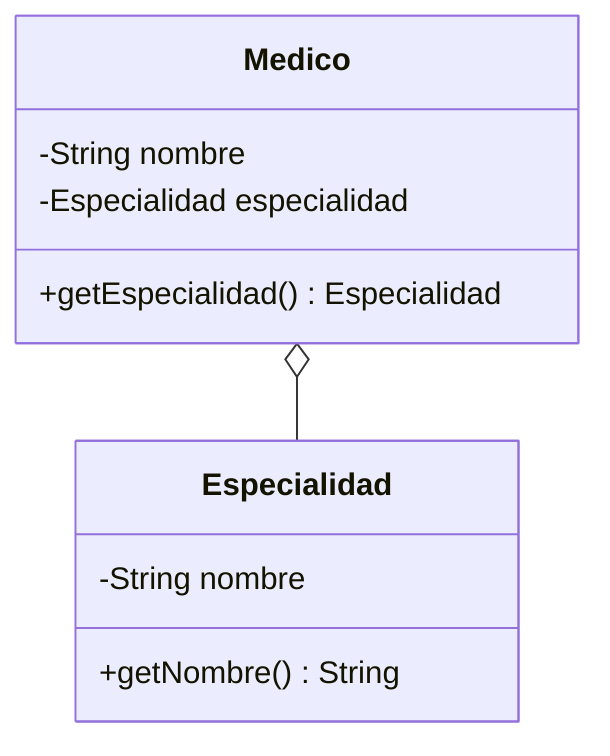

# 💡 Ejemplo 05 — Agregación

## 🌍 Contexto

La **agregación** es una relación todo-parte donde la parte **existe independientemente** del todo: se
recibe ya creada, y puede compartirse entre varios "todos" al mismo tiempo. Una `Especialidad` médica
(por ejemplo, "Cardiología") no la crea ningún `Medico` en particular: existe por su cuenta, y varios
médicos pueden compartir la misma.

**Qué busca demostrar este ejemplo**: cómo declarar una agregación, recibiendo el objeto "parte" ya
creado, y que sigue siendo válido aunque uno de los objetos que lo agregan deje de usarse.

## 🏥 Caso de estudio

MediSalud: un `Medico` tiene una `Especialidad`, que puede compartir con otros médicos.

## 🗺️ Diagrama



## 🌳 Árbol de archivos (como se vería en VS Code)

```text
Modulo09RelacionesEntreClases/
└── src/
    └── com/
        └── medisalud/
            ├── Especialidad.java
            ├── Medico.java
            └── Demo.java
```

## 💻 Archivo: Especialidad.java

```java
package com.medisalud;

public class Especialidad {
    private String nombre;

    public Especialidad(String nombre) {
        this.nombre = nombre;
    }

    public String getNombre() {
        return nombre;
    }
}
```

## 💻 Archivo: Medico.java

```java
package com.medisalud;

public class Medico {
    private String nombre;
    private Especialidad especialidad;

    public Medico(String nombre, Especialidad especialidad) {
        this.nombre = nombre;
        this.especialidad = especialidad;
    }

    public String getNombre() {
        return nombre;
    }

    public Especialidad getEspecialidad() {
        return especialidad;
    }
}
```

## 💻 Archivo: Demo.java

```java
package com.medisalud;

public class Demo {
    public static void main(String[] args) {
        // Datos de entrada
        Especialidad cardiologia = new Especialidad("Cardiologia");
        Medico medico1 = new Medico("Ana Torres", cardiologia);
        Medico medico2 = new Medico("Carlos Ruiz", cardiologia);

        System.out.println(medico1.getNombre() + " - " + medico1.getEspecialidad().getNombre());
        System.out.println(medico2.getNombre() + " - " + medico2.getEspecialidad().getNombre());

        // medico1 deja de usarse; la Especialidad sigue siendo valida desde medico2
        medico1 = null;
        System.out.println("Tras liberar a medico1, medico2 sigue con: " + medico2.getEspecialidad().getNombre());
    }
}
```

## 🧭 Explicación paso a paso

1. `Especialidad` se crea **antes** que cualquier `Medico`, de forma completamente independiente.
2. `Medico` recibe la `Especialidad` ya creada por constructor: no la construye internamente.
3. La misma instancia de `Especialidad` se pasa a dos `Medico` distintos: ambos comparten el mismo
   objeto (no una copia).
4. Aunque `medico1` deje de usarse, la `Especialidad` sigue siendo válida desde `medico2`, porque su
   ciclo de vida no depende de ningún `Medico` en particular.

## ✅ Resultado esperado

```text
Ana Torres - Cardiologia
Carlos Ruiz - Cardiologia
Tras liberar a medico1, medico2 sigue con: Cardiologia
```

## 🧪 Casos de prueba

| Entrada | Operación | Salida esperada |
|---|---|---|
| Una `Especialidad("Cardiologia")` pasada a `medico1` y `medico2` | `medico1.getEspecialidad().getNombre()` y `medico2.getEspecialidad().getNombre()` | `Cardiologia` en ambos casos |
| Igual, tras `medico1 = null` | `medico2.getEspecialidad().getNombre()` | `Cardiologia` (sigue siendo válida) |

## 🔍 Análisis: errores frecuentes

- Confundir agregación con composición: si `Medico` **creara** su propia `Especialidad` dentro del
  constructor (en vez de recibirla), dos médicos con la "misma" especialidad en realidad tendrían dos
  objetos distintos, y no podrían compartir la especialidad real. La pregunta clave para decidir es
  "¿quién crea al objeto, y puede existir independientemente?" (tabla de decisión en la Explicación
  conceptual).
- El error de ejecución de acceder a una **colección** agregada vacía (por ejemplo,
  `biblioteca.getLibros().get(0)` antes de agregar ningún libro) no se demuestra en este ejemplo, porque
  la `Especialidad` es una referencia a-uno, no una colección — se demuestra en el Intermedio 02, con
  `Biblioteca`/`Libro`.

## ❓ Preguntas de repaso

**1. [Selección]** ¿Cómo recibe `Medico` a su `Especialidad`?

- **A.** La crea dentro de su propio constructor.
- **B.** La recibe ya creada, por constructor.
- **C.** La busca en una lista estática.
- **D.** Extiende de `Especialidad`.

<details>
<summary>🔑 Ver respuesta</summary>

**Respuesta correcta: B.** `Medico` recibe la `Especialidad` ya construida; no la crea internamente.

</details>

**2. [Selección múltiple]** ¿Cuáles afirmaciones son verdaderas sobre la agregación de este ejemplo?

- **A.** Dos `Medico` pueden compartir la misma `Especialidad`.
- **B.** La `Especialidad` deja de ser válida si un `Medico` deja de usarse.
- **C.** `Medico` no crea la `Especialidad`.
- **D.** Es una relación "es un".

<details>
<summary>🔑 Ver respuesta</summary>

**Respuestas correctas: A y C.** B es falsa: la `Especialidad` sigue siendo válida independientemente de
cualquier `Medico`. D es falsa: es "tiene un" (agregación), no herencia.

</details>

**3. [Abierta]** ¿Qué cambiaría en el código si, en vez de una agregación, quisieras que cada `Medico`
tuviera su propia `Especialidad` exclusiva, sin poder compartirla con nadie?

<details>
<summary>🔑 Ver respuesta</summary>

**Respuesta esperada:** `Medico` tendría que **crear** la `Especialidad` dentro de su propio
constructor, en vez de recibirla por parámetro — convirtiendo la relación en una composición (tema del
Ejemplo 06).

</details>
