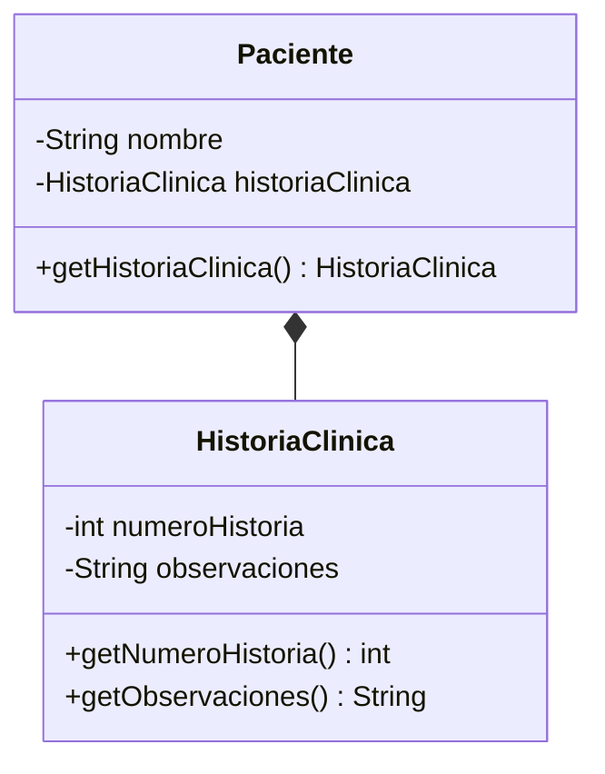

# 💡 Ejemplo 06 — Composición

## 🌍 Contexto

La **composición** es la relación todo-parte más estricta: la parte **no tiene sentido ni existencia**
fuera del todo. Una `HistoriaClinica` no existe por su cuenta — solo tiene sentido asociada a un
`Paciente` específico, y se crea junto con él.

**Qué busca demostrar este ejemplo**: cómo declarar una composición, creando el objeto "parte" dentro
del constructor de la clase "todo", sin que el código externo pueda construirlo por su cuenta.

## 🏥 Caso de estudio

MediSalud: cada `Paciente` tiene su propia `HistoriaClinica`, creada automáticamente al crearse el
`Paciente`.

## 🗺️ Diagrama



## 🌳 Árbol de archivos (como se vería en VS Code)

```text
Modulo09RelacionesEntreClases/
└── src/
    └── com/
        └── medisalud/
            ├── HistoriaClinica.java
            ├── Paciente.java
            └── Demo.java
```

## 💻 Archivo: HistoriaClinica.java

```java
package com.medisalud;

public class HistoriaClinica {
    private int numeroHistoria;
    private String observaciones;

    public HistoriaClinica(int numeroHistoria) {
        this.numeroHistoria = numeroHistoria;
        this.observaciones = "Sin observaciones registradas";
    }

    public int getNumeroHistoria() {
        return numeroHistoria;
    }

    public String getObservaciones() {
        return observaciones;
    }
}
```

## 💻 Archivo: Paciente.java

```java
package com.medisalud;

public class Paciente {
    private String nombre;
    private HistoriaClinica historiaClinica;

    public Paciente(String nombre, int numeroHistoria) {
        this.nombre = nombre;
        this.historiaClinica = new HistoriaClinica(numeroHistoria);
    }

    public String getNombre() {
        return nombre;
    }

    public HistoriaClinica getHistoriaClinica() {
        return historiaClinica;
    }
}
```

## 💻 Archivo: Demo.java

```java
package com.medisalud;

public class Demo {
    public static void main(String[] args) {
        // Datos de entrada
        Paciente paciente = new Paciente("Marta Diaz", 1001);

        System.out.println(paciente.getNombre() + " - Historia N" + paciente.getHistoriaClinica().getNumeroHistoria()
                + ": " + paciente.getHistoriaClinica().getObservaciones());
    }
}
```

## 🧭 Explicación paso a paso

1. `Paciente` NO tiene ningún constructor que reciba una `HistoriaClinica` por parámetro.
2. Dentro del constructor de `Paciente`, se crea `new HistoriaClinica(numeroHistoria)`: la parte nace
   junto con el todo.
3. `paciente.getHistoriaClinica()` devuelve esa `HistoriaClinica`, que nunca existió de forma
   independiente: no hay ninguna lista suelta de historias clínicas en el programa.
4. Si `Paciente` dejara de existir, su `HistoriaClinica` tampoco tendría sentido: dependen por completo
   una de la otra.

## ✅ Resultado esperado

```text
Marta Diaz - Historia N1001: Sin observaciones registradas
```

## 🧪 Casos de prueba

| Entrada | Operación | Salida esperada |
|---|---|---|
| `new Paciente("Marta Diaz", 1001)` | `paciente.getHistoriaClinica().getNumeroHistoria()` | `1001` |
| Mismo caso | `paciente.getHistoriaClinica()` sin haberla construido explícitamente | Devuelve una `HistoriaClinica` válida, creada sola |

## 🔍 Análisis: errores frecuentes

- Confundir composición con agregación: si `Paciente` **recibiera** la `HistoriaClinica` por parámetro
  (en vez de crearla), dos `Paciente` distintos podrían terminar compartiendo la misma
  `HistoriaClinica` por accidente — exactamente lo que la composición existe para evitar. El Avanzado
  del módulo (Ronda 2) muestra este error real con `Prestamo`/`Comprobante`.

## ❓ Preguntas de repaso

**1. [Selección]** ¿Dónde se crea la `HistoriaClinica` de un `Paciente`?

- **A.** Dentro del constructor de `Paciente`.
- **B.** El código externo la crea y se la pasa a `Paciente`.
- **C.** Se crea la primera vez que se llama a `getHistoriaClinica()`.
- **D.** No se crea: es `null` hasta que alguien la asigna.

<details>
<summary>🔑 Ver respuesta</summary>

**Respuesta correcta: A.** `Paciente` la crea dentro de su propio constructor, sin recibirla por
parámetro.

</details>

**2. [Selección múltiple]** ¿Cuáles afirmaciones son verdaderas sobre la composición de este ejemplo?

- **A.** `Paciente` tiene un constructor que recibe una `HistoriaClinica`.
- **B.** La `HistoriaClinica` no tiene sentido fuera de su `Paciente`.
- **C.** El código externo no puede construir una `HistoriaClinica` sola y pasarla.
- **D.** Es lo mismo que la agregación del Ejemplo 05.

<details>
<summary>🔑 Ver respuesta</summary>

**Respuestas correctas: B y C.** A es falsa (no existe ese constructor); D es falsa: en la agregación la
parte se recibe ya creada, en la composición el todo la crea.

</details>

**3. [Abierta]** ¿Qué garantiza, en el código, que ninguna `HistoriaClinica` pueda existir sin un
`Paciente`?

<details>
<summary>🔑 Ver respuesta</summary>

**Respuesta esperada:** que `Paciente` no expone ningún constructor público que reciba una
`HistoriaClinica` por parámetro — la única forma de obtener una es a través de un `Paciente`, que la
crea internamente.

</details>
