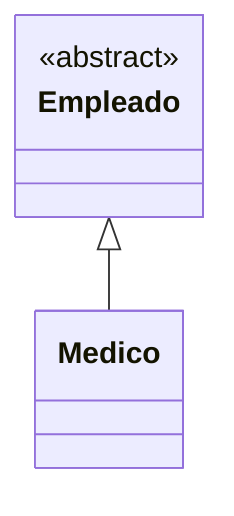
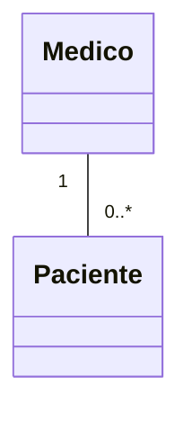
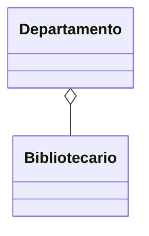

# 🟢 Básico 01 — Identificar el tipo de relación en un diagrama

## 🧩 Problema

Mira los tres diagramas de clases de abajo. Cada uno representa un tipo de relación distinto:
herencia, asociación o agregación.

## 🗺️ Diagrama

**Pregunta**: para cada diagrama, indicá si representa herencia ("es un"), asociación ("tiene un",
sin más) o agregación ("tiene un", con la parte recibida ya creada y compartible).

## 📏 Criterios de evaluación de la solución

- Identifica el primer diagrama como herencia (`<|--`).
- Identifica el segundo diagrama como asociación (línea simple con multiplicidad, sin diamante).
- Identifica el tercer diagrama como agregación (diamante hueco, `o--`).

## 🚧 Restricciones

- No hace falta escribir código: es un ejercicio de lectura de diagramas.

## 📊 Dificultad

Básico

## 🎓 Resultados de aprendizaje

- **RA-1**: distinguir "es un" de "tiene un".
- **RA-10**: distinguir asociación, agregación y composición dado un escenario.
- **RA-11**: reconocer la notación UML de cada relación.
