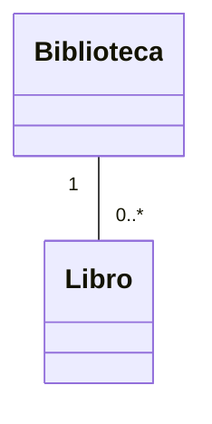

# 🟢 Básico 03 — Predecir multiplicidad, lado Libro

## 🧩 Problema

Mira este diagrama de una `Biblioteca` que agrega `Libro`:

## 🗺️ Diagrama

**Pregunta**: explica, en palabras, qué significa la multiplicidad del lado de `Libro` (`0..*`). ¿Cuántos
`Libro` puede tener una `Biblioteca`, como mínimo y como máximo?

## 📏 Criterios de evaluación de la solución

- Explica que una `Biblioteca` puede tener **cero o más** `Libro` (mínimo cero, sin máximo fijo).
- No confunde `0..*` con `1..*` (que exigiría al menos un `Libro`).

## 🚧 Restricciones

- No hace falta escribir código: es un ejercicio de lectura de diagramas.

## 📊 Dificultad

Básico

## 🎓 Resultados de aprendizaje

- **RA-2**: leer un diagrama de clases UML con multiplicidad.
