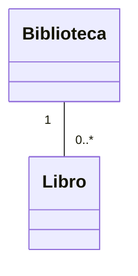

# 🟢 Básico 04 — Predecir multiplicidad, lado Biblioteca

## 🧩 Problema

Mira el mismo diagrama del ejercicio anterior:

## 🗺️ Diagrama

**Pregunta**: explica, en palabras, qué significa la multiplicidad del lado de `Biblioteca` (`1`).
¿Puede un `Libro` pertenecer a ninguna `Biblioteca`? ¿A más de una al mismo tiempo?

## 📏 Criterios de evaluación de la solución

- Explica que, en este diagrama, cada `Libro` está asociado a exactamente **una** `Biblioteca` (ni cero
  ni más de una).
- Distingue esta lectura de la del ejercicio anterior (que describía el otro extremo de la misma
  relación).

## 🚧 Restricciones

- No hace falta escribir código: es un ejercicio de lectura de diagramas.

## 📊 Dificultad

Básico

## 🎓 Resultados de aprendizaje

- **RA-2**: leer un diagrama de clases UML con multiplicidad.
