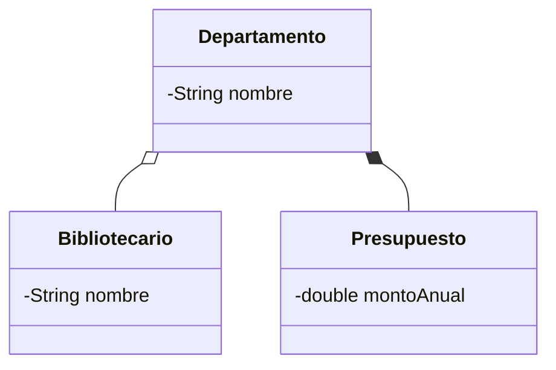

# 🏆 Desafío 01 — Diseñar una relación nueva que combine dos tipos

## 🧩 Problema

Diseña, desde cero, un `Departamento` de Biblioteca Universitaria (clases nuevas, no usadas en ningún
ejemplo del módulo) que combine **dos** de los tres tipos de relación vistos:

- Una **agregación** de `Bibliotecario`: el `Departamento` recibe una lista de `Bibliotecario` ya
  creados (podrían trabajar en otro departamento).
- Una **composición** de `Presupuesto`: el `Departamento` crea su propio `Presupuesto` dentro de su
  constructor, y ningún código externo puede construir uno por su cuenta.

## 🗺️ Diagrama



## 💻 Código o contexto de partida

No se provee ningún archivo de partida: diseña `Bibliotecario`, `Presupuesto` y `Departamento` desde
cero, con al menos dos `Bibliotecario` distintos probados en el mismo programa.

## ✅ Salida esperada al ejecutar

```text
Departamento de Circulacion tiene 2 bibliotecario(s)
- Pedro Soto
- Elena Rios
Presupuesto anual: 25000.0
```

## 🧪 Casos de prueba

| Entrada | Operación | Salida esperada |
|---|---|---|
| `Departamento` con dos `Bibliotecario` agregados | `departamento.getBibliotecarios().size()` | `2` |
| Mismo `Departamento` | `departamento.getPresupuesto()` | Devuelve un `Presupuesto` válido, creado sin haberlo construido explícitamente |

## 📏 Criterios de evaluación de la solución

- `Departamento` recibe cada `Bibliotecario` ya creado (agregación), nunca lo construye.
- `Departamento` crea su propio `Presupuesto` dentro del constructor (composición): no existe ningún
  constructor de `Departamento` que reciba un `Presupuesto` por parámetro.
- El programa se prueba con al menos dos `Bibliotecario` distintos en la misma ejecución.

## 🚧 Restricciones

- Ninguna de las tres clases hereda de otra ni implementa una interfaz.
- No se reutiliza ninguna clase de los ejemplos de este módulo.

## 📊 Dificultad

Desafío

## 🎓 Resultados de aprendizaje

- **RA-7**: declarar y usar una agregación.
- **RA-9**: declarar y usar una composición.
- **RA-10**: distinguir asociación, agregación y composición dado un escenario.
