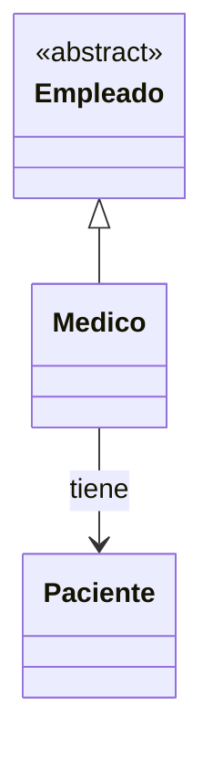
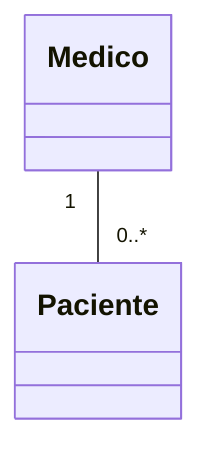
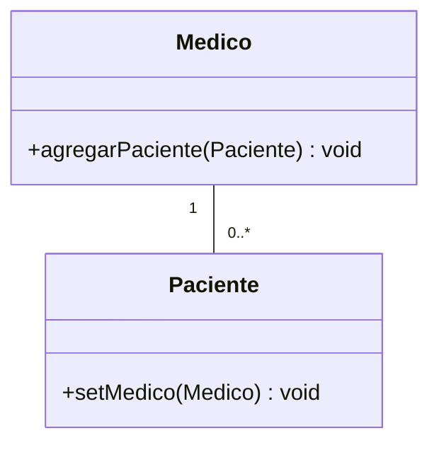
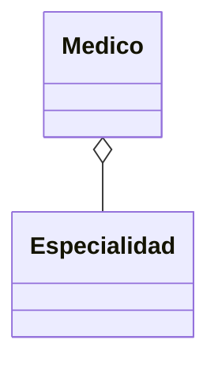
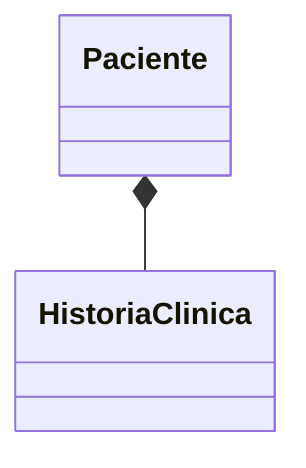

# 📘 Módulo 9 — Relaciones entre Clases

Curso de Java

---

## 🎯 Objetivos del módulo

- Distinguir la relación "es un" (herencia) de la relación "tiene un" (asociación, agregación,
  composición).
- Leer y dibujar un diagrama de clases UML con multiplicidad.
- Declarar asociaciones unidireccionales y bidireccionales consistentes.
- Declarar y usar agregaciones y composiciones.

---

## 🗺️ Ruta de la sesión

1. Relaciones entre clases y multiplicidad.
2. Asociación: unidireccional y bidireccional.
3. Agregación.
4. Composición.

---

## 🧠 ¿Qué es una relación entre clases?

Una relación entre clases describe cómo dos clases se vinculan entre sí, más allá de que una herede de
la otra.

---

## 🧠 "Es un" frente a "tiene un"



`Empleado <|-- Medico` es herencia ("es un"). `Medico --> Paciente` es asociación ("tiene un").

---

## 🧠 Tres formas de "tiene un"

- **Asociación**: una clase simplemente conoce a otra.
- **Agregación**: una clase agrupa a otra, sin controlar su ciclo de vida.
- **Composición**: una clase posee a otra por completo.

---

## 🧠 Multiplicidad: qué es

Indica cuántos objetos participan en cada extremo de una relación.

---

## 🧠 Notación de multiplicidad

| Notación | Significado |
|---|---|
| `1` | Exactamente uno |
| `0..1` | Cero o uno |
| `0..*` / `*` | Cero o más |
| `1..*` | Uno o más |
| `2..4` | Entre 2 y 4 (rango exacto) |

---

## 🗺️ Diagrama: multiplicidad



Cada `Paciente` tiene un `Medico`; cada `Medico` puede tener cero o más `Paciente`.

---

## 🧠 Asociación: definición

Una clase tiene un atributo del tipo de otra clase. Es la forma más simple de "tiene un".

---

## 🧠 Asociación unidireccional

Navegable en un solo sentido: `Libro` conoce a su `Autor`, pero `Autor` no navega de vuelta.

---

## 💻 Asociación unidireccional: código

```java
private Autor autor;

public Libro(String titulo, Autor autor) {
    this.autor = autor;
}
```

---

## 🗺️ Diagrama: asociación bidireccional



---

## 💻 Asociación bidireccional: código

```java
public void agregarPaciente(Paciente paciente) {
    pacientes.add(paciente);
    paciente.setMedico(this);
}
```

Un único método actualiza los dos extremos a la vez.

---

## ⚠️ El riesgo: actualizar un solo extremo

Si se llama solo a `paciente.setMedico(medico)`, el programa **compila y se ejecuta sin fallar**.

---

## 🔍 Evidencia real: salida incompleta

`medico.getPacientes().size()` da `0`, aunque `paciente.getMedico()` devuelva el médico correcto: un
**error lógico**, no detectado por el compilador ni por el panel Problems.

---

## 📌 Cómo evitarlo

Un único método (`agregarPaciente`) que actualice ambos extremos a la vez, siempre.

---

## 🧠 Agregación: definición

Relación todo-parte donde la parte **existe independientemente** del todo.

---

## 🗺️ Diagrama: agregación



Diamante hueco del lado del "todo" (`Medico`).

---

## 💻 Agregación: código

```java
public Medico(String nombre, Especialidad especialidad) {
    this.nombre = nombre;
    this.especialidad = especialidad;
}
```

`Especialidad` se recibe ya creada; `Medico` no la construye.

---

## 🧠 La parte es compartible

La misma `Especialidad` puede pasarse a varios `Medico` distintos.

---

## 🧠 La parte sigue existiendo

Aunque un `Medico` deje de usarse, la `Especialidad` sigue siendo válida desde los demás.

---

## 🧠 Agregación frente a composición (primer contraste)

En la agregación, el todo **recibe** la parte. En la composición, el todo **crea** la parte.

---

## 🧠 Composición: definición

Relación todo-parte donde la parte **no tiene sentido** fuera del todo.

---

## 🗺️ Diagrama: composición



Diamante relleno del lado del "todo" (`Paciente`).

---

## 💻 Composición: código

```java
public Paciente(String nombre, int numeroHistoria) {
    this.nombre = nombre;
    this.historiaClinica = new HistoriaClinica(numeroHistoria);
}
```

`HistoriaClinica` se crea dentro del constructor de `Paciente`.

---

## 🧠 La parte no existe fuera del todo

Ninguna `HistoriaClinica` puede existir sin un `Paciente` que la contenga.

---

## 🧠 Ningún constructor externo

`Paciente` no expone ningún constructor que reciba una `HistoriaClinica` ya creada.

---

## 📌 Tabla de decisión

| Pregunta | Asociación | Agregación | Composición |
|---|---|---|---|
| ¿Quién crea al objeto? | Cualquiera | Se recibe ya creado | El todo, en su constructor |
| ¿Existe independiente? | Sí | Sí | No |
| ¿Se puede compartir? | Sí | Sí | No |

---

## 🔍 Error frecuente: asociación bidireccional inconsistente

Actualizar solo un extremo compila y se ejecuta sin fallar, pero produce un resultado incompleto.

---

## 🔍 Errores frecuentes: composición mal implementada y colección vacía

Recibir la "parte" por parámetro en vez de crearla (agregación disfrazada de composición); acceder a un
elemento de una colección agregada vacía (`IndexOutOfBoundsException` real).

---

## 🛠️ Taller: MediSalud completo

Asociación bidireccional (`Medico`/`Paciente`), agregación (`Especialidad`) y composición
(`HistoriaClinica`), integradas en el mismo diseño.

---

## 📌 Resumen

- "Es un" (herencia) frente a "tiene un" (asociación, agregación, composición).
- La multiplicidad describe cuántos objetos participan en cada extremo.
- Quién crea al objeto y si puede existir independiente decide el tipo de relación.

---

## 📝 Evaluación

Quiz de 14 ítems, taller integrador, ejercicios Básico a Desafío.
