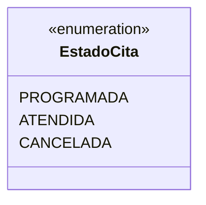

# 💡 Ejemplo 04 — Enumeraciones

## 🌍 Contexto

Hasta ahora, para representar el estado de una cita usarías un `String` (`"PROGRAMADA"`,
`"ATENDIDA"`...) o números sueltos. El problema: nada impide escribir `"Programada"`,
`"PROGRAMDA"` (con un error de tipeo) o cualquier otro texto, y el compilador no te avisa. Un `enum`
declara el conjunto **cerrado** de valores válidos: el compilador rechaza cualquier otro.

**Qué busca demostrar este ejemplo**: cómo declarar un `enum`, recorrer sus valores con `values()`,
consultar la posición de uno con `ordinal()`, y usarlo como condición de un `switch`.

## 🏥 Caso de estudio

MediSalud: el estado de una cita médica.

## 🗺️ Diagrama



| Valor | `ordinal()` |
|---|---|
| `PROGRAMADA` | `0` |
| `ATENDIDA` | `1` |
| `CANCELADA` | `2` |

## 🌳 Árbol de archivos (como se vería en VS Code)

```text
Modulo10ConjuntosMapasEnumeracionesYExcepciones/
└── src/
    └── com/
        └── medisalud/
            └── Demo.java
```

## 💻 Archivo: Demo.java

```java
package com.medisalud;

public class Demo {
    enum EstadoCita {
        PROGRAMADA, ATENDIDA, CANCELADA
    }

    public static void main(String[] args) {
        // Datos de entrada
        for (EstadoCita estado : EstadoCita.values()) {
            System.out.println(estado + " (posicion " + estado.ordinal() + ")");
        }

        EstadoCita estadoActual = EstadoCita.ATENDIDA;
        switch (estadoActual) {
            case PROGRAMADA:
                System.out.println("La cita todavia no se atendio");
                break;
            case ATENDIDA:
                System.out.println("La cita ya se atendio");
                break;
            case CANCELADA:
                System.out.println("La cita fue cancelada");
                break;
        }
    }
}
```

## 🧭 Explicación paso a paso

1. `enum EstadoCita { PROGRAMADA, ATENDIDA, CANCELADA }` declara los tres únicos valores válidos.
2. `EstadoCita.values()` devuelve un arreglo con los tres valores, en el orden en que se declararon.
3. `estado.ordinal()` da la posición de ese valor en la declaración, empezando en `0`.
4. Un valor de `enum` se usa como condición de un `switch`, con un `case` por valor — sin repetir el
   nombre del tipo dentro de cada `case`.

## ✅ Resultado esperado

```text
PROGRAMADA (posicion 0)
ATENDIDA (posicion 1)
CANCELADA (posicion 2)
La cita ya se atendio
```

## 🧪 Casos de prueba

| Entrada | Operación | Salida esperada |
|---|---|---|
| `EstadoCita.values()` | Recorrido | `PROGRAMADA`, `ATENDIDA`, `CANCELADA`, en ese orden |
| `EstadoCita.ATENDIDA` | `.ordinal()` | `1` |
| `estadoActual = EstadoCita.ATENDIDA` | `switch` | `"La cita ya se atendio"` |

## 🔍 Análisis: errores frecuentes

- Usar un valor no declarado (por ejemplo, `EstadoCita.EN_CURSO`, que no existe): el programa no
  compila (`cannot find symbol`), a diferencia de un `String` suelto, que aceptaría cualquier texto sin
  avisar.

## ❓ Preguntas de repaso

**1. [Selección]** ¿Qué devuelve `EstadoCita.values()`?

- **A.** La cantidad de valores del `enum`.
- **B.** Un arreglo con todos los valores, en el orden en que se declararon.
- **C.** El primer valor declarado.
- **D.** Un `Set` con los valores.

<details>
<summary>🔑 Ver respuesta</summary>

**Respuesta correcta: B.** `values()` devuelve un arreglo con todos los valores del `enum`, en el orden
de declaración.

</details>

**2. [Selección múltiple]** ¿Cuáles afirmaciones son verdaderas sobre `EstadoCita`?

- **A.** `PROGRAMADA.ordinal()` da `0`.
- **B.** Se puede usar como condición de un `switch`.
- **C.** `EstadoCita.PROGRAMADA` y el `String` `"PROGRAMADA"` son el mismo valor para Java.
- **D.** El compilador rechaza cualquier valor no declarado.

<details>
<summary>🔑 Ver respuesta</summary>

**Respuestas correctas: A, B y D.** C es falsa: un valor de `enum` no es un `String`, son tipos
distintos.

</details>

**3. [Abierta]** ¿Por qué conviene un `enum` en vez de un `String` suelto para representar el estado de
una cita?

<details>
<summary>🔑 Ver respuesta</summary>

**Respuesta esperada:** porque un `enum` limita los valores posibles a los declarados: el compilador
rechaza cualquier otro. Un `String` suelto aceptaría cualquier texto (incluidos errores de tipeo), sin
que el compilador pueda avisar.

</details>
