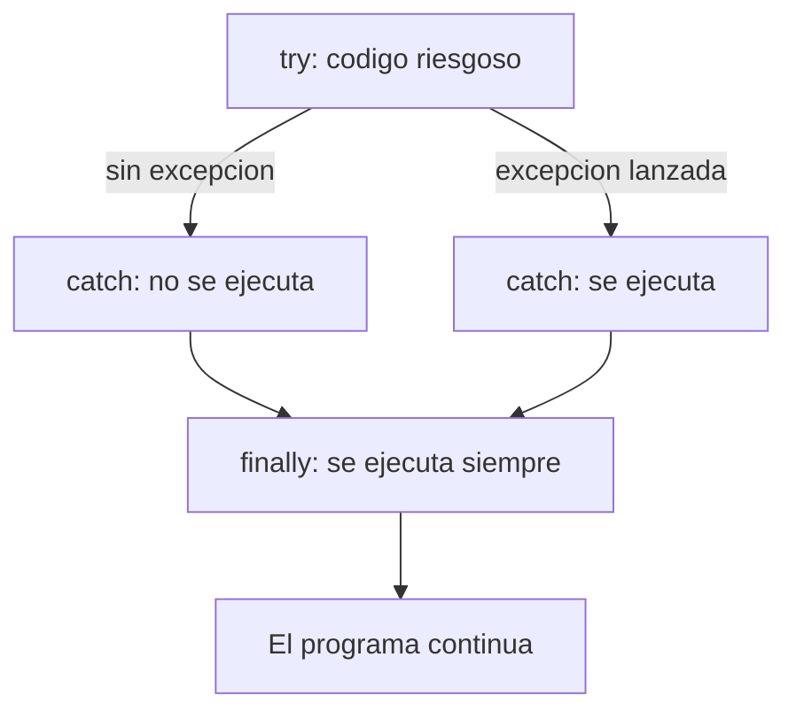

# 💡 Ejemplo 07 — finally

## 🌍 Contexto

A veces necesitás que una parte del código se ejecute **siempre**, sin importar si hubo una excepción o
no — por ejemplo, para confirmar que una consulta terminó. `finally` hace exactamente eso.

**Qué busca demostrar este ejemplo**: con una ejecución real, que el bloque `finally` corre tanto cuando
el `catch` se ejecuta como cuando no.

## 📚 Caso de estudio

Biblioteca Universitaria: el mismo caso de los Ejemplos 05–06, ejecutado dos veces (con un código
inexistente y con uno válido).

## 🗺️ Diagrama



## 🌳 Árbol de archivos (como se vería en VS Code)

```text
Modulo10ConjuntosMapasEnumeracionesYExcepciones/
└── src/
    └── com/
        └── biblioteca/
            └── Demo.java
```

## 💻 Archivo: Demo.java

```java
package com.biblioteca;

import java.util.HashMap;
import java.util.Map;

public class Demo {
    static void buscarTitulo(Map<String, String> catalogoLibros, String codigo) {
        try {
            String titulo = catalogoLibros.get(codigo);
            System.out.println("longitud del titulo=" + titulo.length());
        } catch (NullPointerException e) {
            System.out.println("No se encontro el libro pedido");
        } finally {
            System.out.println("Consulta finalizada");
        }
    }

    public static void main(String[] args) {
        // Datos de entrada
        Map<String, String> catalogoLibros = new HashMap<>();
        catalogoLibros.put("LIB-012", "Cien anios de soledad");
        catalogoLibros.put("LIB-030", "El principito");

        buscarTitulo(catalogoLibros, "LIB-999");
        buscarTitulo(catalogoLibros, "LIB-012");
    }
}
```

## 🧭 Explicación paso a paso

1. `buscarTitulo` envuelve el mismo código riesgoso de los Ejemplos 05–06 en un `try`/`catch`, y agrega
   un bloque `finally` con `System.out.println("Consulta finalizada");`.
2. La primera llamada (`"LIB-999"`, código inexistente) dispara el `catch`: primero se imprime el
   mensaje del `catch`, y **después** el `finally` — en ese orden.
3. La segunda llamada (`"LIB-012"`, código válido) nunca entra al `catch`: el `try` termina sin
   problemas, pero el `finally` se ejecuta **igual**.

## ✅ Resultado esperado

```text
No se encontro el libro pedido
Consulta finalizada
longitud del titulo=21
Consulta finalizada
```

## 🧪 Casos de prueba

| Entrada | ¿Se ejecuta el catch? | ¿Se ejecuta el finally? |
|---|---|---|
| `"LIB-999"` (código inexistente) | Sí | Sí |
| `"LIB-012"` (código válido) | No | Sí |

## 🔍 Análisis: errores frecuentes

- Suponer que `finally` solo se ejecuta cuando hay una excepción: en realidad se ejecuta **siempre**,
  haya o no un error, y se haya capturado o no.
- Confundir el orden: dentro de una misma llamada, primero corre el `catch` (si aplica) y **después**
  el `finally`, nunca al revés.

## ❓ Preguntas de repaso

**1. [Selección]** ¿Cuándo se ejecuta el bloque `finally` de `buscarTitulo`?

- **A.** Solo cuando el `catch` se ejecuta.
- **B.** Solo cuando el `try` termina sin errores.
- **C.** Siempre, en las dos llamadas del ejemplo.
- **D.** Nunca, porque el método también tiene un `catch`.

<details>
<summary>🔑 Ver respuesta</summary>

**Respuesta correcta: C.** El `finally` corre en ambas llamadas: con y sin excepción.

</details>

**2. [Selección múltiple]** ¿Cuáles afirmaciones son verdaderas sobre el `finally` de este ejemplo?

- **A.** Se ejecuta después del `catch`, cuando el `catch` corre.
- **B.** Se ejecuta antes que el `try`.
- **C.** Imprime `"Consulta finalizada"` en las dos llamadas.
- **D.** Solo se ejecuta si el programa no captura ninguna excepción.

<details>
<summary>🔑 Ver respuesta</summary>

**Respuestas correctas: A y C.** B es falsa (el orden es `try` → `catch` si aplica → `finally`); D es
falsa (el `finally` es independiente de si hubo o no una excepción).

</details>

**3. [Abierta]** ¿Para qué tipo de código conviene usar `finally` en vez de repetir la misma línea al
final del `try` y de cada `catch`?

<details>
<summary>🔑 Ver respuesta</summary>

**Respuesta esperada:** para código que debe ejecutarse pase lo que pase (por ejemplo, confirmar que una
operación terminó, liberar un recurso, cerrar una conexión). Ponerlo en `finally` evita repetirlo en
cada camino posible (`try` exitoso, cada `catch`) y garantiza que no se olvide en alguno de ellos.

</details>
