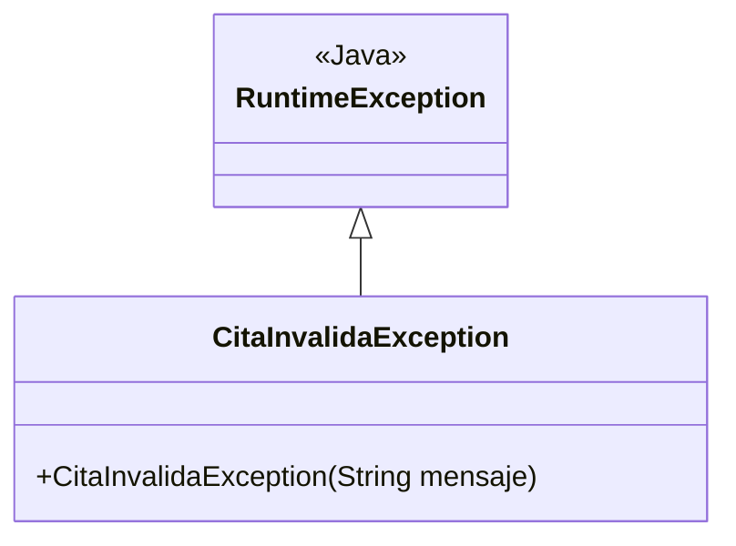

# 💡 Ejemplo 08 — throw y excepción personalizada

## 🌍 Contexto

Hasta ahora capturaste excepciones que Java lanza por su cuenta (`NullPointerException`,
`IndexOutOfBoundsException`...). Pero también puedes lanzar las tuyas: cuando un método detecta un dato
inválido, `throw` interrumpe la ejecución con una excepción, propia o de la biblioteca estándar.

**Qué busca demostrar este ejemplo**: cómo declarar una excepción personalizada
(`extends RuntimeException`) y lanzarla con `throw` desde un método de validación.

## 🏥 Caso de estudio

MediSalud: validar que la especialidad de una cita esté entre las disponibles en la clínica, reutilizando
el `Set<String>` del Ejemplo 01.

## 🗺️ Diagrama



## 🌳 Árbol de archivos (como se vería en VS Code)

```text
Modulo10ConjuntosMapasEnumeracionesYExcepciones/
└── src/
    └── com/
        └── medisalud/
            ├── CitaInvalidaException.java
            └── Demo.java
```

## 💻 Archivo: CitaInvalidaException.java

```java
package com.medisalud;

public class CitaInvalidaException extends RuntimeException {
    public CitaInvalidaException(String mensaje) {
        super(mensaje);
    }
}
```

## 💻 Archivo: Demo.java

```java
package com.medisalud;

import java.util.HashSet;
import java.util.Set;

public class Demo {
    static void validarEspecialidad(String especialidad, Set<String> disponibles) {
        if (!disponibles.contains(especialidad)) {
            throw new CitaInvalidaException("Especialidad no disponible: " + especialidad);
        }
    }

    public static void main(String[] args) {
        // Datos de entrada
        Set<String> especialidadesDisponibles = new HashSet<>();
        especialidadesDisponibles.add("Cardiologia");
        especialidadesDisponibles.add("Pediatria");

        try {
            validarEspecialidad("Neurologia", especialidadesDisponibles);
        } catch (CitaInvalidaException e) {
            System.out.println("Error: " + e.getMessage());
        }

        try {
            validarEspecialidad("Cardiologia", especialidadesDisponibles);
            System.out.println("Especialidad valida, cita puede continuar");
        } catch (CitaInvalidaException e) {
            System.out.println("Error: " + e.getMessage());
        }
    }
}
```

## 🧭 Explicación paso a paso

1. `CitaInvalidaException extends RuntimeException` declara una excepción propia, con un constructor
   que recibe el mensaje de error.
2. `validarEspecialidad` comprueba si la especialidad está en el `Set` de disponibles; si no está, hace
   `throw new CitaInvalidaException(...)`, interrumpiendo la ejecución del método en ese punto.
3. Quien invoca `validarEspecialidad` la envuelve en `try`/`catch (CitaInvalidaException e)`: si la
   especialidad es inválida, el `catch` se ejecuta e imprime `e.getMessage()`.
4. Con una especialidad válida, `validarEspecialidad` no lanza nada: la línea después de la llamada se
   ejecuta con normalidad.

## ✅ Resultado esperado

```text
Error: Especialidad no disponible: Neurologia
Especialidad valida, cita puede continuar
```

## 🧪 Casos de prueba

| Entrada | Operación | Salida esperada |
|---|---|---|
| `validarEspecialidad("Neurologia", disponibles)`, sin `"Neurologia"` en el `Set` | Ejecución | `throw`, capturado, imprime el mensaje real |
| `validarEspecialidad("Cardiologia", disponibles)`, con `"Cardiologia"` en el `Set` | Ejecución | No lanza nada; sigue con normalidad |

## 🔍 Análisis: errores frecuentes

- Olvidar el `throw` dentro del método de validación: el método terminaría sin avisar de nada, dejando
  pasar una especialidad inválida como si fuera correcta.
- Declarar `CitaInvalidaException` sin extender de `RuntimeException` (o de `Exception`): sin
  `extends`, no sería una excepción, y `throw` no la aceptaría.

## ❓ Preguntas de repaso

**1. [Selección]** ¿Qué hace `throw new CitaInvalidaException("...")` dentro de
`validarEspecialidad`?

- **A.** Imprime el mensaje y sigue ejecutando el método.
- **B.** Interrumpe el método, lanzando la excepción a quien lo invocó.
- **C.** Ignora el error y continúa.
- **D.** Crea la excepción, pero no hace nada más si no se le agrega `.lanzar()`.

<details>
<summary>🔑 Ver respuesta</summary>

**Respuesta correcta: B.** `throw` lanza la excepción de inmediato: el resto del método no se ejecuta,
y la excepción viaja hacia quien invocó el método.

</details>

**2. [Selección múltiple]** ¿Cuáles afirmaciones son verdaderas sobre `CitaInvalidaException`?

- **A.** Extiende `RuntimeException`.
- **B.** Tiene un constructor que recibe un mensaje.
- **C.** Es una excepción marcada (`checked`).
- **D.** Se lanza con `throw`.

<details>
<summary>🔑 Ver respuesta</summary>

**Respuestas correctas: A, B y D.** C es falsa: al extender `RuntimeException`, es una excepción **no**
marcada (`unchecked`).

</details>

**3. [Abierta]** ¿Por qué conviene una excepción personalizada (`CitaInvalidaException`) en vez de
lanzar directamente `new RuntimeException("...")`?

<details>
<summary>🔑 Ver respuesta</summary>

**Respuesta esperada:** una excepción personalizada le da un nombre específico al error (queda claro,
con solo leer el `catch`, qué tipo de problema se está manejando), y permite capturar **solo** ese tipo
de error sin atrapar, por accidente, cualquier otro `RuntimeException` no relacionado.

</details>
