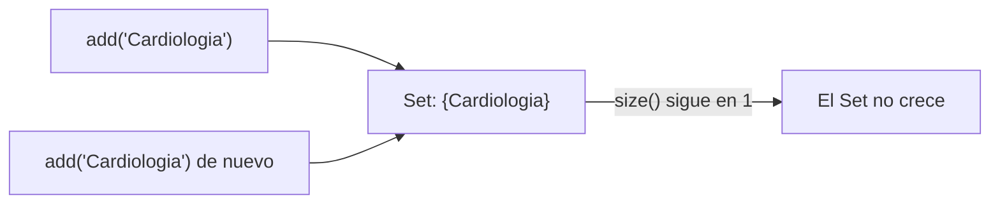
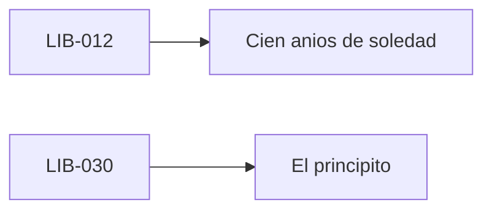
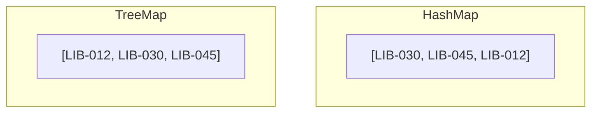
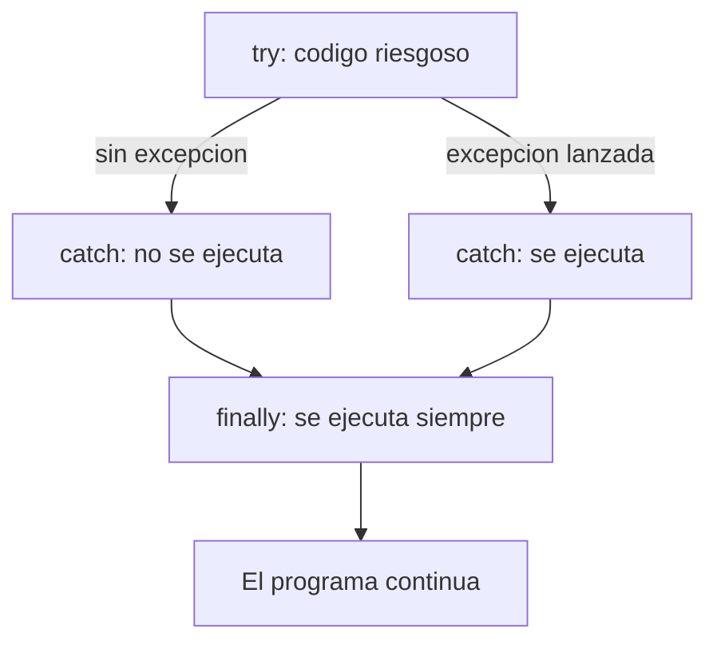

# 📘 Módulo 10 — Conjuntos, Mapas, Enumeraciones y Excepciones

Curso de Java

---

## 🎯 Objetivos del módulo

- Declarar un `Set` y usar sus operaciones más comunes, incluidas unión, intersección y diferencia.
- Declarar y usar un `HashMap` y un `TreeMap`, y elegir entre ambos.
- Declarar y usar una enumeración (`enum`).
- Manejar excepciones con `try`/`catch`/`finally`, y lanzar excepciones propias con `throw`.

---

## 🗺️ Ruta de la sesión

1. Set: operaciones y combinación de conjuntos.
2. Map: HashMap y TreeMap.
3. Enumeraciones.
4. Excepciones: capturar, `finally`, lanzar las propias.

---

## 🧠 ¿Qué es un Set?

Una estructura que agrupa valores **sin duplicados**. Agregar un valor ya presente no cambia nada.

---

## 🗺️ Diagrama: Set sin duplicados



---

## 💻 Declarar un Set

```java
Set<String> especialidades = new HashSet<>();
especialidades.add("Cardiologia");
especialidades.add("Cardiologia");
```

`especialidades.size()` da `1`: el segundo `add` no agrega nada.

---

## 🧠 Operaciones básicas de un Set

- `add`, `remove`, `contains`, `size`, `isEmpty`.
- Se recorre con `for-each`; no tiene índice.

---

## 🧠 Combinar dos conjuntos

- **Unión** (`addAll`): todos los valores de ambos.
- **Intersección** (`retainAll`): solo los valores compartidos.
- **Diferencia** (`removeAll`): solo los valores exclusivos del primero.

---

## ⚠️ Operar sobre una copia

`a.retainAll(b)` **modifica** `a`. Para conservar los originales, operá sobre `new HashSet<>(a)`.

---

## 🧠 ¿Qué es un Map?

Asocia una **clave única** a un **valor**. Cada clave aparece una sola vez.

---

## 🗺️ Diagrama: Map



---

## 💻 Declarar un HashMap

```java
Map<String, String> catalogoLibros = new HashMap<>();
catalogoLibros.put("LIB-012", "Cien anios de soledad");
catalogoLibros.put("LIB-012", "Cien anios de soledad (2da edicion)");
```

El segundo `put` **actualiza** el valor; el `Map` no crece.

---

## 🧠 Operaciones básicas de un Map

- `put`, `get`, `containsKey`, `remove`, `size`.
- Se recorre con `keySet()` o `entrySet()`.

---

## 🧠 HashMap no garantiza orden

`get` de una clave inexistente devuelve `null`, sin lanzar nada por sí solo. Recorrer un `HashMap` no
sigue ningún orden garantizado.

---

## 🧠 TreeMap mantiene sus claves ordenadas

A diferencia de `HashMap`, `TreeMap` recorre siempre sus claves en orden alfabético.

---

## 🗺️ Diagrama: HashMap frente a TreeMap



Mismos datos, orden distinto.

---

## 📌 HashMap o TreeMap: cómo elegir

| Necesitás... | Elige |
|---|---|
| Que las claves queden ordenadas | `TreeMap` |
| Que no importe el orden | `HashMap` |

---

## 🧠 ¿Qué es una enumeración?

Un `enum` declara un **conjunto cerrado** de valores válidos. El compilador rechaza cualquier otro.

---

## 💻 Declarar un enum

```java
enum EstadoCita {
    PROGRAMADA, ATENDIDA, CANCELADA
}
```

---

## 📋 Tabla de valores de un enum

| Valor | `ordinal()` |
|---|---|
| `PROGRAMADA` | `0` |
| `ATENDIDA` | `1` |
| `CANCELADA` | `2` |

---

## 🧠 values() y switch

`EstadoCita.values()` recorre los tres valores. Un valor de `enum` puede ser condición de un `switch`.

---

## 🔍 Enum frente a String suelto

Un `String` acepta cualquier texto, incluidos errores de tipeo. Un `enum` no compila con un valor no
declarado.

---

## 🧠 ¿Qué es una excepción?

Un error real que ocurre mientras el programa corre. Si nadie la maneja, el programa termina.

---

## 💻 Excepción sin capturar

```java
String titulo = catalogoLibros.get("LIB-999");
System.out.println(titulo.length());
```

`get` devuelve `null`; `.length()` sobre ese `null` termina el programa con
`NullPointerException`.

---

## 🧠 try/catch: capturar el error

El código riesgoso va en el `try`; si falla, el `catch` correspondiente se ejecuta en su lugar.

---

## 💻 try/catch en acción

```java
try {
    String titulo = catalogoLibros.get("LIB-999");
    System.out.println(titulo.length());
} catch (NullPointerException e) {
    System.out.println("No se encontro el libro pedido");
}
```

El programa sigue corriendo después del bloque.

---

## 🗺️ Diagrama: ciclo try/catch/finally



---

## 🧠 finally: código que corre siempre

Se ejecuta haya o no una excepción, y se haya capturado o no.

---

## 🧠 Lanzar tus propias excepciones

`throw` interrumpe un método con una excepción, propia o de la biblioteca estándar.

---

## 💻 Excepción personalizada

```java
public class CitaInvalidaException extends RuntimeException {
    public CitaInvalidaException(String mensaje) {
        super(mensaje);
    }
}
```

---

## 💻 throw en un método de validación

```java
static void validarEspecialidad(String especialidad, Set<String> disponibles) {
    if (!disponibles.contains(especialidad)) {
        throw new CitaInvalidaException("Especialidad no disponible: " + especialidad);
    }
}
```

---

## 🔍 Error frecuente: orden de catch

```java
catch (RuntimeException e) { ... }
catch (NumberFormatException e) { ... }
```

El segundo `catch` queda inalcanzable: `NumberFormatException` ya lo cubre el primero. **No compila.**

---

## 🔍 Un catch no relacionado sí compila

`catch (ArithmeticException e)` alrededor de un `Integer.parseInt` inválido **compila**: queda como
código muerto, pero es sintácticamente válido.

---

## 🔍 Otros errores frecuentes

- Una clave de `Map` de un tipo distinto al declarado.
- Un valor de `enum` no declarado.
- Confundir `==` con `.equals()` al comparar el contenido de dos `String`.

---

## 📌 Tabla resumen del módulo

| Capacidad | Para qué sirve |
|---|---|
| `Set` | Agrupar sin duplicados |
| `Map` | Asociar clave y valor |
| `enum` | Conjunto cerrado de valores |
| `try`/`catch`/`finally`/`throw` | Manejar errores en tiempo real |

---

## 🛠️ Taller: Registro de Citas de MediSalud

`Set` de especialidades, `Map` de citas por paciente, `enum EstadoCita`, y `throw`/`try`/`catch`/
`finally` con una excepción personalizada — las cuatro capacidades juntas.

---

## 📌 Resumen

- `Set` evita duplicados; `Map` asocia clave y valor; `TreeMap` los ordena.
- `enum` cierra el conjunto de valores válidos.
- `try`/`catch`/`finally` maneja errores reales; `throw` permite lanzar los propios.

---

## 📝 Evaluación

Quiz de 15 ítems, taller integrador, ejercicios Básico a Desafío.
