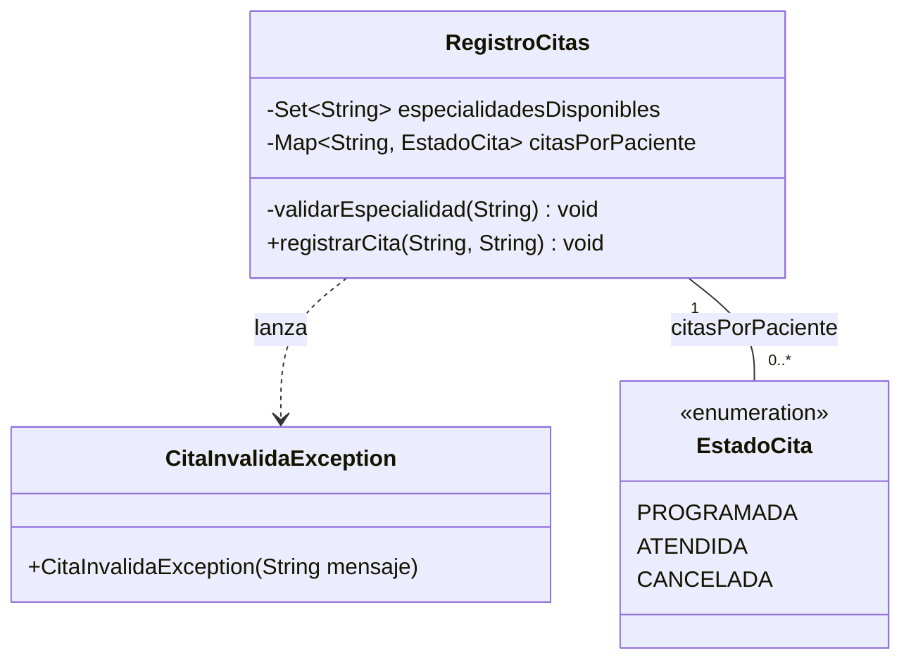

# 🔑 Solución — Taller 01

> Material docente, no enlazar desde la audiencia estudiante.

## 🗺️ Diagrama de clases



## 📦 Árbol de archivos

```text
RegistroCitas/
└── src/
    └── com/
        └── medisalud/
            ├── EstadoCita.java
            ├── CitaInvalidaException.java
            ├── RegistroCitas.java
            └── Demo.java
```

## 💻 Archivo: EstadoCita.java

```java
package com.medisalud;

public enum EstadoCita {
    PROGRAMADA, ATENDIDA, CANCELADA
}
```

## 💻 Archivo: CitaInvalidaException.java

```java
package com.medisalud;

public class CitaInvalidaException extends RuntimeException {
    public CitaInvalidaException(String mensaje) {
        super(mensaje);
    }
}
```

## 💻 Archivo: RegistroCitas.java

```java
package com.medisalud;

import java.util.HashMap;
import java.util.Map;
import java.util.Set;

public class RegistroCitas {
    private Set<String> especialidadesDisponibles;
    private Map<String, EstadoCita> citasPorPaciente = new HashMap<>();

    public RegistroCitas(Set<String> especialidadesDisponibles) {
        this.especialidadesDisponibles = especialidadesDisponibles;
    }

    private void validarEspecialidad(String especialidad) {
        if (!especialidadesDisponibles.contains(especialidad)) {
            throw new CitaInvalidaException("Especialidad no disponible: " + especialidad);
        }
    }

    public void registrarCita(String paciente, String especialidad) {
        validarEspecialidad(especialidad);
        citasPorPaciente.put(paciente, EstadoCita.PROGRAMADA);
    }

    public Map<String, EstadoCita> getCitasPorPaciente() {
        return citasPorPaciente;
    }
}
```

## 💻 Archivo: Demo.java

```java
package com.medisalud;

import java.util.HashSet;
import java.util.Set;

public class Demo {
    public static void main(String[] args) {
        // Datos de entrada
        Set<String> especialidadesDisponibles = new HashSet<>();
        especialidadesDisponibles.add("Cardiologia");
        especialidadesDisponibles.add("Pediatria");

        RegistroCitas registro = new RegistroCitas(especialidadesDisponibles);

        try {
            registro.registrarCita("Jorge Paz", "Neurologia");
        } catch (CitaInvalidaException e) {
            System.out.println("Error: " + e.getMessage());
        } finally {
            System.out.println("Registro de Jorge Paz finalizado");
        }

        try {
            registro.registrarCita("Marta Diaz", "Cardiologia");
            System.out.println("Cita de Marta Diaz registrada");
        } catch (CitaInvalidaException e) {
            System.out.println("Error: " + e.getMessage());
        } finally {
            System.out.println("Registro de Marta Diaz finalizado");
        }

        System.out.println("citasPorPaciente.size=" + registro.getCitasPorPaciente().size());
        System.out.println("Marta Diaz -> " + registro.getCitasPorPaciente().get("Marta Diaz"));
        System.out.println("contiene Jorge Paz=" + registro.getCitasPorPaciente().containsKey("Jorge Paz"));
    }
}
```

## ✅ Salida real

```text
Error: Especialidad no disponible: Neurologia
Registro de Jorge Paz finalizado
Cita de Marta Diaz registrada
Registro de Marta Diaz finalizado
citasPorPaciente.size=1
Marta Diaz -> PROGRAMADA
contiene Jorge Paz=false
```

## 🔍 Errores comunes observados

- Agregar el paciente a `citasPorPaciente` **antes** de validar la especialidad: dejaría citas
  inválidas registradas.
- Olvidar el `throw` dentro de `validarEspecialidad`: el método terminaría sin avisar, dejando pasar
  cualquier especialidad como si fuera válida.
- Capturar `Exception` en vez de `CitaInvalidaException` en `Demo`: oculta cualquier otro error real que
  pudiera ocurrir, no solo el de especialidad inválida.
