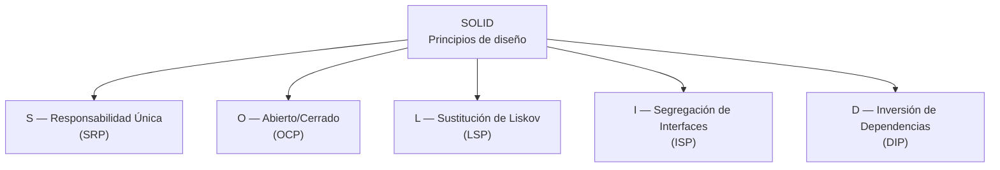

# 💡 Ejemplo 01 — Qué son los principios SOLID

## 🌍 Contexto

Hasta el Módulo 10 el curso se concentró en que el código **compile y funcione**: tipos correctos,
estructuras de datos adecuadas, manejo de errores. Este módulo cambia de pregunta. El código de los
próximos ejemplos y ejercicios **siempre** compila, se ejecuta y termina sin errores — el problema que
resuelven no es de sintaxis ni de ejecución, sino de **diseño**: qué tan fácil es entender, extender y
mantener ese código a medida que el sistema crece.

SOLID es un acrónimo que agrupa cinco principios de diseño orientado a objetos, formulados originalmente
por Robert C. Martin. No son reglas de sintaxis de Java ni un patrón de diseño con nombre propio: son
criterios para decidir **cómo repartir responsabilidades entre clases e interfaces** de forma que un
cambio futuro (un caso nuevo, un tipo nuevo, un canal nuevo) cueste lo menos posible.

| Letra | Principio | Qué evita |
|---|---|---|
| S | Responsabilidad Única (SRP) | Una clase que cambia por más de una razón |
| O | Abierto/Cerrado (OCP) | Modificar código que ya funciona para agregar un caso nuevo |
| L | Sustitución de Liskov (LSP) | Una subclase que rompe las expectativas de su superclase |
| I | Segregación de Interfaces (ISP) | Una clase obligada a implementar métodos que no usa |
| D | Inversión de Dependencias (DIP) | Una clase atada a un detalle concreto en vez de una abstracción |

## 🗺️ Diagrama

## 🧭 Explicación paso a paso

1. **SRP** pregunta: ¿esta clase tiene una sola razón para cambiar? Si `GestorCitas` agenda, notifica y
   factura a la vez, un cambio en la forma de facturar obliga a tocar la misma clase que agenda citas.
2. **OCP** pregunta: ¿para agregar un caso nuevo, tengo que modificar código que ya funcionaba? Una
   cadena de `if`/`else` por tipo de paciente crece con cada tipo nuevo; una interfaz con una
   implementación por tipo se extiende agregando una clase, sin tocar las anteriores.
3. **LSP** pregunta: ¿puedo reemplazar un objeto de la clase base por uno de la subclase sin que el
   resultado me sorprenda? Si `MedicoResidente extends Medico` responde distinto a la misma llamada que
   `Medico`, un código que trata a todos como `Medico` puede fallar en silencio.
4. **ISP** pregunta: ¿esta clase está obligada a implementar métodos que no le corresponden? Una
   interfaz `TrabajadorClinica` con `realizarCirugia` obliga a una `Recepcionista` a declarar un método
   sin sentido real para su rol.
5. **DIP** pregunta: ¿esta clase depende de un detalle concreto o de una abstracción? Si
   `SistemaNotificaciones` crea `new NotificadorEmail()` dentro de su propio código, no puede notificar
   por otro canal sin modificarse.

Los cinco principios comparten una misma idea de fondo: **repartir bien las responsabilidades para que
un cambio futuro sea agregar código, no reescribirlo**. Los Ejemplos 02 a 06 desarrollan cada uno con un
caso real de MediSalud, mostrando una versión "antes" (que lo viola) y una "después" (que lo respeta),
ambas compilando y funcionando correctamente.

## ✅ Resultado esperado

Después de este ejemplo, el estudiante puede explicar:

- Qué representa cada letra de SOLID y qué problema de diseño evita.
- Que los cinco principios se aplican sobre código que ya compila y funciona: no corrigen errores, sino
  decisiones de diseño.
- Que "antes" y "después" en este módulo no significa "no compila" y "compila", sino "diseño rígido o
  frágil" y "diseño que admite cambio sin sorpresas".

## ❓ Preguntas de repaso

❓ 1. ¿Qué tienen en común los cinco principios SOLID?

🔑 Ver respuesta

Todos buscan repartir bien las responsabilidades entre clases e interfaces, para que un cambio futuro se
resuelva agregando código en vez de modificar código que ya funciona.

❓ 2. ¿El código "antes" de los ejemplos de este módulo tiene errores de compilación o de
ejecución?

🔑 Ver respuesta

No. Todo el código del módulo, "antes" y "después", compila y se ejecuta correctamente. El problema que
demuestra la versión "antes" es de diseño: qué tan fácil es mantenerlo o extenderlo, no si funciona.

❓ 3. Relaciona cada letra de SOLID con la pregunta que responde: (a) SRP, (b) OCP, (c) LSP,
(d) ISP, (e) DIP — (1) ¿Puedo sustituir la clase base por la subclase sin sorpresas?, (2) ¿Dependo de un
detalle concreto o de una abstracción?, (3) ¿Esta clase tiene una sola razón para cambiar?, (4) ¿Agregar
un caso nuevo exige modificar código existente?, (5) ¿Esta clase implementa métodos que no usa?

🔑 Ver respuesta

(a)-(3), (b)-(4), (c)-(1), (d)-(5), (e)-(2).

