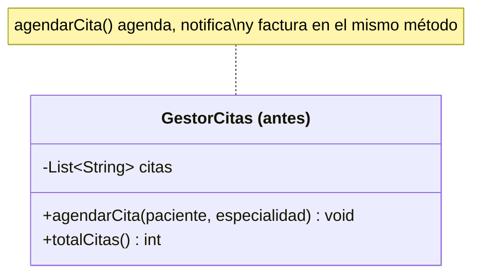
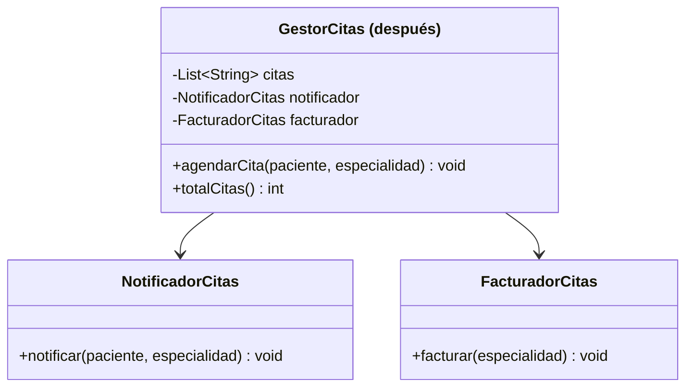

# 💡 Ejemplo 02 — Responsabilidad Única (SRP)

## 🌍 Contexto

En MediSalud, agendar una cita involucra varias tareas: registrar la cita, avisarle al paciente y
calcular su factura. Es tentador resolver las tres en el mismo método, porque las tres "pasan" cuando se
agenda una cita. Pero cada una responde a un motivo de cambio distinto: la forma de notificar puede
cambiar (de consola a email), la forma de facturar puede cambiar (nuevas tarifas, impuestos), y la forma
de agendar puede cambiar (validaciones nuevas) — cada una por su cuenta, sin que las otras dos tengan que
tocarse.

**Qué busca demostrar este ejemplo**: que separar responsabilidades en clases distintas no cambia el
comportamiento observable del programa — produce exactamente la misma salida — y sí reduce los motivos
por los que cada clase podría necesitar cambiar en el futuro.

## 🏥 Caso de estudio

MediSalud registra citas médicas. Cada vez que se agenda una, el sistema debe guardarla, notificar al
paciente y generar su factura según la especialidad consultada.

## 🗺️ Diagrama





*Arriba, la versión "antes" (una sola clase con tres responsabilidades). Abajo, la versión "después"
(cada responsabilidad en su propia clase, colaborando por composición).*

## 🌳 Árbol de archivos — antes

```text
srp-antes/
└── com/medisalud/
    ├── GestorCitas.java
    └── Demo.java
```

## 💻 Archivo: GestorCitas.java

```java
package com.medisalud;

import java.util.ArrayList;
import java.util.List;

public class GestorCitas {
    private List<String> citas = new ArrayList<>();

    public void agendarCita(String paciente, String especialidad) {
        citas.add(paciente + " - " + especialidad);

        // Responsabilidad 2: notificar (mezclada con agendar)
        System.out.println("Notificacion: cita agendada para " + paciente + " (" + especialidad + ")");

        // Responsabilidad 3: facturar (mezclada con agendar)
        double monto = especialidad.equals("Cardiologia") ? 5000.0 : 3000.0;
        System.out.println("Factura: $" + monto + " por consulta de " + especialidad);
    }

    public int totalCitas() {
        return citas.size();
    }
}
```

## 💻 Archivo: Demo.java

```java
package com.medisalud;

public class Demo {
    public static void main(String[] args) {
        // Datos de entrada
        GestorCitas gestor = new GestorCitas();
        gestor.agendarCita("Marta Diaz", "Cardiologia");
        gestor.agendarCita("Jorge Paz", "Pediatria");

        System.out.println("totalCitas=" + gestor.totalCitas());
    }
}
```

## ✅ Resultado esperado — antes

```text
Notificacion: cita agendada para Marta Diaz (Cardiologia)
Factura: $5000.0 por consulta de Cardiologia
Notificacion: cita agendada para Jorge Paz (Pediatria)
Factura: $3000.0 por consulta de Pediatria
totalCitas=2
```

## 🌳 Árbol de archivos — después

```text
srp-despues/
└── com/medisalud/
    ├── GestorCitas.java
    ├── NotificadorCitas.java
    ├── FacturadorCitas.java
    └── Demo.java
```

## 💻 Archivo: GestorCitas.java

```java
package com.medisalud;

import java.util.ArrayList;
import java.util.List;

public class GestorCitas {
    private List<String> citas = new ArrayList<>();
    private NotificadorCitas notificador;
    private FacturadorCitas facturador;

    public GestorCitas(NotificadorCitas notificador, FacturadorCitas facturador) {
        this.notificador = notificador;
        this.facturador = facturador;
    }

    public void agendarCita(String paciente, String especialidad) {
        citas.add(paciente + " - " + especialidad);
        notificador.notificar(paciente, especialidad);
        facturador.facturar(especialidad);
    }

    public int totalCitas() {
        return citas.size();
    }
}
```

## 💻 Archivo: NotificadorCitas.java

```java
package com.medisalud;

public class NotificadorCitas {
    public void notificar(String paciente, String especialidad) {
        System.out.println("Notificacion: cita agendada para " + paciente + " (" + especialidad + ")");
    }
}
```

## 💻 Archivo: FacturadorCitas.java

```java
package com.medisalud;

public class FacturadorCitas {
    public void facturar(String especialidad) {
        double monto = especialidad.equals("Cardiologia") ? 5000.0 : 3000.0;
        System.out.println("Factura: $" + monto + " por consulta de " + especialidad);
    }
}
```

## 💻 Archivo: Demo.java

```java
package com.medisalud;

public class Demo {
    public static void main(String[] args) {
        // Datos de entrada
        GestorCitas gestor = new GestorCitas(new NotificadorCitas(), new FacturadorCitas());
        gestor.agendarCita("Marta Diaz", "Cardiologia");
        gestor.agendarCita("Jorge Paz", "Pediatria");

        System.out.println("totalCitas=" + gestor.totalCitas());
    }
}
```

## ✅ Resultado esperado — después

```text
Notificacion: cita agendada para Marta Diaz (Cardiologia)
Factura: $5000.0 por consulta de Cardiologia
Notificacion: cita agendada para Jorge Paz (Pediatria)
Factura: $3000.0 por consulta de Pediatria
totalCitas=2
```

## 🔍 Comparación: la prueba concreta

Las dos versiones, ejecutadas con exactamente los mismos datos de entrada (`"Marta Diaz"` en
`"Cardiologia"`, `"Jorge Paz"` en `"Pediatria"`), producen **la misma salida, carácter por carácter**:
mismos mensajes de notificación, mismos montos de factura, mismo `totalCitas=2` al final. Refactorizar
para separar responsabilidades no cambió una sola línea de lo que el programa imprime — solo cambió cómo
está organizado el código que lo produce. Eso es lo que permite decir que la versión "después" respeta
SRP sin sacrificar nada: el comportamiento observable es idéntico, pero ahora `GestorCitas` tiene un solo
motivo para cambiar (cómo se agenda), `NotificadorCitas` otro (cómo se notifica) y `FacturadorCitas` otro
(cómo se factura).

## 🔍 Análisis: errores frecuentes

El error más frecuente al aplicar SRP es confundir "una responsabilidad" con "un método". Una clase
puede tener varios métodos y seguir teniendo una sola responsabilidad (por ejemplo, `GestorCitas` en la
versión "después" tiene dos métodos, `agendarCita` y `totalCitas`, pero ambos giran alrededor de un solo
motivo: administrar el registro de citas). La pregunta correcta no es "¿cuántos métodos tiene la clase?"
sino "¿cuántos motivos de negocio distintos podrían obligarme a modificarla?".

## ❓ Preguntas de repaso

**1. [Selección]** En la versión "antes", ¿cuántas responsabilidades distintas mezcla el método
`agendarCita`?

- A. Una.
- B. Dos.
- C. Tres: registrar la cita, notificar al paciente y facturar la consulta.
- D. Ninguna: agendar una cita es una sola responsabilidad, sin importar cuántas cosas haga el método.

<details>
<summary>🔑 Ver respuesta</summary>

**Respuesta correcta: C.** El método guarda la cita en la lista, imprime un mensaje de notificación y
calcula y muestra el monto de la factura — tres motivos de cambio distintos en el mismo bloque de código.

</details>

**2. [Selección múltiple]** ¿Cuáles de las siguientes afirmaciones sobre la versión "después" son
verdaderas?

- A. `GestorCitas` sigue teniendo el método `agendarCita`, pero ya no calcula el monto de la factura
  directamente.
- B. La salida del programa cambió respecto de la versión "antes".
- C. Un cambio en la forma de notificar (por ejemplo, agregar un correo electrónico) solo requeriría
  modificar `NotificadorCitas`.
- D. `NotificadorCitas` y `FacturadorCitas` se reciben por constructor en `GestorCitas`.

<details>
<summary>🔑 Ver respuesta</summary>

**Respuestas correctas: A, C y D.** B es falsa: la salida es exactamente la misma en ambas versiones,
comprobado con `diff` sobre la salida real de ambos programas.

</details>

**3. [Abierta]** Un compañero propone resolver el problema de la versión "antes" agregando comentarios
que dividan visualmente el método `agendarCita` en tres bloques (`// Responsabilidad 1`,
`// Responsabilidad 2`, `// Responsabilidad 3`), sin extraer ninguna clase nueva. ¿Ese cambio resuelve la
violación de SRP? Justificá tu respuesta.

<details>
<summary>🔑 Ver respuesta</summary>

No. Los comentarios pueden ayudar a leer el método, pero no cambian el hecho de fondo: las tres
responsabilidades siguen viviendo en la misma clase, y un cambio en cualquiera de ellas (la forma de
notificar, la forma de facturar) sigue obligando a modificar `GestorCitas`. SRP se resuelve moviendo cada
responsabilidad a su propia clase, no organizando visualmente el código que las mezcla.

</details>
