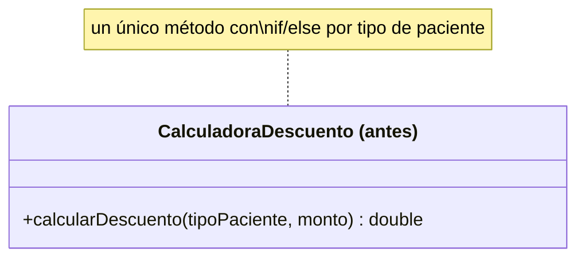
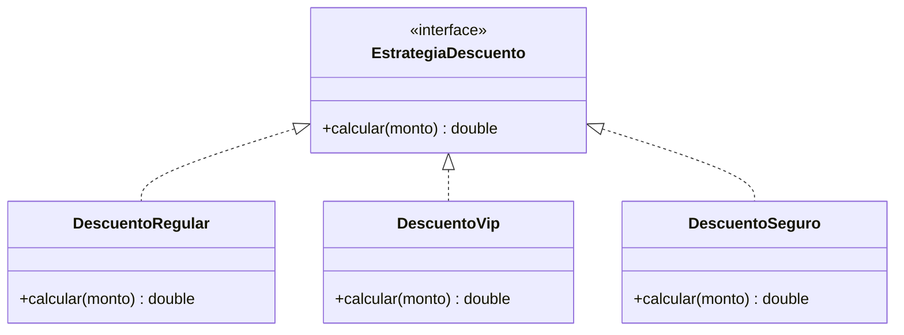

# 💡 Ejemplo 03 — Abierto/Cerrado (OCP)

## 🌍 Contexto

MediSalud aplica un descuento distinto según el tipo de paciente: regular, VIP o con seguro. La forma más
directa de programarlo es una cadena de `if`/`else` que compara el tipo contra cada caso. Funciona bien
mientras los tipos de paciente no cambien — pero en cuanto aparece un tipo nuevo (por ejemplo, pacientes
corporativos), hay que volver a abrir ese mismo método y modificarlo, con el riesgo de romper algo que ya
funcionaba para los tipos anteriores.

**Qué busca demostrar este ejemplo**: cuánto código hay que tocar para agregar un caso nuevo, comparado
entre una cadena de `if`/`else` y un diseño basado en una interfaz con una implementación por caso.

## 🏥 Caso de estudio

MediSalud calcula el descuento de una consulta según el tipo de paciente que la solicita.

## 🗺️ Diagrama





*Arriba, la versión "antes" (un método cerrado que hay que reabrir para cada caso nuevo). Abajo, la
versión "después" (una implementación nueva por cada tipo de paciente).*

## 🌳 Árbol de archivos — antes

```text
ocp-antes/
└── com/medisalud/
    ├── CalculadoraDescuento.java
    └── Demo.java
```

## 💻 Archivo: CalculadoraDescuento.java

```java
package com.medisalud;

public class CalculadoraDescuento {
    public double calcularDescuento(String tipoPaciente, double monto) {
        if (tipoPaciente.equals("REGULAR")) {
            return monto * 0.0;
        } else if (tipoPaciente.equals("VIP")) {
            return monto * 0.15;
        } else if (tipoPaciente.equals("SEGURO")) {
            return monto * 0.30;
        }
        throw new IllegalArgumentException("Tipo de paciente desconocido: " + tipoPaciente);
    }
}
```

## 💻 Archivo: Demo.java

```java
package com.medisalud;

public class Demo {
    public static void main(String[] args) {
        // Datos de entrada
        CalculadoraDescuento calculadora = new CalculadoraDescuento();

        System.out.println("REGULAR=" + calculadora.calcularDescuento("REGULAR", 1000.0));
        System.out.println("VIP=" + calculadora.calcularDescuento("VIP", 1000.0));
        System.out.println("SEGURO=" + calculadora.calcularDescuento("SEGURO", 1000.0));
    }
}
```

## ✅ Resultado esperado — antes

```text
REGULAR=0.0
VIP=150.0
SEGURO=300.0
```

## 🌳 Árbol de archivos — después

```text
ocp-despues/
└── com/medisalud/
    ├── EstrategiaDescuento.java
    ├── DescuentoRegular.java
    ├── DescuentoVip.java
    ├── DescuentoSeguro.java
    └── Demo.java
```

## 💻 Archivo: EstrategiaDescuento.java

```java
package com.medisalud;

public interface EstrategiaDescuento {
    double calcular(double monto);
}
```

## 💻 Archivo: DescuentoRegular.java

```java
package com.medisalud;

public class DescuentoRegular implements EstrategiaDescuento {
    public double calcular(double monto) {
        return monto * 0.0;
    }
}
```

## 💻 Archivo: DescuentoVip.java

```java
package com.medisalud;

public class DescuentoVip implements EstrategiaDescuento {
    public double calcular(double monto) {
        return monto * 0.15;
    }
}
```

## 💻 Archivo: DescuentoSeguro.java

```java
package com.medisalud;

public class DescuentoSeguro implements EstrategiaDescuento {
    public double calcular(double monto) {
        return monto * 0.30;
    }
}
```

## 💻 Archivo: Demo.java

```java
package com.medisalud;

public class Demo {
    public static void main(String[] args) {
        // Datos de entrada
        double monto = 1000.0;

        System.out.println("REGULAR=" + new DescuentoRegular().calcular(monto));
        System.out.println("VIP=" + new DescuentoVip().calcular(monto));
        System.out.println("SEGURO=" + new DescuentoSeguro().calcular(monto));
    }
}
```

## ✅ Resultado esperado — después

```text
REGULAR=0.0
VIP=150.0
SEGURO=300.0
```

## 🔍 Comparación: la prueba concreta

Ambas versiones producen la misma salida para los tres tipos originales. La diferencia real aparece al
agregar un cuarto tipo, `"CORPORATIVO"`, a cada una:

| Comparación | Resultado |
|---|---|
| `CalculadoraDescuento.java` de la versión "antes" agregando `"CORPORATIVO"` | El único método existente se modifica: se agrega una rama `else if` más dentro de `calcularDescuento`. |
| `EstrategiaDescuento.java`, `DescuentoRegular.java`, `DescuentoVip.java` y `DescuentoSeguro.java` de la versión "después" agregando `"CORPORATIVO"` | **Idénticos, byte a byte** (`diff` sin salida) — el caso nuevo se agrega solo con una clase nueva, `DescuentoCorporativo.java`, que implementa `EstrategiaDescuento`. |

En la versión "antes", agregar un caso nuevo exige reabrir y modificar el único método existente. En la
versión "después", las cuatro clases que ya existían (la interfaz y las tres implementaciones) quedan sin
ningún cambio — la extensión se hace agregando una clase, nunca modificando las que ya funcionaban:

## 💻 Archivo nuevo: DescuentoCorporativo.java

```java
package com.medisalud;

public class DescuentoCorporativo implements EstrategiaDescuento {
    public double calcular(double monto) {
        return monto * 0.20;
    }
}
```

## ✅ Resultado esperado tras extender — después

```text
REGULAR=0.0
VIP=150.0
SEGURO=300.0
CORPORATIVO=200.0
```

## 🔍 Análisis: errores frecuentes

El error más frecuente al aplicar OCP es pensar que "cerrado a modificación" significa que la clase nunca
puede volver a compilarse ni tocarse por ningún motivo. No es así: significa que agregar un **caso nuevo
del mismo tipo de variación** (otro tipo de paciente, en este ejemplo) no debería exigir modificar el
código ya existente y ya probado. Otros cambios — corregir un bug, cambiar el nombre de un método — siguen
siendo cambios legítimos sobre esas clases.

## ❓ Preguntas de repaso

**1. [Selección]** ¿Qué significa que `CalculadoraDescuento` (versión "antes") viole OCP?

- A. Que la clase no compila.
- B. Que agregar un tipo de paciente nuevo exige modificar el único método existente.
- C. Que la clase tiene demasiados atributos.
- D. Que el método `calcularDescuento` es demasiado largo en líneas de código.

<details>
<summary>🔑 Ver respuesta</summary>

**Respuesta correcta: B.** OCP mide cuánto código existente hay que modificar para agregar un caso
nuevo — no la longitud ni la cantidad de atributos de la clase.

</details>

**2. [Selección múltiple]** Comparando el `diff` real de agregar `"CORPORATIVO"` a ambas versiones,
¿cuáles afirmaciones son verdaderas?

- A. `CalculadoraDescuento.java` cambia: se agrega una rama `else if` al método existente.
- B. `EstrategiaDescuento.java`, `DescuentoRegular.java`, `DescuentoVip.java` y `DescuentoSeguro.java`
  quedan exactamente iguales, byte a byte.
- C. El caso nuevo, en la versión "después", se agrega con una clase nueva: `DescuentoCorporativo.java`.
- D. En la versión "después" también hay que modificar `DescuentoVip.java` para que reconozca el caso
  corporativo.

<details>
<summary>🔑 Ver respuesta</summary>

**Respuestas correctas: A, B y C.** D es falsa: `DescuentoVip.java` no tiene ninguna relación con el caso
corporativo y no requiere ningún cambio — esa es justamente la prueba de que la versión "después" respeta
OCP.

</details>

**3. [Abierta]** Un compañero dice: "para respetar OCP, nunca más se puede volver a tocar
`EstrategiaDescuento.java` ni ninguna de sus implementaciones, pase lo que pase". ¿Estás de acuerdo?
Justificá tu respuesta.

<details>
<summary>🔑 Ver respuesta</summary>

No completamente. OCP dice que agregar un caso nuevo del mismo tipo de variación (otro tipo de paciente)
no debería requerir modificar las clases existentes — y eso se cumplió, como muestra el `diff`. Pero eso
no significa que esas clases sean intocables para siempre: si aparece un bug real en `DescuentoVip`, por
ejemplo un error en la fórmula del 15%, corregirlo sigue siendo un cambio legítimo. OCP protege contra
tener que modificar código que funciona correctamente solo para agregar una variación nueva del mismo
tipo, no contra cualquier modificación futura.

</details>
