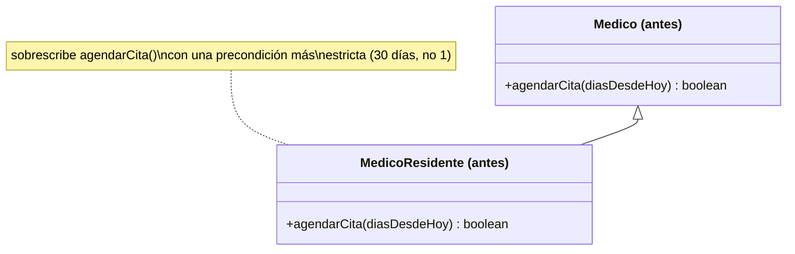
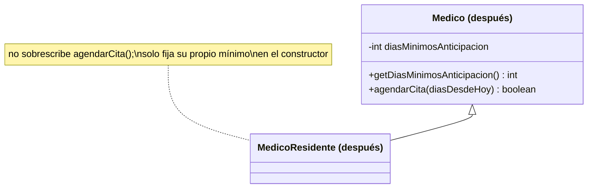

# 💡 Ejemplo 04 — Sustitución de Liskov (LSP)

## 🌍 Contexto

En MediSalud, cualquier `Medico` puede agendar una cita con al menos un día de anticipación. Los médicos
residentes son un tipo particular de médico: solo atienden con al menos 30 días de anticipación. Es
tentador expresar esa diferencia sobrescribiendo `agendarCita` en `MedicoResidente` con una condición más
estricta. El problema aparece cuando un código trata a todos los médicos de manera uniforme, como
`Medico`: la misma llamada, con el mismo argumento, da resultados distintos según el tipo real del
objeto, sin ningún aviso.

**Qué busca demostrar este ejemplo**: que sustituir la superclase por la subclase, en un código que las
trata de forma uniforme, puede producir un resultado silenciosamente distinto — sin lanzar ninguna
excepción — y cómo evitarlo.

## 🏥 Caso de estudio

MediSalud agenda citas para médicos de planta y para médicos residentes, cada uno con su propio mínimo de
días de anticipación.

## 🗺️ Diagrama





*Arriba, la versión "antes" (la subclase sobrescribe el método con una regla más estricta). Abajo, la
versión "después" (el mínimo es un dato de la superclase, consultable, no una regla oculta).*

## 🌳 Árbol de archivos — antes

```text
lsp-antes/
└── com/medisalud/
    ├── Medico.java
    ├── MedicoResidente.java
    └── Demo.java
```

## 💻 Archivo: Medico.java

```java
package com.medisalud;

public class Medico {
    protected String nombre;

    public Medico(String nombre) {
        this.nombre = nombre;
    }

    public boolean agendarCita(int diasDesdeHoy) {
        if (diasDesdeHoy < 1) {
            return false;
        }
        System.out.println(nombre + ": cita agendada para dentro de " + diasDesdeHoy + " dias");
        return true;
    }

    public String getNombre() {
        return nombre;
    }
}
```

## 💻 Archivo: MedicoResidente.java

```java
package com.medisalud;

public class MedicoResidente extends Medico {
    public MedicoResidente(String nombre) {
        super(nombre);
    }

    @Override
    public boolean agendarCita(int diasDesdeHoy) {
        // Precondicion mas estricta que la de Medico: exige 30 dias, no 1
        if (diasDesdeHoy < 30) {
            System.out.println(nombre + ": cita NO agendada (los residentes solo atienden con 30 dias de anticipacion)");
            return false;
        }
        System.out.println(nombre + ": cita agendada para dentro de " + diasDesdeHoy + " dias");
        return true;
    }
}
```

## 💻 Archivo: Demo.java

```java
package com.medisalud;

import java.util.List;

public class Demo {
    public static void main(String[] args) {
        // Datos de entrada
        List<Medico> medicos = List.of(new Medico("Ana Torres"), new MedicoResidente("Carlos Ruiz"));

        for (Medico medico : medicos) {
            boolean exito = medico.agendarCita(7);
            System.out.println("resultado=" + exito);
        }
    }
}
```

## ✅ Resultado esperado — antes

```text
Ana Torres: cita agendada para dentro de 7 dias
resultado=true
Carlos Ruiz: cita NO agendada (los residentes solo atienden con 30 dias de anticipacion)
resultado=false
```

## 🌳 Árbol de archivos — después

```text
lsp-despues/
└── com/medisalud/
    ├── Medico.java
    ├── MedicoResidente.java
    └── Demo.java
```

## 💻 Archivo: Medico.java

```java
package com.medisalud;

public class Medico {
    protected String nombre;
    private int diasMinimosAnticipacion;

    public Medico(String nombre) {
        this(nombre, 1);
    }

    protected Medico(String nombre, int diasMinimosAnticipacion) {
        this.nombre = nombre;
        this.diasMinimosAnticipacion = diasMinimosAnticipacion;
    }

    public int getDiasMinimosAnticipacion() {
        return diasMinimosAnticipacion;
    }

    public boolean agendarCita(int diasDesdeHoy) {
        if (diasDesdeHoy < diasMinimosAnticipacion) {
            return false;
        }
        System.out.println(nombre + ": cita agendada para dentro de " + diasDesdeHoy + " dias");
        return true;
    }

    public String getNombre() {
        return nombre;
    }
}
```

## 💻 Archivo: MedicoResidente.java

```java
package com.medisalud;

public class MedicoResidente extends Medico {
    public MedicoResidente(String nombre) {
        super(nombre, 30);
    }
}
```

## 💻 Archivo: Demo.java

```java
package com.medisalud;

import java.util.List;

public class Demo {
    public static void main(String[] args) {
        // Datos de entrada
        List<Medico> medicos = List.of(new Medico("Ana Torres"), new MedicoResidente("Carlos Ruiz"));

        for (Medico medico : medicos) {
            int minimo = medico.getDiasMinimosAnticipacion();
            System.out.println(medico.getNombre() + ": minimo=" + minimo + " dias");
            boolean exito = medico.agendarCita(minimo);
            System.out.println("resultado=" + exito);
        }
    }
}
```

## ✅ Resultado esperado — después

```text
Ana Torres: minimo=1 dias
Ana Torres: cita agendada para dentro de 1 dias
resultado=true
Carlos Ruiz: minimo=30 dias
Carlos Ruiz: cita agendada para dentro de 30 dias
resultado=true
```

## 🔍 Comparación: la prueba concreta

En la versión "antes", `Demo` recorre una `List<Medico>` mixta y llama a `medico.agendarCita(7)` sobre
cada uno, sin distinguir el tipo real. Para `Medico`, `7` es suficiente y devuelve `true`. Para
`MedicoResidente`, la misma llamada `agendarCita(7)` devuelve `false` **en silencio**: no hay ninguna
excepción, ningún mensaje de error, solo un resultado distinto ante el mismo argumento. Un código que
confía en `Medico` para tratar a todos los médicos de manera uniforme puede terminar descartando citas
válidas sin saber por qué.

En la versión "después", `Demo` ya no asume un mínimo fijo: consulta `getDiasMinimosAnticipacion()` de
cada médico antes de agendar, y usa ese valor real. `Medico` responde `1`, `MedicoResidente` responde
`30` — el mínimo pasó de ser una regla oculta dentro de un método sobrescrito a ser un dato explícito y
consultable de la superclase. Cualquier código que trabaje con `Medico` puede preguntar por ese mínimo en
vez de descubrirlo por un resultado inesperado.

## 🔍 Análisis: errores frecuentes

El error más frecuente al pensar en LSP es asumir que solo se viola lanzando una excepción que la
superclase no lanzaba (por ejemplo, que `MedicoResidente.agendarCita` lance una
`IllegalArgumentException` cuando faltan días). Esa es una forma real de violar LSP, pero no la única: en
este ejemplo, la violación es más sutil porque el programa nunca falla — simplemente responde distinto en
silencio. Reconocer esta segunda forma es tan importante como reconocer la primera: un método que
devuelve un resultado silenciosamente diferente ante la misma llamada, por una precondición más estricta,
rompe la sustitución igual que una excepción inesperada.

## ❓ Preguntas de repaso

**1. [Selección]** En la versión "antes", ¿qué le exige `MedicoResidente.agendarCita` a
`diasDesdeHoy` que `Medico.agendarCita` no exige?

- A. Que sea un número negativo.
- B. Que sea al menos 30, en vez de al menos 1.
- C. Que sea un múltiplo de 7.
- D. Nada: ambas exigen exactamente lo mismo.

<details>
<summary>🔑 Ver respuesta</summary>

**Respuesta correcta: B.** `MedicoResidente` estrecha la precondición heredada: donde `Medico` acepta
cualquier valor desde 1, `MedicoResidente` exige al menos 30.

</details>

**2. [Selección múltiple]** Sobre la llamada `medico.agendarCita(7)` dentro del `for` de la versión
"antes", ¿cuáles afirmaciones son verdaderas?

- A. Para el objeto `Medico`, la llamada devuelve `true`.
- B. Para el objeto `MedicoResidente`, la llamada devuelve `false`.
- C. El programa lanza una excepción al llegar al `MedicoResidente`.
- D. El código del `for` es exactamente el mismo para ambos objetos: no distingue el tipo real.

<details>
<summary>🔑 Ver respuesta</summary>

**Respuestas correctas: A, B y D.** C es falsa: el programa no lanza ninguna excepción, termina
normalmente con código 0 — la violación de LSP aquí es un resultado silenciosamente distinto, no un
error.

</details>

**3. [Abierta]** Explica, en tus palabras, por qué el ejemplo de este módulo (precondición más estricta,
resultado `false` en silencio) es una violación de LSP tan real como el caso clásico de "la subclase
lanza una excepción que la superclase nunca lanzaba".

<details>
<summary>🔑 Ver respuesta</summary>

LSP exige que sustituir la superclase por la subclase no sorprenda a quien usa el objeto a través del
tipo de la superclase. Una excepción nueva es una sorpresa evidente: el programa se detiene donde antes
no se detenía. Pero un resultado silenciosamente distinto es una sorpresa igual de real, solo que más
difícil de detectar: el programa sigue corriendo, no hay ningún mensaje de error, y sin embargo el
resultado de la misma llamada cambió según el tipo real del objeto. En ambos casos, un código escrito
contra la superclase deja de comportarse como se esperaba al recibir un objeto de la subclase.

</details>
