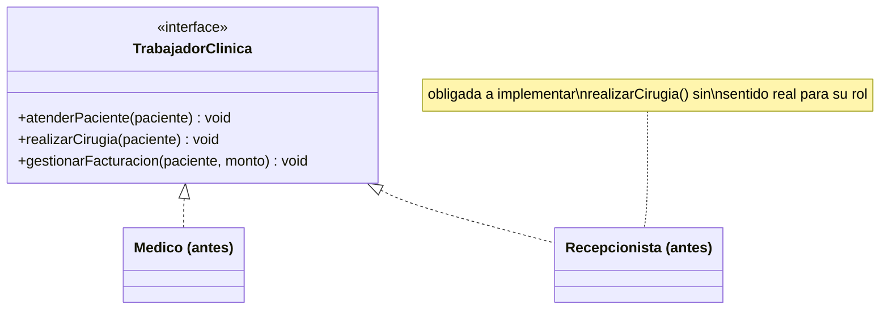
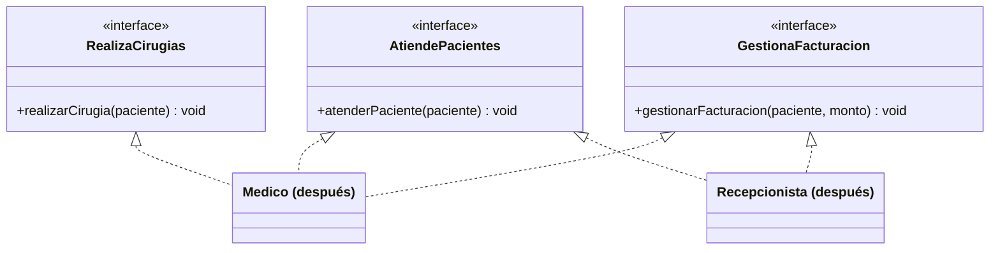

# 💡 Ejemplo 05 — Segregación de Interfaces (ISP)

## 🌍 Contexto

En MediSalud trabajan distintos roles: médicos y personal de recepción, entre otros. Es tentador
declarar una única interfaz `TrabajadorClinica` con todos los métodos que "alguien en la clínica" podría
necesitar: atender pacientes, realizar cirugías, gestionar facturación. El problema aparece cuando un rol
que no realiza cirugías, como `Recepcionista`, se ve obligado por el compilador a implementar
`realizarCirugia` de todas formas, aunque no exista ninguna implementación con sentido real para ese
método.

**Qué busca demostrar este ejemplo**: que dividir una interfaz "gorda" en interfaces más pequeñas, una
por capacidad, elimina la obligación de implementar métodos sin sentido — y que la prueba de que la
corrección funcionó es que el código que llamaba a ese método ya no compila.

## 🏥 Caso de estudio

MediSalud tiene médicos y personal de recepción. Ambos atienden pacientes y gestionan facturación; solo
los médicos realizan cirugías.

## 🗺️ Diagrama





*Arriba, la versión "antes" (una interfaz gorda con métodos de roles distintos). Abajo, la versión
"después" (una interfaz por capacidad; cada clase implementa solo las que le corresponden).*

## 🌳 Árbol de archivos — antes

```text
isp-antes/
└── com/medisalud/
    ├── TrabajadorClinica.java
    ├── Medico.java
    ├── Recepcionista.java
    └── Demo.java
```

## 💻 Archivo: TrabajadorClinica.java

```java
package com.medisalud;

public interface TrabajadorClinica {
    void atenderPaciente(String paciente);
    void realizarCirugia(String paciente);
    void gestionarFacturacion(String paciente, double monto);
}
```

## 💻 Archivo: Medico.java

```java
package com.medisalud;

public class Medico implements TrabajadorClinica {
    private String nombre;

    public Medico(String nombre) {
        this.nombre = nombre;
    }

    public void atenderPaciente(String paciente) {
        System.out.println(nombre + " atiende a " + paciente);
    }

    public void realizarCirugia(String paciente) {
        System.out.println(nombre + " realiza cirugia a " + paciente);
    }

    public void gestionarFacturacion(String paciente, double monto) {
        System.out.println(nombre + " factura $" + monto + " a " + paciente);
    }
}
```

## 💻 Archivo: Recepcionista.java

```java
package com.medisalud;

public class Recepcionista implements TrabajadorClinica {
    private String nombre;

    public Recepcionista(String nombre) {
        this.nombre = nombre;
    }

    public void atenderPaciente(String paciente) {
        System.out.println(nombre + " recibe a " + paciente + " en recepcion");
    }

    public void realizarCirugia(String paciente) {
        // La interfaz obliga a declarar este metodo, pero una recepcionista no realiza cirugias:
        // no hay ninguna implementacion con sentido real para este rol.
        System.out.println(nombre + " no puede realizar cirugias (no le corresponde este rol)");
    }

    public void gestionarFacturacion(String paciente, double monto) {
        System.out.println(nombre + " factura $" + monto + " a " + paciente);
    }
}
```

## 💻 Archivo: Demo.java

```java
package com.medisalud;

public class Demo {
    public static void main(String[] args) {
        // Datos de entrada
        TrabajadorClinica medico = new Medico("Ana Torres");
        TrabajadorClinica recepcionista = new Recepcionista("Lucia Fernandez");

        medico.atenderPaciente("Marta Diaz");
        medico.realizarCirugia("Marta Diaz");
        medico.gestionarFacturacion("Marta Diaz", 5000.0);

        recepcionista.atenderPaciente("Jorge Paz");
        recepcionista.realizarCirugia("Jorge Paz");
        recepcionista.gestionarFacturacion("Jorge Paz", 3000.0);
    }
}
```

## ✅ Resultado esperado — antes

```text
Ana Torres atiende a Marta Diaz
Ana Torres realiza cirugia a Marta Diaz
Ana Torres factura $5000.0 a Marta Diaz
Lucia Fernandez recibe a Jorge Paz en recepcion
Lucia Fernandez no puede realizar cirugias (no le corresponde este rol)
Lucia Fernandez factura $3000.0 a Jorge Paz
```

## 🌳 Árbol de archivos — después

```text
isp-despues/
└── com/medisalud/
    ├── AtiendePacientes.java
    ├── RealizaCirugias.java
    ├── GestionaFacturacion.java
    ├── Medico.java
    ├── Recepcionista.java
    └── Demo.java
```

## 💻 Archivo: AtiendePacientes.java

```java
package com.medisalud;

public interface AtiendePacientes {
    void atenderPaciente(String paciente);
}
```

## 💻 Archivo: RealizaCirugias.java

```java
package com.medisalud;

public interface RealizaCirugias {
    void realizarCirugia(String paciente);
}
```

## 💻 Archivo: GestionaFacturacion.java

```java
package com.medisalud;

public interface GestionaFacturacion {
    void gestionarFacturacion(String paciente, double monto);
}
```

## 💻 Archivo: Medico.java

```java
package com.medisalud;

public class Medico implements AtiendePacientes, RealizaCirugias, GestionaFacturacion {
    private String nombre;

    public Medico(String nombre) {
        this.nombre = nombre;
    }

    public void atenderPaciente(String paciente) {
        System.out.println(nombre + " atiende a " + paciente);
    }

    public void realizarCirugia(String paciente) {
        System.out.println(nombre + " realiza cirugia a " + paciente);
    }

    public void gestionarFacturacion(String paciente, double monto) {
        System.out.println(nombre + " factura $" + monto + " a " + paciente);
    }
}
```

## 💻 Archivo: Recepcionista.java

```java
package com.medisalud;

public class Recepcionista implements AtiendePacientes, GestionaFacturacion {
    private String nombre;

    public Recepcionista(String nombre) {
        this.nombre = nombre;
    }

    public void atenderPaciente(String paciente) {
        System.out.println(nombre + " recibe a " + paciente + " en recepcion");
    }

    public void gestionarFacturacion(String paciente, double monto) {
        System.out.println(nombre + " factura $" + monto + " a " + paciente);
    }
}
```

## 💻 Archivo: Demo.java

```java
package com.medisalud;

public class Demo {
    public static void main(String[] args) {
        // Datos de entrada
        Medico medico = new Medico("Ana Torres");
        Recepcionista recepcionista = new Recepcionista("Lucia Fernandez");

        medico.atenderPaciente("Marta Diaz");
        medico.realizarCirugia("Marta Diaz");
        medico.gestionarFacturacion("Marta Diaz", 5000.0);

        recepcionista.atenderPaciente("Jorge Paz");
        recepcionista.gestionarFacturacion("Jorge Paz", 3000.0);
        // recepcionista.realizarCirugia(...) ya no existe: Recepcionista no implementa RealizaCirugias
    }
}
```

## ✅ Resultado esperado — después

```text
Ana Torres atiende a Marta Diaz
Ana Torres realiza cirugia a Marta Diaz
Ana Torres factura $5000.0 a Marta Diaz
Lucia Fernandez recibe a Jorge Paz en recepcion
Lucia Fernandez factura $3000.0 a Jorge Paz
```

## 🔍 Comparación: la prueba concreta

En la versión "antes", `Recepcionista.realizarCirugia` existe porque la interfaz obliga a declararlo,
pero su cuerpo no hace nada real: solo imprime que no le corresponde ese rol. El compilador no puede
detectar ese problema — el código compila y se ejecuta sin errores, aunque el método no tenga sentido.

En la versión "después", `Recepcionista` ya no implementa `RealizaCirugias`, así que
`realizarCirugia` simplemente no existe en su tipo. La prueba concreta de que ISP se corrigió no es una
ejecución que falle, sino un **error real de compilación** al intentar llamar a ese método sobre una
`Recepcionista`:

```text
DemoRoto.java:6: error: cannot find symbol
        recepcionista.realizarCirugia("Jorge Paz");
                     ^
  symbol:   method realizarCirugia(String)
  location: variable recepcionista of type Recepcionista
```

Este mensaje real de `javac` (verificado con Temurin 25) confirma que la interfaz dividida ya no permite
el error: no hace falta ejecutar nada para descubrir que `Recepcionista` no puede realizar cirugías, el
compilador lo impide antes de llegar a correr el programa.

## 🔍 Análisis: errores frecuentes

El error más frecuente al aplicar ISP es "resolverlo" dejando el método en la interfaz gorda pero con un
cuerpo vacío o con un mensaje de disculpa (como hace `Recepcionista.realizarCirugia` en la versión
"antes"). Eso no elimina la obligación de implementar el método: solo la disimula. La corrección real
pasa por dividir la interfaz según capacidades, de forma que cada clase implemente exactamente los
métodos que le corresponden a su rol — ni uno más.

## ❓ Preguntas de repaso

**1. [Selección]** En la versión "antes", ¿por qué `Recepcionista` implementa `realizarCirugia`?

- A. Porque de verdad realiza cirugías en algunos casos excepcionales.
- B. Porque la interfaz `TrabajadorClinica` obliga a declarar ese método, aunque no tenga sentido real
  para su rol.
- C. Porque Java exige que toda clase tenga al menos tres métodos.
- D. Porque hereda ese método de `Medico`.

<details>
<summary>🔑 Ver respuesta</summary>

**Respuesta correcta: B.** El compilador exige que toda clase que implemente `TrabajadorClinica`
declare los tres métodos de la interfaz, sin importar si tienen sentido real para ese rol.

</details>

**2. [Selección múltiple]** Sobre la versión "después", ¿cuáles afirmaciones son verdaderas?

- A. `Medico` implementa `AtiendePacientes`, `RealizaCirugias` y `GestionaFacturacion`.
- B. `Recepcionista` implementa `AtiendePacientes` y `GestionaFacturacion`, pero no `RealizaCirugias`.
- C. Intentar llamar a `recepcionista.realizarCirugia(...)` sobre una variable de tipo `Recepcionista`
  produce un error de compilación real.
- D. `Recepcionista` sigue teniendo un método `realizarCirugia` que imprime un mensaje de disculpa.

<details>
<summary>🔑 Ver respuesta</summary>

**Respuestas correctas: A, B y C.** D es falsa: en la versión "después", `Recepcionista` ya no declara
ese método en absoluto — no existe ni siquiera como una implementación vacía.

</details>

**3. [Abierta]** Explica, en tus palabras, por qué el mensaje `cannot find symbol` de `javac` es la
prueba de que ISP se corrigió, y no un error que haya que arreglar.

<details>
<summary>🔑 Ver respuesta</summary>

Ese mensaje aparece al intentar compilar un código que llama a `realizarCirugia` sobre una variable de
tipo `Recepcionista`, algo que en la versión "antes" sí compilaba (aunque no tuviera sentido real). El
mensaje demuestra que, tras dividir la interfaz, el compilador ya no permite tratar a una `Recepcionista`
como si pudiera realizar cirugías — el error es la señal de que el diseño ahora refleja correctamente las
capacidades reales de cada rol, no un bug a corregir en el material del curso.

</details>
