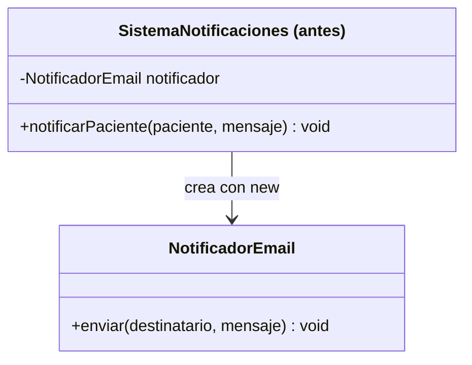
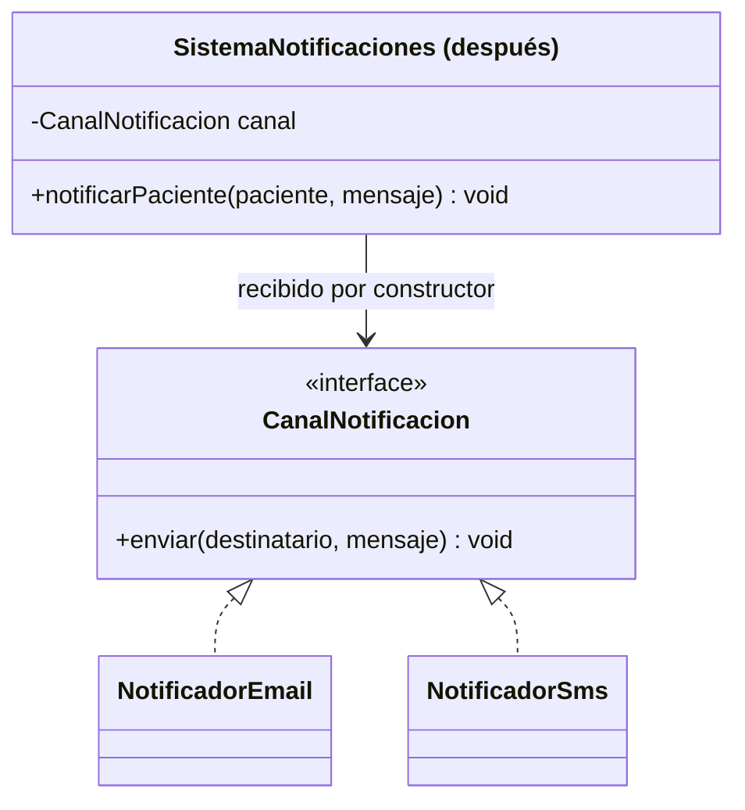

# 💡 Ejemplo 06 — Inversión de Dependencias (DIP)

## 🌍 Contexto

MediSalud notifica a sus pacientes cuando se les agenda una cita. La forma más directa de programarlo es
que `SistemaNotificaciones` cree su propio `NotificadorEmail` con `new`, dentro de su propio código. El
problema aparece el día que la clínica quiere notificar por SMS en vez de (o además de) email: como
`SistemaNotificaciones` depende directamente de `NotificadorEmail`, la única forma de cambiar el canal es
modificar el código de `SistemaNotificaciones`.

**Qué busca demostrar este ejemplo**: que una clase que depende de una abstracción, en vez de un detalle
concreto, puede funcionar con implementaciones distintas sin que su propio código cambie entre una
ejecución y otra.

## 🏥 Caso de estudio

MediSalud notifica a sus pacientes sobre sus citas, y quiere poder elegir el canal de notificación sin
reescribir la lógica que decide cuándo notificar.

## 🗺️ Diagrama





*Arriba, la versión "antes" (`SistemaNotificaciones` crea su propia dependencia concreta). Abajo, la
versión "después" (`SistemaNotificaciones` depende de una interfaz, inyectada por constructor).*

## 🌳 Árbol de archivos — antes

```text
dip-antes/
└── com/medisalud/
    ├── NotificadorEmail.java
    ├── SistemaNotificaciones.java
    └── Demo.java
```

## 💻 Archivo: NotificadorEmail.java

```java
package com.medisalud;

public class NotificadorEmail {
    public void enviar(String destinatario, String mensaje) {
        System.out.println("Email a " + destinatario + ": " + mensaje);
    }
}
```

## 💻 Archivo: SistemaNotificaciones.java

```java
package com.medisalud;

public class SistemaNotificaciones {
    private NotificadorEmail notificador = new NotificadorEmail();

    public void notificarPaciente(String paciente, String mensaje) {
        notificador.enviar(paciente, mensaje);
    }
}
```

## 💻 Archivo: Demo.java

```java
package com.medisalud;

public class Demo {
    public static void main(String[] args) {
        // Datos de entrada
        SistemaNotificaciones sistema = new SistemaNotificaciones();
        sistema.notificarPaciente("Marta Diaz", "Su cita es manana a las 10:00");
    }
}
```

## ✅ Resultado esperado — antes

```text
Email a Marta Diaz: Su cita es manana a las 10:00
```

## 🌳 Árbol de archivos — después

```text
dip-despues/
└── com/medisalud/
    ├── CanalNotificacion.java
    ├── NotificadorEmail.java
    ├── NotificadorSms.java
    ├── SistemaNotificaciones.java
    └── Demo.java
```

## 💻 Archivo: CanalNotificacion.java

```java
package com.medisalud;

public interface CanalNotificacion {
    void enviar(String destinatario, String mensaje);
}
```

## 💻 Archivo: NotificadorEmail.java

```java
package com.medisalud;

public class NotificadorEmail implements CanalNotificacion {
    public void enviar(String destinatario, String mensaje) {
        System.out.println("Email a " + destinatario + ": " + mensaje);
    }
}
```

## 💻 Archivo: NotificadorSms.java

```java
package com.medisalud;

public class NotificadorSms implements CanalNotificacion {
    public void enviar(String destinatario, String mensaje) {
        System.out.println("SMS a " + destinatario + ": " + mensaje);
    }
}
```

## 💻 Archivo: SistemaNotificaciones.java

```java
package com.medisalud;

public class SistemaNotificaciones {
    private CanalNotificacion canal;

    public SistemaNotificaciones(CanalNotificacion canal) {
        this.canal = canal;
    }

    public void notificarPaciente(String paciente, String mensaje) {
        canal.enviar(paciente, mensaje);
    }
}
```

## 💻 Archivo: Demo.java

```java
package com.medisalud;

public class Demo {
    public static void main(String[] args) {
        // Datos de entrada
        SistemaNotificaciones sistemaEmail = new SistemaNotificaciones(new NotificadorEmail());
        sistemaEmail.notificarPaciente("Marta Diaz", "Su cita es manana a las 10:00");

        SistemaNotificaciones sistemaSms = new SistemaNotificaciones(new NotificadorSms());
        sistemaSms.notificarPaciente("Jorge Paz", "Su cita es manana a las 11:00");
    }
}
```

## ✅ Resultado esperado — después

```text
Email a Marta Diaz: Su cita es manana a las 10:00
SMS a Jorge Paz: Su cita es manana a las 11:00
```

## 🔍 Comparación: la prueba concreta

En la versión "antes", `SistemaNotificaciones` solo puede notificar por email: `NotificadorEmail` está
"cableado" dentro de su propio constructor, así que la única forma de notificar por otro canal es
modificar el código de `SistemaNotificaciones`.

En la versión "después", `SistemaNotificaciones` recibe un `CanalNotificacion` por constructor y no sabe
—ni le importa— si ese canal es email, SMS o cualquier otra implementación futura. `Demo` crea **dos**
instancias de `SistemaNotificaciones`, una con `NotificadorEmail` y otra con `NotificadorSms`, y ambas
notifican correctamente por su canal respectivo — sin que una sola línea de `SistemaNotificaciones`
cambie entre una ejecución y la otra. La misma clase sirve para los dos canales porque depende de la
abstracción `CanalNotificacion`, no de un detalle concreto.

## 🔍 Análisis: errores frecuentes

El error más frecuente al aplicar DIP es pensar que hace falta un framework de inyección de dependencias
para lograrlo. No es así: en Java plano, "inyectar por constructor" es simplemente que la clase reciba la
interfaz como parámetro al crearse, en vez de instanciar la implementación con `new` dentro de su propio
código. Ese cambio, por sí solo, ya invierte la dependencia: quien decide qué implementación usar pasa a
ser quien crea el objeto (en este ejemplo, `Demo`), no la clase que lo usa internamente.

## ❓ Preguntas de repaso

**1. [Selección]** En la versión "antes", ¿de qué depende directamente `SistemaNotificaciones`?

- A. De la interfaz `CanalNotificacion`.
- B. De la clase concreta `NotificadorEmail`, creada con `new` dentro de su propio constructor.
- C. De ninguna otra clase: no tiene dependencias.
- D. De `NotificadorSms`.

<details>
<summary>🔑 Ver respuesta</summary>

**Respuesta correcta: B.** `SistemaNotificaciones` crea `new NotificadorEmail()` dentro de su propio
código: depende de un detalle concreto, no de una abstracción.

</details>

**2. [Selección múltiple]** Sobre la versión "después", ¿cuáles afirmaciones son verdaderas?

- A. `SistemaNotificaciones` recibe `CanalNotificacion` por constructor.
- B. La misma clase `SistemaNotificaciones` funciona con `NotificadorEmail` y con `NotificadorSms`, sin
  que su código cambie entre una ejecución y la otra.
- C. Para notificar por SMS, hace falta modificar el código de `SistemaNotificaciones`.
- D. `NotificadorEmail` y `NotificadorSms` implementan la misma interfaz, `CanalNotificacion`.

<details>
<summary>🔑 Ver respuesta</summary>

**Respuestas correctas: A, B y D.** C es falsa: justamente porque `SistemaNotificaciones` depende de la
interfaz y no de un canal concreto, notificar por SMS solo requiere pasarle un `NotificadorSms` al crear
la instancia — no modificar su código.

</details>

**3. [Abierta]** Explica, en tus palabras, por qué DIP no requiere un framework de inyección de
dependencias, usando como ejemplo cómo `Demo` crea las dos instancias de `SistemaNotificaciones`.

<details>
<summary>🔑 Ver respuesta</summary>

DIP exige que una clase dependa de una abstracción, no de un detalle concreto — pero no dice nada sobre
cómo se le entrega esa abstracción. En este ejemplo, `Demo` simplemente escribe
`new SistemaNotificaciones(new NotificadorEmail())` y, en otra línea,
`new SistemaNotificaciones(new NotificadorSms())`: es código Java común, sin ninguna herramienta externa.
Un framework de inyección de dependencias automatiza esa decisión (elige qué implementación pasar según
configuración), pero el principio en sí ya se cumple con recibir la interfaz por constructor, que es
exactamente lo que hace `SistemaNotificaciones` en la versión "después".

</details>
