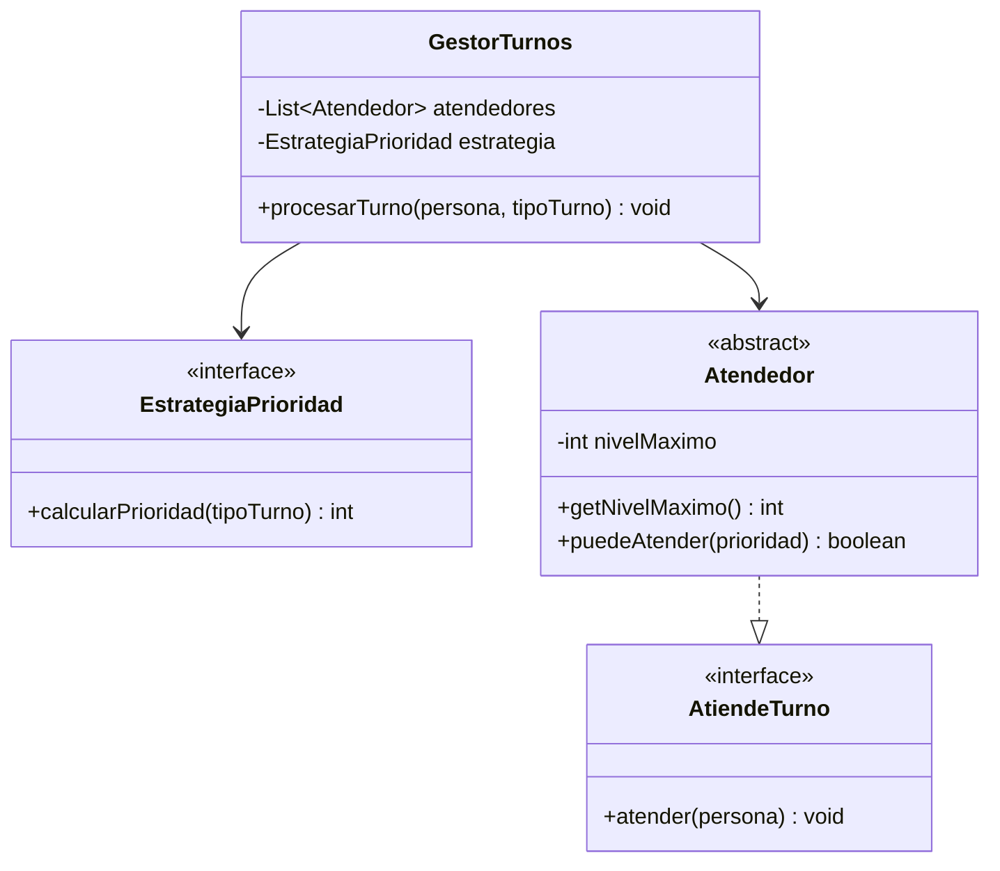

# 🏆 Desafío 01 — Diseñar un sistema pequeño que respete los 5 principios

## 🧩 Problema

La Biblioteca Universitaria quiere un sistema de turnos de atención: cada persona que llega solicita un
turno de un tipo (`"REGULAR"` o `"URGENTE"`), y debe ser atendida por alguien capacitado según la
prioridad de su turno. Hay distintos roles de personal (por ejemplo, pasantes y bibliotecarios), cada uno
capaz de atender hasta cierto nivel de prioridad, y la forma de calcular la prioridad de un turno debe
poder cambiar sin modificar el resto del sistema.

Diseña un sistema nuevo (no usado en los ejemplos de este módulo) que respete los cinco principios SOLID
a la vez.

## 💻 Código o contexto de partida

No se provee código de partida: el diseño es completamente tuyo. Como guía, pensá en:

- Una interfaz para "quien calcula la prioridad de un turno" (OCP + DIP), con al menos dos
  implementaciones que puedan intercambiarse.
- Una interfaz para "quien atiende un turno" (ISP), sin métodos que no todos los roles necesiten.
- Una jerarquía de roles donde cada uno declare, como un dato consultable, hasta qué nivel de prioridad
  puede atender — no como una condición sobrescrita en silencio (LSP).
- Una clase que orqueste el proceso de turnos sin imprimir nada por su cuenta: solo decide a quién le
  corresponde cada turno y delega la atención (SRP).

## 🗺️ Diagrama

## 🧪 Casos de prueba

| Entrada | Verificación | Resultado esperado |
|---|---|---|
| Al menos dos roles con distinto nivel máximo, y una estrategia que trata todos los turnos por igual | Un turno `"URGENTE"` | Lo atiende el rol de menor nivel, porque la estrategia no distingue el tipo |
| Los mismos dos roles, con una estrategia que sí distingue el tipo de turno | El mismo turno `"URGENTE"` | Lo atiende el rol de mayor nivel, porque la estrategia le asigna prioridad alta |

## 📏 Criterios de evaluación de la solución

- El sistema compila y se ejecuta con éxito, probado con al menos dos roles distintos y al menos dos
  estrategias de prioridad distintas.
- Se puede identificar, para cada clase o interfaz del diseño, a cuál de los cinco principios SOLID
  responde.
- Ningún rol sobrescribe un método heredado con una condición más estricta: el nivel que cada uno puede
  atender es un dato consultable.
- Agregar una estrategia de prioridad nueva no exige modificar ninguna de las existentes.

## 🚧 Restricciones

- No se reutiliza ninguna clase de los ejemplos ni de los demás ejercicios del módulo: todo el diseño es
  nuevo.
- No se usan `Set`, `Map`, `enum` ni excepciones como parte del diseño (temas fuera de alcance de este
  módulo).

## 📊 Dificultad

Desafío

## 🎓 Resultados de aprendizaje

- **RA-15**: dado un fragmento de código, identificar qué principio viola — y, en este caso, diseñar un
  sistema que no viole ninguno.
