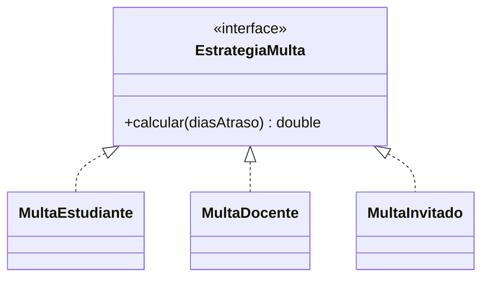

# 🟡 Intermedio 02 — Diseñar solución OCP

## 🧩 Problema

Tienes la misma clase de la Biblioteca Universitaria del ejercicio Básico 02:

## 💻 Código o contexto de partida

```java
package com.biblioteca;

public class CalculadoraMulta {
    public double calcularMulta(String tipoUsuario, int diasAtraso) {
        if (tipoUsuario.equals("ESTUDIANTE")) {
            return diasAtraso * 50.0;
        } else if (tipoUsuario.equals("DOCENTE")) {
            return diasAtraso * 20.0;
        } else if (tipoUsuario.equals("INVITADO")) {
            return diasAtraso * 100.0;
        }
        throw new IllegalArgumentException("Tipo de usuario desconocido: " + tipoUsuario);
    }
}
```

```java
package com.biblioteca;

public class Demo {
    public static void main(String[] args) {
        // Datos de entrada
        CalculadoraMulta calculadora = new CalculadoraMulta();

        System.out.println("ESTUDIANTE=" + calculadora.calcularMulta("ESTUDIANTE", 3));
        System.out.println("DOCENTE=" + calculadora.calcularMulta("DOCENTE", 3));
        System.out.println("INVITADO=" + calculadora.calcularMulta("INVITADO", 3));
    }
}
```

Rediséñala para que respete OCP: declara una interfaz con una implementación por tipo de usuario, de
forma que agregar un tipo nuevo no exija modificar ninguna de las clases existentes.

## 🗺️ Diagrama



## 🧪 Casos de prueba

| Entrada | Verificación | Resultado esperado |
|---|---|---|
| `calcular(3)` sobre cada implementación | Salida completa del programa antes y después de refactorizar | Idéntica, carácter por carácter |
| Se agrega un tipo nuevo (`MultaExterno`) como una clase que implementa la interfaz | Archivos existentes de la solución (interfaz y las tres implementaciones anteriores) | Sin ninguna modificación |

## 📏 Criterios de evaluación de la solución

- Declara una interfaz con un único método `calcular(int diasAtraso)`.
- Declara una implementación por tipo de usuario existente.
- La salida por consola no cambia respecto de la versión original.
- Un tipo de usuario nuevo se agrega con una clase nueva, sin modificar ninguna de las existentes.

## 🚧 Restricciones

- No se usan anotaciones ni un framework de inyección de dependencias.

## 📊 Dificultad

Intermedio

## 🎓 Resultados de aprendizaje

- **RA-7**: diseñar una solución que respete OCP.
