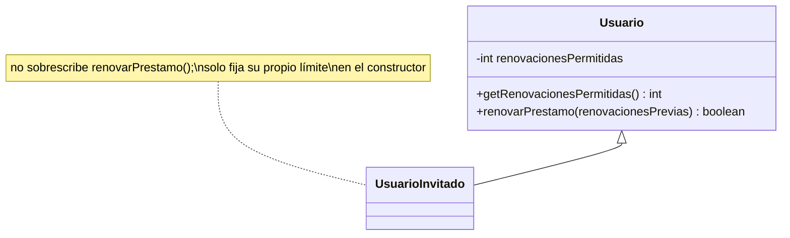

# 🟡 Intermedio 03 — Corregir violación de LSP

## 🧩 Problema

Tienes la misma jerarquía de la Biblioteca Universitaria del ejercicio Básico 03:

## 💻 Código o contexto de partida

```java
package com.biblioteca;

public class Usuario {
    protected String nombre;

    public Usuario(String nombre) {
        this.nombre = nombre;
    }

    public boolean renovarPrestamo(int renovacionesPrevias) {
        if (renovacionesPrevias >= 3) {
            return false;
        }
        System.out.println(nombre + ": prestamo renovado (van " + (renovacionesPrevias + 1) + ")");
        return true;
    }

    public String getNombre() {
        return nombre;
    }
}
```

```java
package com.biblioteca;

public class UsuarioInvitado extends Usuario {
    public UsuarioInvitado(String nombre) {
        super(nombre);
    }

    @Override
    public boolean renovarPrestamo(int renovacionesPrevias) {
        // Precondicion mas estricta que la de Usuario: exige 0 renovaciones previas, no 3
        if (renovacionesPrevias >= 0) {
            System.out.println(nombre + ": prestamo NO renovado (los invitados no pueden renovar)");
            return false;
        }
        System.out.println(nombre + ": prestamo renovado (van " + (renovacionesPrevias + 1) + ")");
        return true;
    }
}
```

```java
package com.biblioteca;

import java.util.List;

public class Demo {
    public static void main(String[] args) {
        // Datos de entrada
        List<Usuario> usuarios = List.of(new Usuario("Elena Ruiz"), new UsuarioInvitado("Pablo Sosa"));

        for (Usuario usuario : usuarios) {
            boolean exito = usuario.renovarPrestamo(0);
            System.out.println("resultado=" + exito);
        }
    }
}
```

Corrígela para que respete LSP: en vez de sobrescribir `renovarPrestamo` con una condición más estricta,
convierte el límite de renovaciones en un dato consultable de `Usuario`.

## 🗺️ Diagrama



## 🧪 Casos de prueba

| Entrada | Operación | Resultado esperado |
|---|---|---|
| `new Usuario("Elena Ruiz").getRenovacionesPermitidas()` | Consulta del límite | `3` |
| `new UsuarioInvitado("Pablo Sosa").getRenovacionesPermitidas()` | Consulta del límite | `0` |
| `List<Usuario>` mixta, `renovarPrestamo(0)` sobre cada uno | Recorrido uniforme por `Usuario` | Ningún resultado sorprende: cada uno puede consultarse antes de llamar |

## 📏 Criterios de evaluación de la solución

- `Usuario` declara un atributo consultable con el límite de renovaciones (por defecto 3).
- `UsuarioInvitado` ya no sobrescribe `renovarPrestamo`: solo fija su propio límite en el constructor
  (en 0).
- Un código que recorre una lista mixta puede consultar el límite real de cada usuario antes de actuar.

## 🚧 Restricciones

- No se usan excepciones para señalar el límite alcanzado.

## 📊 Dificultad

Intermedio

## 🎓 Resultados de aprendizaje

- **RA-10**: corregir una violación de LSP.
