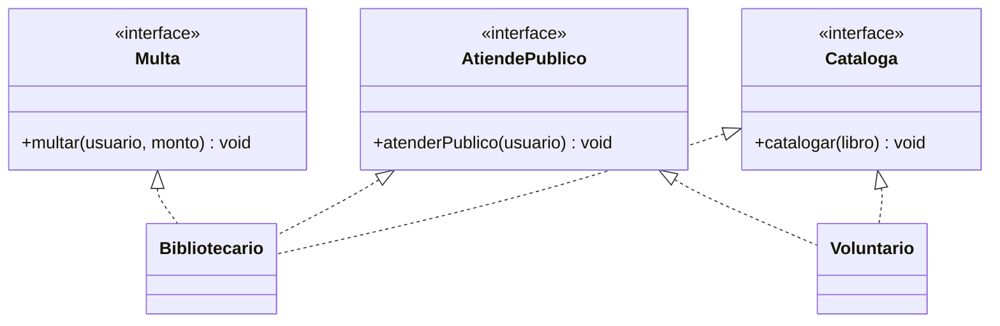

# 🟡 Intermedio 04 — Dividir interfaz que viola ISP

## 🧩 Problema

Tienes la misma interfaz y las mismas clases del ejercicio Básico 04:

## 💻 Código o contexto de partida

```java
package com.biblioteca;

public interface PersonalBiblioteca {
    void catalogar(String libro);
    void atenderPublico(String usuario);
    void multar(String usuario, double monto);
}
```

```java
package com.biblioteca;

public class Bibliotecario implements PersonalBiblioteca {
    private String nombre;

    public Bibliotecario(String nombre) {
        this.nombre = nombre;
    }

    public void catalogar(String libro) {
        System.out.println(nombre + " cataloga " + libro);
    }

    public void atenderPublico(String usuario) {
        System.out.println(nombre + " atiende a " + usuario);
    }

    public void multar(String usuario, double monto) {
        System.out.println(nombre + " multa $" + monto + " a " + usuario);
    }
}
```

```java
package com.biblioteca;

public class Voluntario implements PersonalBiblioteca {
    private String nombre;

    public Voluntario(String nombre) {
        this.nombre = nombre;
    }

    public void catalogar(String libro) {
        System.out.println(nombre + " cataloga " + libro);
    }

    public void atenderPublico(String usuario) {
        System.out.println(nombre + " atiende a " + usuario);
    }

    public void multar(String usuario, double monto) {
        // La interfaz obliga a declarar este metodo, pero un voluntario no puede aplicar multas:
        // no hay ninguna implementacion con sentido real para este rol.
        System.out.println(nombre + " no puede aplicar multas (no le corresponde este rol)");
    }
}
```

Divide `PersonalBiblioteca` en interfaces más pequeñas, una por capacidad, de forma que `Voluntario`
implemente solo las que le corresponden a su rol.

## 🗺️ Diagrama



## 🧪 Casos de prueba

| Entrada | Verificación | Resultado esperado |
|---|---|---|
| `bibliotecario.catalogar(...)`, `bibliotecario.multar(...)` | Compila y se ejecuta | Sin cambios respecto de la versión original |
| `voluntario.multar(...)` | Intento de llamada sobre una variable de tipo `Voluntario` | Ya no compila: `Voluntario` no implementa `Multa` |

## 📏 Criterios de evaluación de la solución

- Declara tres interfaces separadas, una por método de la interfaz original.
- `Bibliotecario` implementa las tres; `Voluntario` implementa solo `Cataloga` y `AtiendePublico`.
- El programa ya no llama a `multar` sobre el voluntario, porque ese método ya no existe en su tipo.

## 🚧 Restricciones

- No se usan clases anidadas ni internas para las interfaces nuevas.

## 📊 Dificultad

Intermedio

## 🎓 Resultados de aprendizaje

- **RA-12**: dividir una interfaz gorda dado un escenario.
