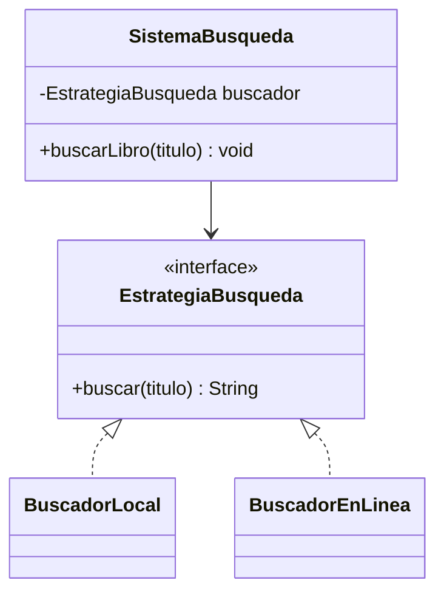

# 🟡 Intermedio 05 — Diseñar solución DIP

## 🧩 Problema

Tienes el mismo sistema de la Biblioteca Universitaria del ejercicio Básico 05:

## 💻 Código o contexto de partida

```java
package com.biblioteca;

public class BuscadorLocal {
    public String buscar(String titulo) {
        return "Encontrado en el catalogo local: " + titulo;
    }
}
```

```java
package com.biblioteca;

public class SistemaBusqueda {
    private BuscadorLocal buscador = new BuscadorLocal();

    public void buscarLibro(String titulo) {
        System.out.println(buscador.buscar(titulo));
    }
}
```

Rediséñalo para que respete DIP: declara una interfaz que ambas formas de buscar puedan implementar, y
haz que `SistemaBusqueda` la reciba por constructor. Agrega una segunda implementación,
`BuscadorEnLinea`, y prueba `SistemaBusqueda` con las dos.

## 🗺️ Diagrama



## 🧪 Casos de prueba

| Entrada | Operación | Resultado esperado |
|---|---|---|
| `new SistemaBusqueda(new BuscadorLocal()).buscarLibro("Rayuela")` | Búsqueda con el buscador local | `Encontrado en el catalogo local: Rayuela` |
| `new SistemaBusqueda(new BuscadorEnLinea()).buscarLibro("Ficciones")` | Misma clase `SistemaBusqueda`, otro buscador, sin modificar su código | `Encontrado en el catalogo en linea: Ficciones` |

## 📏 Criterios de evaluación de la solución

- Declara una interfaz `EstrategiaBusqueda` con un único método `buscar(String titulo)`.
- `SistemaBusqueda` recibe la interfaz por constructor, no crea la implementación con `new` internamente.
- La misma clase `SistemaBusqueda` funciona con ambas implementaciones sin que su código cambie entre
  una y otra.

## 🚧 Restricciones

- No se usa un framework de inyección de dependencias: la interfaz se pasa como parámetro del
  constructor, en Java plano.

## 📊 Dificultad

Intermedio

## 🎓 Resultados de aprendizaje

- **RA-14**: diseñar una solución que respete DIP.
