# Módulo 11 — Principios de Diseño SOLID

Curso de Java

---

## 🎯 Objetivos del módulo

- Explicar qué problema de diseño evita cada uno de los cinco principios SOLID.
- Identificar una violación de SRP, OCP, LSP, ISP o DIP dado un fragmento de código real.
- Refactorizar una clase que viola uno de estos principios sin cambiar su comportamiento observable.
- Diseñar una solución nueva que respete los cinco principios a la vez.

---

## 🗺️ Ruta de la sesión

1. Qué son los principios SOLID.
2. Responsabilidad Única (SRP).
3. Abierto/Cerrado (OCP).
4. Sustitución de Liskov (LSP).
5. Segregación de Interfaces (ISP).
6. Inversión de Dependencias (DIP).

---

## 🧠 ¿Qué es SOLID?

Cinco principios de diseño orientado a objetos que reparten bien las responsabilidades entre clases e
interfaces, para que un cambio futuro cueste agregar código, no reescribirlo.

---

## 🗺️ Diagrama: los cinco principios

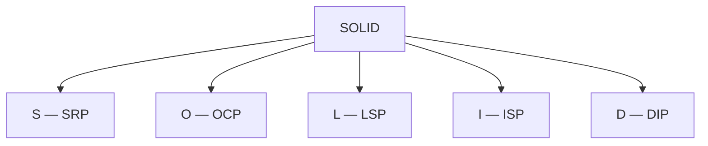

---

## 🧩 SRP: Responsabilidad Única

Todo el código de este módulo, "antes" y "después", **compila y se ejecuta correctamente**: el problema
que resuelven estos principios es de diseño, no de sintaxis ni de ejecución.

Una clase debe tener **una sola razón para cambiar**. Mezclar responsabilidades en un mismo método las
ata entre sí, aunque cada una responda a un motivo de cambio distinto.

---

## 🗺️ Diagrama: SRP antes/después

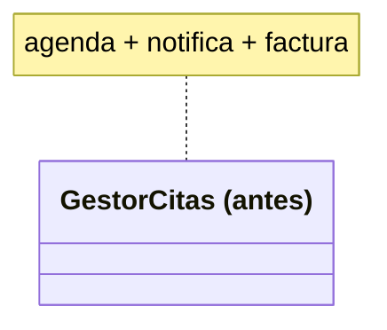

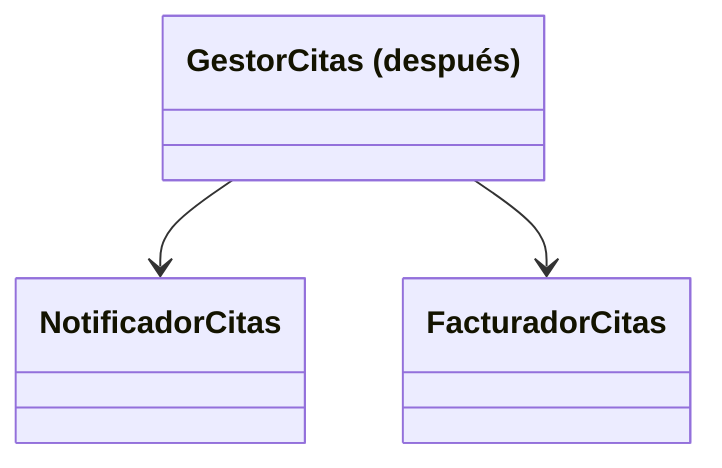

---

## 💻 SRP — antes

```java
public void agendarCita(String paciente, String especialidad) {
    citas.add(paciente + " - " + especialidad);
    System.out.println("Notificacion: cita agendada para " + paciente);
    double monto = especialidad.equals("Cardiologia") ? 5000.0 : 3000.0;
    System.out.println("Factura: $" + monto);
}
```

---

## 💻 SRP — después

```java
public void agendarCita(String paciente, String especialidad) {
    citas.add(paciente + " - " + especialidad);
    notificador.notificar(paciente, especialidad);
    facturador.facturar(especialidad);
}
```

---

## 🔍 SRP — la prueba concreta

Ambas versiones producen **exactamente la misma salida**. Refactorizar no cambió el comportamiento
observable, solo la organización del código.

---

## 🔓 OCP: Abierto/Cerrado

Una clase debe estar **abierta a extensión, cerrada a modificación**: agregar un caso nuevo no debería
exigir modificar el código que ya funcionaba.

---

## 🗺️ Diagrama: OCP antes/después

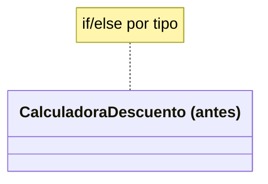

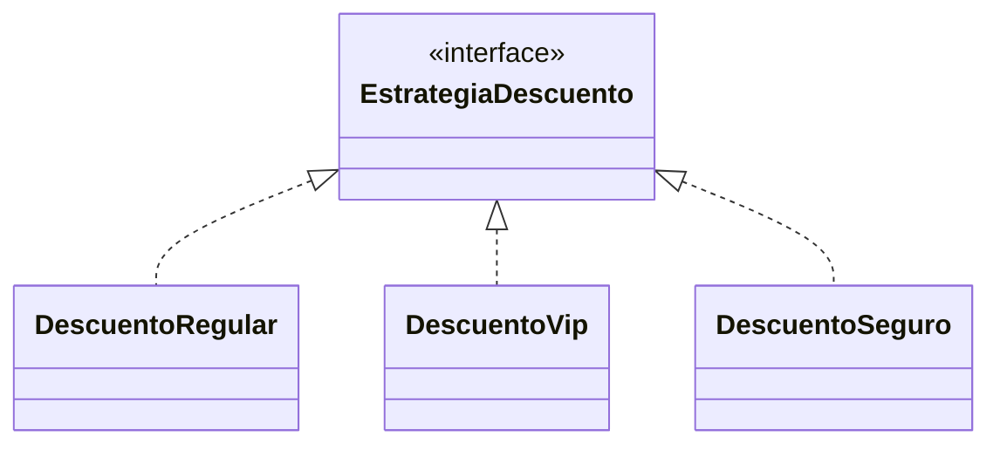

---

## 💻 OCP — antes

```java
public double calcularDescuento(String tipoPaciente, double monto) {
    if (tipoPaciente.equals("REGULAR")) return monto * 0.0;
    else if (tipoPaciente.equals("VIP")) return monto * 0.15;
    else if (tipoPaciente.equals("SEGURO")) return monto * 0.30;
    throw new IllegalArgumentException("Tipo desconocido: " + tipoPaciente);
}
```

---

## 💻 OCP — después

```java
interface EstrategiaDescuento {
    double calcular(double monto);
}

class DescuentoVip implements EstrategiaDescuento {
    public double calcular(double monto) { return monto * 0.15; }
}
```

---

## 🔍 OCP — la prueba concreta

Agregar un tipo nuevo (`"CORPORATIVO"`): la versión "antes" modifica su único método existente. La
versión "después" agrega solo una clase nueva — las cuatro existentes quedan **idénticas, byte a byte**.

---

## 🔄 LSP: Sustitución de Liskov

Un objeto de una subclase debe poder **sustituir** a uno de la superclase sin sorprender a quien lo usa
— ni con una excepción nueva, ni con un resultado silenciosamente distinto.

---

## 🗺️ Diagrama: LSP antes/después

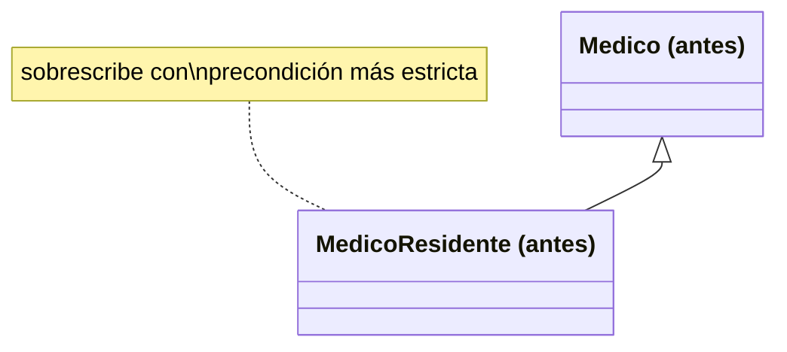

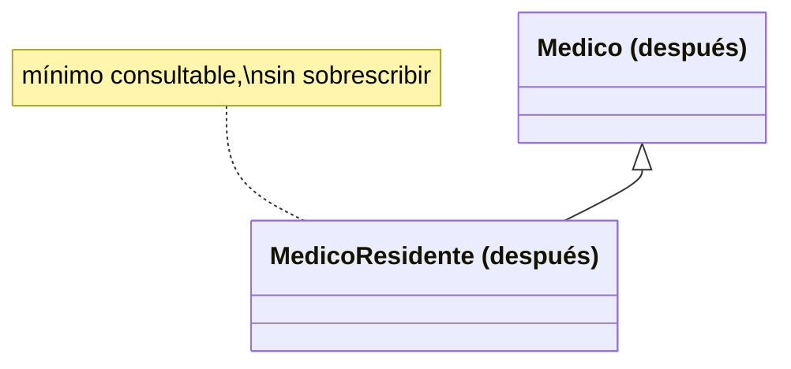

---

## 💻 LSP — antes

```java
@Override
public boolean agendarCita(int diasDesdeHoy) {
    if (diasDesdeHoy < 30) {
        return false;   // sorpresa silenciosa: Medico solo exigia 1
    }
    return true;
}
```

---

## 💻 LSP — después

```java
public int getDiasMinimosAnticipacion() {
    return diasMinimosAnticipacion;   // dato consultable, no una regla oculta
}
```

---

## 🔍 LSP — la prueba concreta

`agendarCita(7)` sobre una lista mixta de médicos: `Medico` responde `true`, `MedicoResidente` responde
`false` **sin ninguna excepción**. Una violación real de LSP no siempre lanza un error.

---

## ✂️ ISP: Segregación de Interfaces

Ninguna clase debe verse obligada a implementar métodos que **no usa**, por pertenecer a una interfaz
demasiado amplia.

---

## 🗺️ Diagrama: ISP antes/después

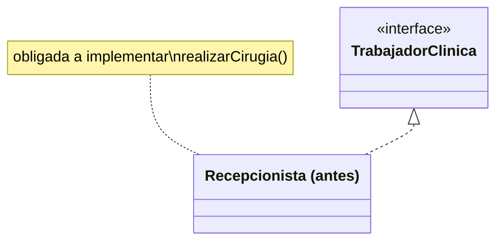

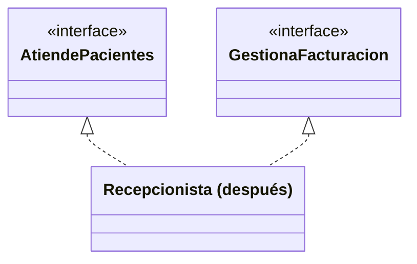

---

## 💻 ISP — antes

```java
public void realizarCirugia(String paciente) {
    // sin sentido real para una recepcionista
    System.out.println(nombre + " no puede realizar cirugias");
}
```

---

## 💻 ISP — después

```java
class Recepcionista implements AtiendePacientes, GestionaFacturacion {
    // ya no implementa RealizaCirugias: el metodo no existe en su tipo
}
```

---

## 🔍 ISP — la prueba concreta

```text
DemoRoto.java:6: error: cannot find symbol
        recepcionista.realizarCirugia("Jorge Paz");
                     ^
```

Un error real de `javac`, no una ejecución fallida: la prueba de que ISP se corrigió.

---

## 🔌 DIP: Inversión de Dependencias

Una clase debe depender de una **abstracción**, no de un detalle concreto creado con `new` dentro de su
propio código.

---

## 🗺️ Diagrama: DIP antes/después

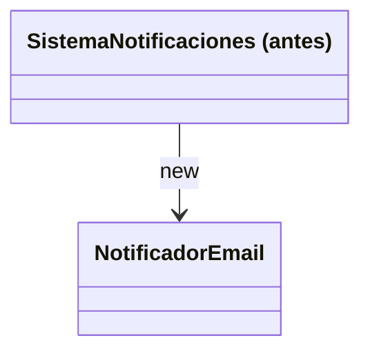

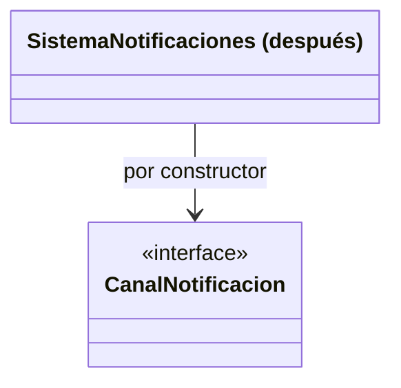

---

## 💻 DIP — antes

```java
class SistemaNotificaciones {
    private NotificadorEmail notificador = new NotificadorEmail();
}
```

---

## 💻 DIP — después

```java
class SistemaNotificaciones {
    private CanalNotificacion canal;
    public SistemaNotificaciones(CanalNotificacion canal) {
        this.canal = canal;
    }
}
```

---

## 🔍 DIP — la prueba concreta

La misma clase `SistemaNotificaciones`, ejecutada una vez con `NotificadorEmail` y otra con
`NotificadorSms`, notifica correctamente por ambos canales sin que su código cambie entre una ejecución
y la otra.

---

## ⚠️ Errores frecuentes, uno por principio

- **SRP**: confundir "una responsabilidad" con "un método".
- **OCP**: pensar que "cerrado a modificación" significa "intocable para siempre".
- **LSP**: asumir que solo se viola lanzando una excepción nueva.
- **ISP**: "resolverlo" con un método vacío en vez de dividir la interfaz.
- **DIP**: pensar que hace falta un framework de inyección de dependencias.

---

## 📋 Resumen de los cinco principios

| Sigla | Principio | Qué evita |
|---|---|---|
| S | Responsabilidad Única | Una clase con más de un motivo de cambio |
| O | Abierto/Cerrado | Modificar código existente para un caso nuevo |
| L | Sustitución de Liskov | Una subclase que sorprende a quien usa la superclase |
| I | Segregación de Interfaces | Una clase obligada a implementar lo que no usa |
| D | Inversión de Dependencias | Una clase atada a un detalle concreto |

---

## 🛠️ Taller: Rediseño SOLID de MediSalud

Vas a diseñar, desde cero, un sistema de citas que aplique los cinco principios a la vez: `GestorCitas`
con una sola responsabilidad, una estrategia de descuento inyectada y extensible, una jerarquía de
médicos sustituible sin sorpresas, y responsabilidades segregadas por interfaz.

---

## 🧪 Ejercicios: Biblioteca Universitaria

12 ejercicios, del 🟢 Básico al 🏆 Desafío: identificar violaciones, refactorizar, diseñar soluciones
nuevas y corregir un diseño con dos violaciones a la vez.

---

## ❓ Quiz 01

15 preguntas en formato entrevista técnica: una por cada resultado de aprendizaje, desde "qué representa
cada letra de SOLID" hasta "identificar qué principio viola un fragmento nuevo".

---

## 📚 Repaso: la pregunta clave de cada principio

- SRP: ¿esta clase tiene una sola razón para cambiar?
- OCP: ¿agregar un caso nuevo exige modificar código existente?
- LSP: ¿puedo sustituir la superclase por la subclase sin sorpresas?
- ISP: ¿esta clase implementa métodos que no usa?
- DIP: ¿dependo de un detalle concreto o de una abstracción?

---

## ✅ Checklist de cierre

- Puedo nombrar los cinco principios y qué evita cada uno.
- Puedo identificar una violación de cada uno dado un fragmento de código.
- Puedo refactorizar o rediseñar para corregirla, sin romper el comportamiento observable.

---

## 🎓 Cierre

Con SOLID termina el bloque de diseño orientado a objetos del curso: de aquí en más, cada clase nueva que
escribas puede evaluarse con estas cinco preguntas.
