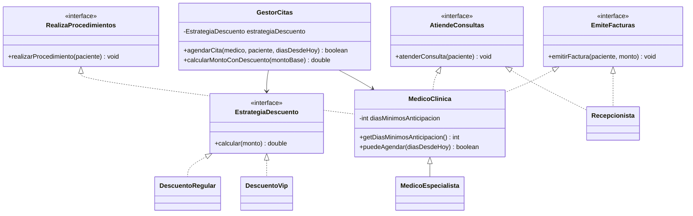

# 🔑 Solución del Taller 01 — Rediseño SOLID del sistema de citas de MediSalud

> Material docente, no enlazar desde la audiencia estudiante.

## 🗺️ Diagrama de clases



## 🌳 Árbol de archivos

```text
RediseñoCitasMediSalud/
└── com/medisalud/
    ├── EstrategiaDescuento.java
    ├── DescuentoRegular.java
    ├── DescuentoVip.java
    ├── AtiendeConsultas.java
    ├── RealizaProcedimientos.java
    ├── EmiteFacturas.java
    ├── MedicoClinica.java
    ├── MedicoEspecialista.java
    ├── Recepcionista.java
    ├── GestorCitas.java
    └── Demo.java
```

## 💻 Código completo

## 💻 Archivo: EstrategiaDescuento.java

```java
package com.medisalud;

public interface EstrategiaDescuento {
    double calcular(double monto);
}
```

## 💻 Archivo: DescuentoRegular.java

```java
package com.medisalud;

public class DescuentoRegular implements EstrategiaDescuento {
    public double calcular(double monto) {
        return monto * 0.0;
    }
}
```

## 💻 Archivo: DescuentoVip.java

```java
package com.medisalud;

public class DescuentoVip implements EstrategiaDescuento {
    public double calcular(double monto) {
        return monto * 0.20;
    }
}
```

## 💻 Archivo: AtiendeConsultas.java

```java
package com.medisalud;

public interface AtiendeConsultas {
    void atenderConsulta(String paciente);
}
```

## 💻 Archivo: RealizaProcedimientos.java

```java
package com.medisalud;

public interface RealizaProcedimientos {
    void realizarProcedimiento(String paciente);
}
```

## 💻 Archivo: EmiteFacturas.java

```java
package com.medisalud;

public interface EmiteFacturas {
    void emitirFactura(String paciente, double monto);
}
```

## 💻 Archivo: MedicoClinica.java

```java
package com.medisalud;

public class MedicoClinica implements AtiendeConsultas, RealizaProcedimientos, EmiteFacturas {
    protected String nombre;
    private int diasMinimosAnticipacion;

    public MedicoClinica(String nombre) {
        this(nombre, 1);
    }

    protected MedicoClinica(String nombre, int diasMinimosAnticipacion) {
        this.nombre = nombre;
        this.diasMinimosAnticipacion = diasMinimosAnticipacion;
    }

    public int getDiasMinimosAnticipacion() {
        return diasMinimosAnticipacion;
    }

    public boolean puedeAgendar(int diasDesdeHoy) {
        return diasDesdeHoy >= diasMinimosAnticipacion;
    }

    public String getNombre() {
        return nombre;
    }

    public void atenderConsulta(String paciente) {
        System.out.println(nombre + " atiende la consulta de " + paciente);
    }

    public void realizarProcedimiento(String paciente) {
        System.out.println(nombre + " realiza un procedimiento a " + paciente);
    }

    public void emitirFactura(String paciente, double monto) {
        System.out.println(nombre + " factura $" + monto + " a " + paciente);
    }
}
```

## 💻 Archivo: MedicoEspecialista.java

```java
package com.medisalud;

public class MedicoEspecialista extends MedicoClinica {
    public MedicoEspecialista(String nombre) {
        super(nombre, 15);
    }
}
```

## 💻 Archivo: Recepcionista.java

```java
package com.medisalud;

public class Recepcionista implements AtiendeConsultas, EmiteFacturas {
    private String nombre;

    public Recepcionista(String nombre) {
        this.nombre = nombre;
    }

    public void atenderConsulta(String paciente) {
        System.out.println(nombre + " recibe a " + paciente + " en recepcion");
    }

    public void emitirFactura(String paciente, double monto) {
        System.out.println(nombre + " factura $" + monto + " a " + paciente);
    }
}
```

## 💻 Archivo: GestorCitas.java

```java
package com.medisalud;

import java.util.ArrayList;
import java.util.List;

public class GestorCitas {
    private List<String> citas = new ArrayList<>();
    private EstrategiaDescuento estrategiaDescuento;

    public GestorCitas(EstrategiaDescuento estrategiaDescuento) {
        this.estrategiaDescuento = estrategiaDescuento;
    }

    public boolean agendarCita(MedicoClinica medico, String paciente, int diasDesdeHoy) {
        if (!medico.puedeAgendar(diasDesdeHoy)) {
            return false;
        }
        citas.add(medico.getNombre() + " - " + paciente);
        medico.atenderConsulta(paciente);
        return true;
    }

    public double calcularMontoConDescuento(double montoBase) {
        return montoBase - estrategiaDescuento.calcular(montoBase);
    }

    public int totalCitas() {
        return citas.size();
    }
}
```

## 💻 Archivo: Demo.java

```java
package com.medisalud;

public class Demo {
    public static void main(String[] args) {
        // Datos de entrada
        MedicoClinica clinico = new MedicoClinica("Ana Torres");
        MedicoClinica especialista = new MedicoEspecialista("Carlos Ruiz");

        GestorCitas gestorRegular = new GestorCitas(new DescuentoRegular());
        boolean cita1 = gestorRegular.agendarCita(clinico, "Marta Diaz", 3);
        System.out.println("cita1=" + cita1);
        System.out.println("montoRegular=" + gestorRegular.calcularMontoConDescuento(1000.0));

        GestorCitas gestorVip = new GestorCitas(new DescuentoVip());
        boolean cita2 = gestorVip.agendarCita(especialista, "Jorge Paz", 15);
        System.out.println("cita2=" + cita2);
        System.out.println("montoVip=" + gestorVip.calcularMontoConDescuento(1000.0));

        // Un cliente de MedicoEspecialista con menos dias que el minimo NO logra agendar
        boolean cita3 = gestorVip.agendarCita(especialista, "Lucia Fernandez", 3);
        System.out.println("cita3=" + cita3);

        System.out.println("totalCitasRegular=" + gestorRegular.totalCitas());
        System.out.println("totalCitasVip=" + gestorVip.totalCitas());
    }
}
```

## ✅ Salida real

```text
Ana Torres atiende la consulta de Marta Diaz
cita1=true
montoRegular=1000.0
Carlos Ruiz atiende la consulta de Jorge Paz
cita2=true
montoVip=800.0
cita3=false
totalCitasRegular=1
totalCitasVip=1
```

Verificado agregando una tercera estrategia de descuento (`DescuentoCorporativo implements
EstrategiaDescuento`, `monto * 0.35`): las diez clases existentes (`EstrategiaDescuento`,
`DescuentoRegular`, `DescuentoVip`, `AtiendeConsultas`, `RealizaProcedimientos`, `EmiteFacturas`,
`MedicoClinica`, `MedicoEspecialista`, `Recepcionista`, `GestorCitas`) quedan **idénticas, byte a byte**
(`diff` sin salida) — el caso nuevo se agrega solo con una clase nueva.

## ⚠️ Errores comunes observados

- **Volver a mezclar la facturación dentro de `GestorCitas`**: es tentador que `GestorCitas.agendarCita`
  también calcule e imprima la factura, "ya que está ahí". Eso reintroduce la violación de SRP que el
  taller pide evitar — facturar es responsabilidad de quien implementa `EmiteFacturas`, no de
  `GestorCitas`.
- **Crear la `EstrategiaDescuento` con `new` dentro de `GestorCitas`**: declarar
  `private EstrategiaDescuento estrategia = new DescuentoRegular();` como atributo, en vez de recibirla
  por constructor, reintroduce la violación de DIP — `GestorCitas` quedaría atado a un tipo de descuento
  fijo.
- **Sobrescribir el método que decide si un médico puede agendar**: declarar `puedeAgendar` en
  `MedicoEspecialista` con una condición distinta a la de `MedicoClinica`, en vez de fijar su propio
  mínimo consultable en el constructor, reintroduce la violación de LSP — un código uniforme sobre
  `MedicoClinica` podría volver a obtener resultados silenciosamente distintos.
