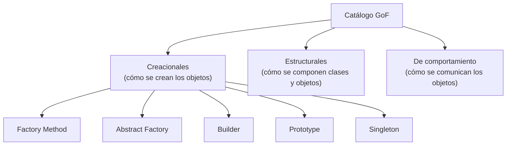

# 💡 Ejemplo 01 — Qué son los patrones de diseño

## 🌍 Contexto

En el Módulo 11 aprendiste los cinco principios SOLID: criterios para repartir bien las
responsabilidades entre clases e interfaces. De hecho, el diseño que resolvía OCP en ese módulo —una
interfaz con una implementación por caso— coincidía, sin que se nombrara, con una solución que la
industria conoce y usa desde hace décadas con un nombre propio: el patrón Strategy.

Este módulo formaliza ese vocabulario. Un **patrón de diseño** es una solución reutilizable y ya
probada a un problema de diseño que se repite en proyectos distintos, con un nombre que cualquier
programador que lo conozca reconoce de inmediato. El catálogo más citado, el de "Gang of Four" (GoF, los
cuatro autores del libro que los catalogó por primera vez en 1994), agrupa los patrones en tres
categorías según qué tipo de problema resuelven.

## 🗺️ Diagrama

## 🧭 Explicación paso a paso

1. **Creacionales** (este módulo): controlan **cómo se crean los objetos** — quién decide qué clase
   concreta instanciar, cómo se arma un objeto complejo, cuántas instancias de una clase pueden existir.
2. **Estructurales** (módulo posterior): controlan cómo se componen clases y objetos para formar
   estructuras más grandes, sin que esa composición se vuelva rígida.
3. **De comportamiento** (módulo posterior): controlan cómo se reparten responsabilidades y se
   comunican los objetos entre sí para resolver una tarea.
4. Los cinco patrones creacionales de este módulo resuelven, cada uno, un problema distinto de
   creación: acoplamiento a clases concretas (Factory Method), familias de objetos que deben ser
   consistentes entre sí (Abstract Factory), construcción de un objeto complejo paso a paso (Builder),
   copiar en vez de construir desde cero (Prototype), y garantizar una única instancia (Singleton).
5. Ningún patrón se aplica "porque es lo correcto": cada uno se justifica por el problema concreto que
   resuelve. Aplicar un patrón a un problema que no lo necesita agrega complejidad sin ningún beneficio.

## ✅ Resultado esperado

Después de este ejemplo, el estudiante puede explicar:

- Qué es un patrón de diseño y por qué tener un nombre común para una solución es valioso.
- Las tres categorías del catálogo GoF, y que este módulo cubre solo la creacional.
- Que los cinco patrones creacionales resuelven problemas de creación de objetos distintos entre sí, no
  son intercambiables ni una "checklist" a aplicar siempre.

## ❓ Preguntas de repaso

❓ 1. ¿Qué es un patrón de diseño?

🔑 Ver respuesta

Una solución reutilizable y ya probada a un problema de diseño que se repite en proyectos distintos,
identificada con un nombre propio que la industria reconoce.

❓ 2. ¿Qué distingue a los patrones creacionales de las otras dos categorías del catálogo
GoF?

🔑 Ver respuesta

Los patrones creacionales controlan cómo se crean los objetos (quién decide qué clase concreta
instanciar, cómo se arma un objeto complejo, cuántas instancias pueden existir). Los estructurales
controlan cómo se componen clases y objetos más grandes; los de comportamiento, cómo se comunican y
reparten responsabilidades entre sí.

❓ 3. ¿Es correcto aplicar siempre un patrón de diseño a cualquier problema de creación de
objetos, "porque es una buena práctica"?

🔑 Ver respuesta

No. Cada patrón se justifica por el problema concreto que resuelve. Aplicar un patrón donde no hace
falta agrega complejidad (clases e interfaces adicionales) sin ningún beneficio real.

