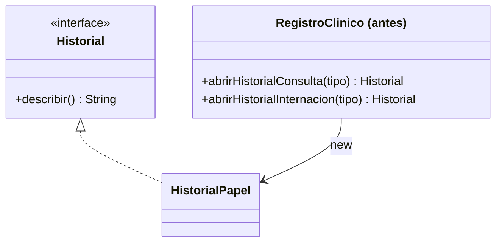
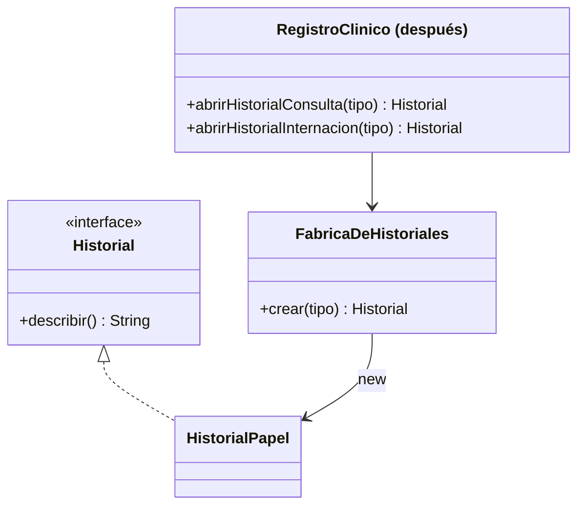

# 💡 Ejemplo 02 — Factory Method

## 🌍 Contexto

MediSalud registra historiales clínicos. Hoy todos son de papel, y el código que abre un historial
—tanto para una consulta como para una internación— crea la instancia directamente con
`new HistorialPapel()`. Funciona bien mientras exista un solo tipo de historial. El problema aparece el
día que MediSalud quiere ofrecer historiales digitales: hay que volver a abrir cada lugar del código que
crea un historial y modificarlo para que también sepa crear el tipo nuevo.

**Qué busca demostrar este ejemplo**: cuánto código cliente hay que tocar para agregar un tipo nuevo,
comparado entre crear objetos directamente con `new` y delegar esa creación a un método fábrica.

## 🏥 Caso de estudio

MediSalud abre un historial clínico cada vez que un paciente tiene una consulta o una internación.

## 🗺️ Diagrama





*Arriba, la versión "antes" (el cliente crea el tipo concreto directamente). Abajo, la versión "después"
(el cliente delega la creación en una fábrica).*

## 🌳 Árbol de archivos — antes

```text
factory-antes/
└── com/medisalud/
    ├── Historial.java
    ├── HistorialPapel.java
    ├── RegistroClinico.java
    └── Demo.java
```

## 💻 Archivo: Historial.java

```java
package com.medisalud;

public interface Historial {
    String describir();
}
```

## 💻 Archivo: HistorialPapel.java

```java
package com.medisalud;

public class HistorialPapel implements Historial {
    public String describir() {
        return "Historial en papel, archivado fisicamente";
    }
}
```

## 💻 Archivo: RegistroClinico.java

```java
package com.medisalud;

public class RegistroClinico {
    public Historial abrirHistorialConsulta(String tipo) {
        if (tipo.equals("PAPEL")) {
            return new HistorialPapel();
        }
        throw new IllegalArgumentException("Tipo de historial desconocido: " + tipo);
    }

    public Historial abrirHistorialInternacion(String tipo) {
        if (tipo.equals("PAPEL")) {
            return new HistorialPapel();
        }
        throw new IllegalArgumentException("Tipo de historial desconocido: " + tipo);
    }
}
```

## 💻 Archivo: Demo.java

```java
package com.medisalud;

public class Demo {
    public static void main(String[] args) {
        // Datos de entrada
        RegistroClinico registro = new RegistroClinico();

        System.out.println(registro.abrirHistorialConsulta("PAPEL").describir());
        System.out.println(registro.abrirHistorialInternacion("PAPEL").describir());
    }
}
```

## ✅ Resultado esperado — antes

```text
Historial en papel, archivado fisicamente
Historial en papel, archivado fisicamente
```

## 🌳 Árbol de archivos — después

```text
factory-despues/
└── com/medisalud/
    ├── Historial.java
    ├── HistorialPapel.java
    ├── FabricaDeHistoriales.java
    ├── RegistroClinico.java
    └── Demo.java
```

## 💻 Archivo: Historial.java

```java
package com.medisalud;

public interface Historial {
    String describir();
}
```

## 💻 Archivo: HistorialPapel.java

```java
package com.medisalud;

public class HistorialPapel implements Historial {
    public String describir() {
        return "Historial en papel, archivado fisicamente";
    }
}
```

## 💻 Archivo: FabricaDeHistoriales.java

```java
package com.medisalud;

public class FabricaDeHistoriales {
    public static Historial crear(String tipo) {
        if (tipo.equals("PAPEL")) {
            return new HistorialPapel();
        }
        throw new IllegalArgumentException("Tipo de historial desconocido: " + tipo);
    }
}
```

## 💻 Archivo: RegistroClinico.java

```java
package com.medisalud;

public class RegistroClinico {
    public Historial abrirHistorialConsulta(String tipo) {
        return FabricaDeHistoriales.crear(tipo);
    }

    public Historial abrirHistorialInternacion(String tipo) {
        return FabricaDeHistoriales.crear(tipo);
    }
}
```

## 💻 Archivo: Demo.java

```java
package com.medisalud;

public class Demo {
    public static void main(String[] args) {
        // Datos de entrada
        RegistroClinico registro = new RegistroClinico();

        System.out.println(registro.abrirHistorialConsulta("PAPEL").describir());
        System.out.println(registro.abrirHistorialInternacion("PAPEL").describir());
    }
}
```

## ✅ Resultado esperado — después

```text
Historial en papel, archivado fisicamente
Historial en papel, archivado fisicamente
```

## 🔍 Comparación: la prueba concreta

Ambas versiones producen la misma salida para el historial de papel. La diferencia real aparece al
agregar un tipo nuevo, `HistorialDigital`, a cada una:

| Comparación | Resultado |
|---|---|
| `RegistroClinico.java` de la versión "antes" agregando `HistorialDigital` | El cliente se modifica: ambos métodos (`abrirHistorialConsulta`, `abrirHistorialInternacion`) agregan una rama `else if` |
| `RegistroClinico.java`, `Historial.java` y `HistorialPapel.java` de la versión "después" agregando `HistorialDigital` | **Idénticos, byte a byte** (`diff` sin salida) — el tipo nuevo se agrega con una clase nueva (`HistorialDigital.java`) y una rama dentro de `FabricaDeHistoriales`, el punto de extensión |

En la versión "antes", agregar un tipo nuevo exige reabrir y modificar el cliente en dos lugares. En la
versión "después", el cliente (`RegistroClinico`) queda exactamente igual — la extensión se hace
agregando una clase y modificando solo la fábrica, nunca el código que la usa:

## 💻 Archivo nuevo: HistorialDigital.java

```java
package com.medisalud;

public class HistorialDigital implements Historial {
    public String describir() {
        return "Historial digital, accesible desde cualquier consultorio";
    }
}
```

## ✅ Resultado esperado tras extender — después

```text
Historial en papel, archivado fisicamente
Historial en papel, archivado fisicamente
Historial digital, accesible desde cualquier consultorio
Historial digital, accesible desde cualquier consultorio
```

## 🔍 Análisis: errores frecuentes

El error más frecuente al aplicar Factory Method es escribir un método que hace `new` pero que no aporta
ningún beneficio real de extensión — por ejemplo, un método `crear()` que solo puede construir un tipo,
sin ningún parámetro ni lógica de decisión. Eso no es Factory Method: es simplemente mover una llamada a
`new` de un lugar a otro. El beneficio real aparece cuando el método fábrica es el único lugar que sabe
qué clase concreta instanciar, y el cliente puede seguir funcionando sin cambios cuando esa decisión se
amplía.

## ❓ Preguntas de repaso

**1. [Selección]** En la versión "antes", ¿de qué depende directamente `RegistroClinico`?

- A. De la interfaz `Historial` únicamente.
- B. De la clase concreta `HistorialPapel`, creada con `new` dentro de sus propios métodos.
- C. De ninguna clase: `RegistroClinico` no crea ningún objeto.
- D. De `FabricaDeHistoriales`.

<details>
<summary>🔑 Ver respuesta</summary>

**Respuesta correcta: B.** `RegistroClinico` invoca `new HistorialPapel()` directamente dentro de sus
propios métodos: depende de la clase concreta, no de una fábrica ni solo de la interfaz.

</details>

**2. [Selección múltiple]** Sobre la comparación real de agregar `HistorialDigital` a ambas versiones,
¿cuáles afirmaciones son verdaderas?

- A. `RegistroClinico.java` de la versión "antes" cambia: se agrega una rama `else if` en cada método.
- B. `RegistroClinico.java` de la versión "después" queda exactamente igual, byte a byte.
- C. El tipo nuevo, en la versión "después", se agrega con una clase nueva y una rama en la fábrica.
- D. En la versión "después" también hay que modificar `HistorialPapel.java` para que reconozca el tipo
  digital.

<details>
<summary>🔑 Ver respuesta</summary>

**Respuestas correctas: A, B y C.** D es falsa: `HistorialPapel.java` no tiene ninguna relación con el
tipo digital y no requiere ningún cambio — esa es la prueba de que la versión "después" respeta el
principio.

</details>

**3. [Abierta]** Un compañero dice: "para usar Factory Method, alcanza con crear un método que devuelva
`new HistorialPapel()`, sin ningún parámetro". ¿Estás de acuerdo? Justifica tu respuesta.

<details>
<summary>🔑 Ver respuesta</summary>

No completamente. Un método que siempre devuelve el mismo tipo, sin ningún parámetro ni lógica de
decisión, no aporta el beneficio real de Factory Method: solo mueve la llamada a `new` de un lugar a
otro, sin resolver el problema de extensión. El valor real aparece cuando el método fábrica decide, según
un parámetro o una condición, qué clase concreta instanciar — de forma que agregar un tipo nuevo se
resuelva modificando solo ese método, sin tocar el código cliente que lo usa.

</details>
