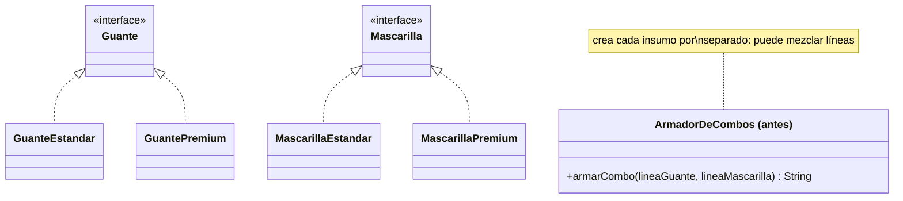
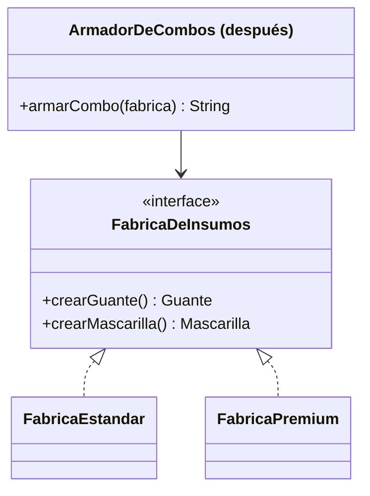

# 💡 Ejemplo 03 — Abstract Factory

## 🌍 Contexto

MediSalud arma combos de insumos de consulta (guantes, mascarillas) en dos líneas: estándar y premium.
Es tentador crear cada insumo por separado, cada uno con su propio parámetro de línea. El problema
aparece cuando alguien, por error, arma un combo mezclando líneas: un guante premium con una mascarilla
estándar, algo que nunca debería pasar pero que ninguna parte del código impide.

**Qué busca demostrar este ejemplo**: que crear cada miembro de una familia de objetos relacionados por
separado permite mezclarlos por error, y cómo una fábrica que crea la familia completa lo hace imposible.

## 🏥 Caso de estudio

MediSalud arma combos de insumos de consulta, que deben pertenecer todos a la misma línea (estándar o
premium).

## 🗺️ Diagrama





*Arriba, la versión "antes" (cada insumo se crea por separado). Abajo, la versión "después" (una única
fábrica crea toda la familia, garantizando consistencia).*

## 🌳 Árbol de archivos — antes

```text
abstractfactory-antes/
└── com/medisalud/
    ├── Guante.java
    ├── GuanteEstandar.java
    ├── GuantePremium.java
    ├── Mascarilla.java
    ├── MascarillaEstandar.java
    ├── MascarillaPremium.java
    ├── ArmadorDeCombos.java
    └── Demo.java
```

## 💻 Archivo: Guante.java

```java
package com.medisalud;

public interface Guante {
    String describir();
}
```

## 💻 Archivo: GuanteEstandar.java

```java
package com.medisalud;

public class GuanteEstandar implements Guante {
    public String describir() {
        return "Guante linea ESTANDAR";
    }
}
```

## 💻 Archivo: GuantePremium.java

```java
package com.medisalud;

public class GuantePremium implements Guante {
    public String describir() {
        return "Guante linea PREMIUM";
    }
}
```

## 💻 Archivo: Mascarilla.java

```java
package com.medisalud;

public interface Mascarilla {
    String describir();
}
```

## 💻 Archivo: MascarillaEstandar.java

```java
package com.medisalud;

public class MascarillaEstandar implements Mascarilla {
    public String describir() {
        return "Mascarilla linea ESTANDAR";
    }
}
```

## 💻 Archivo: MascarillaPremium.java

```java
package com.medisalud;

public class MascarillaPremium implements Mascarilla {
    public String describir() {
        return "Mascarilla linea PREMIUM";
    }
}
```

## 💻 Archivo: ArmadorDeCombos.java

```java
package com.medisalud;

public class ArmadorDeCombos {
    public String armarCombo(String lineaGuante, String lineaMascarilla) {
        Guante guante = lineaGuante.equals("PREMIUM") ? new GuantePremium() : new GuanteEstandar();
        Mascarilla mascarilla = lineaMascarilla.equals("PREMIUM") ? new MascarillaPremium() : new MascarillaEstandar();
        return guante.describir() + " + " + mascarilla.describir();
    }
}
```

## 💻 Archivo: Demo.java

```java
package com.medisalud;

public class Demo {
    public static void main(String[] args) {
        // Datos de entrada
        ArmadorDeCombos armador = new ArmadorDeCombos();

        System.out.println("combo1=" + armador.armarCombo("ESTANDAR", "ESTANDAR"));
        // Error de un lugar del codigo que arma el combo con lineas mezcladas por accidente:
        System.out.println("combo2 (mezclado por error)=" + armador.armarCombo("PREMIUM", "ESTANDAR"));
    }
}
```

## ✅ Resultado esperado — antes

```text
combo1=Guante linea ESTANDAR + Mascarilla linea ESTANDAR
combo2 (mezclado por error)=Guante linea PREMIUM + Mascarilla linea ESTANDAR
```

## 🌳 Árbol de archivos — después

```text
abstractfactory-despues/
└── com/medisalud/
    ├── Guante.java
    ├── GuanteEstandar.java
    ├── GuantePremium.java
    ├── Mascarilla.java
    ├── MascarillaEstandar.java
    ├── MascarillaPremium.java
    ├── FabricaDeInsumos.java
    ├── FabricaEstandar.java
    ├── FabricaPremium.java
    ├── ArmadorDeCombos.java
    └── Demo.java
```

Sin cambios respecto de "antes": `Guante.java`, `GuanteEstandar.java`, `GuantePremium.java`,
`Mascarilla.java`, `MascarillaEstandar.java` y `MascarillaPremium.java` — su código ya se mostró arriba
y es exactamente el mismo, byte a byte.

<details>
<summary>💻 Ver de nuevo el código sin cambios (Guante, GuanteEstandar, GuantePremium, Mascarilla,
MascarillaEstandar, MascarillaPremium)</summary>

## 💻 Archivo: Guante.java

```java
package com.medisalud;

public interface Guante {
    String describir();
}
```

## 💻 Archivo: GuanteEstandar.java

```java
package com.medisalud;

public class GuanteEstandar implements Guante {
    public String describir() {
        return "Guante linea ESTANDAR";
    }
}
```

## 💻 Archivo: GuantePremium.java

```java
package com.medisalud;

public class GuantePremium implements Guante {
    public String describir() {
        return "Guante linea PREMIUM";
    }
}
```

## 💻 Archivo: Mascarilla.java

```java
package com.medisalud;

public interface Mascarilla {
    String describir();
}
```

## 💻 Archivo: MascarillaEstandar.java

```java
package com.medisalud;

public class MascarillaEstandar implements Mascarilla {
    public String describir() {
        return "Mascarilla linea ESTANDAR";
    }
}
```

## 💻 Archivo: MascarillaPremium.java

```java
package com.medisalud;

public class MascarillaPremium implements Mascarilla {
    public String describir() {
        return "Mascarilla linea PREMIUM";
    }
}
```

</details>

## 💻 Archivo: FabricaDeInsumos.java — nuevo

```java
package com.medisalud;

public interface FabricaDeInsumos {
    Guante crearGuante();
    Mascarilla crearMascarilla();
}
```

## 💻 Archivo: FabricaEstandar.java — nuevo

```java
package com.medisalud;

public class FabricaEstandar implements FabricaDeInsumos {
    public Guante crearGuante() {
        return new GuanteEstandar();
    }

    public Mascarilla crearMascarilla() {
        return new MascarillaEstandar();
    }
}
```

## 💻 Archivo: FabricaPremium.java — nuevo

```java
package com.medisalud;

public class FabricaPremium implements FabricaDeInsumos {
    public Guante crearGuante() {
        return new GuantePremium();
    }

    public Mascarilla crearMascarilla() {
        return new MascarillaPremium();
    }
}
```

## 💻 Archivo: ArmadorDeCombos.java — cambió

```java
package com.medisalud;

public class ArmadorDeCombos {
    public String armarCombo(FabricaDeInsumos fabrica) {
        Guante guante = fabrica.crearGuante();
        Mascarilla mascarilla = fabrica.crearMascarilla();
        return guante.describir() + " + " + mascarilla.describir();
    }
}
```

## 💻 Archivo: Demo.java — cambió

```java
package com.medisalud;

public class Demo {
    public static void main(String[] args) {
        // Datos de entrada
        ArmadorDeCombos armador = new ArmadorDeCombos();

        System.out.println("combo1=" + armador.armarCombo(new FabricaEstandar()));
        System.out.println("combo2=" + armador.armarCombo(new FabricaPremium()));
    }
}
```

## ✅ Resultado esperado — después

```text
combo1=Guante linea ESTANDAR + Mascarilla linea ESTANDAR
combo2=Guante linea PREMIUM + Mascarilla linea PREMIUM
```

## 🔍 Comparación: la prueba concreta

En la versión "antes", `Demo` arma un segundo combo pasando `"PREMIUM"` para el guante y `"ESTANDAR"`
para la mascarilla — un error de tipeo perfectamente posible — y el programa lo arma sin quejarse:
`combo2 (mezclado por error)=Guante linea PREMIUM + Mascarilla linea ESTANDAR`. Nada en el diseño impide
esa combinación.

En la versión "después", `ArmadorDeCombos.armarCombo` recibe una única `FabricaDeInsumos` y le pide los
dos insumos a esa misma instancia. Ejecutado con `FabricaEstandar` y con `FabricaPremium` por separado,
cada combo sale completo de una sola línea: `combo1=Guante linea ESTANDAR + Mascarilla linea ESTANDAR`,
`combo2=Guante linea PREMIUM + Mascarilla linea PREMIUM`. No existe ninguna forma de invocar
`armarCombo` que produzca una mezcla, porque no hay dos parámetros de línea independientes que puedan
desincronizarse.

## 🔍 Análisis: errores frecuentes

El error más frecuente es usar Abstract Factory cuando Factory Method alcanza: si un diseño solo necesita
crear **un** tipo de objeto (no una familia de varios que deban ser consistentes entre sí), envolverlo en
una fábrica abstracta con una sola implementación por variante agrega una interfaz y varias clases sin
ningún beneficio real sobre un Factory Method simple.

## ❓ Preguntas de repaso

**1. [Selección]** En la versión "antes", ¿qué le impide a `ArmadorDeCombos` crear un combo con líneas
mezcladas?

- A. El compilador lo impide.
- B. Nada: cada insumo se crea con su propio parámetro de línea, independiente del otro.
- C. `GuantePremium` no compila junto con `MascarillaEstandar`.
- D. `armarCombo` valida que ambas líneas coincidan antes de crear los insumos.

<details>
<summary>🔑 Ver respuesta</summary>

**Respuesta correcta: B.** No hay ninguna validación: cada insumo se crea con un parámetro de línea
independiente, así que nada impide pasar líneas distintas para cada uno.

</details>

**2. [Selección múltiple]** Sobre la versión "después", ¿cuáles afirmaciones son verdaderas?

- A. `ArmadorDeCombos.armarCombo` recibe una única `FabricaDeInsumos`.
- B. `FabricaEstandar` y `FabricaPremium` implementan `FabricaDeInsumos`.
- C. Es posible invocar `armarCombo` de forma que el guante y la mascarilla resulten de líneas distintas.
- D. Cada método de `FabricaDeInsumos` (`crearGuante`, `crearMascarilla`) crea un insumo de la línea que
  esa fábrica concreta representa.

<details>
<summary>🔑 Ver respuesta</summary>

**Respuestas correctas: A, B y D.** C es falsa: como ambos insumos salen de la misma instancia de
fábrica, es imposible que resulten de líneas distintas.

</details>

**3. [Abierta]** Un compañero propone resolver el problema de la versión "antes" agregando una
validación dentro de `armarCombo` que compare `lineaGuante` y `lineaMascarilla` y lance un error si no
coinciden. ¿Esa solución es equivalente a Abstract Factory? Justifica tu respuesta.

<details>
<summary>🔑 Ver respuesta</summary>

No es equivalente. La validación detecta el error después de que ya se cometió (dos parámetros
independientes que alguien pasó distintos), mientras que Abstract Factory lo hace imposible por
construcción: no existen dos parámetros de línea independientes para desincronizar, porque ambos insumos
salen siempre de la misma instancia de fábrica. La validación es un parche que depende de que alguien se
acuerde de escribirla en cada lugar donde se arme un combo; Abstract Factory resuelve el problema de raíz
en el diseño.

</details>
