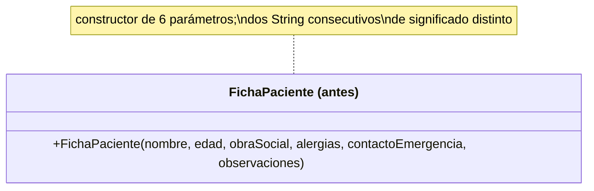
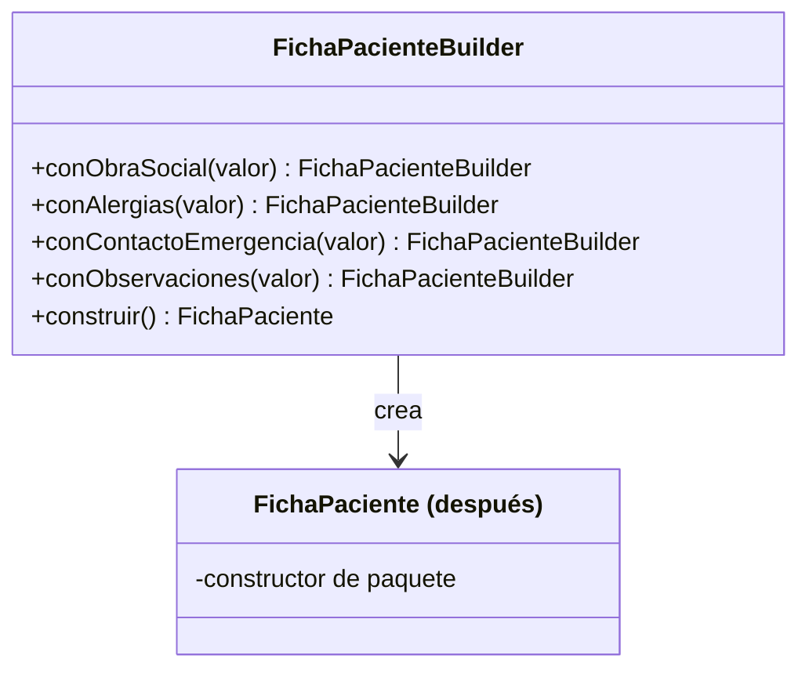

# 💡 Ejemplo 04 — Builder

## 🌍 Contexto

Una ficha de paciente en MediSalud tiene dos datos obligatorios (nombre, edad) y varios opcionales (obra
social, alergias, contacto de emergencia, observaciones). Es tentador resolverlo con un único
constructor de seis parámetros. El problema aparece cuando dos de esos parámetros son `String`
consecutivos de significado distinto: nada impide invocar el constructor con el orden equivocado, y el
compilador no puede detectarlo.

**Qué busca demostrar este ejemplo**: un error real de orden de argumentos que el compilador no detecta,
y cómo un Builder con métodos nombrados lo hace imposible.

## 🏥 Caso de estudio

MediSalud registra la ficha de cada paciente al admitirlo, con datos obligatorios y opcionales.

## 🗺️ Diagrama





*Arriba, la versión "antes" (constructor de varios parámetros). Abajo, la versión "después" (un Builder
que arma la ficha paso a paso, con cada dato identificado por nombre).*

## 🌳 Árbol de archivos — antes

```text
builder-antes/
└── com/medisalud/
    ├── FichaPaciente.java
    └── Demo.java
```

## 💻 Archivo: FichaPaciente.java

```java
package com.medisalud;

public class FichaPaciente {
    private String nombre;
    private int edad;
    private String obraSocial;
    private String alergias;
    private String contactoEmergencia;
    private String observaciones;

    public FichaPaciente(String nombre, int edad, String obraSocial, String alergias,
                          String contactoEmergencia, String observaciones) {
        this.nombre = nombre;
        this.edad = edad;
        this.obraSocial = obraSocial;
        this.alergias = alergias;
        this.contactoEmergencia = contactoEmergencia;
        this.observaciones = observaciones;
    }

    public String resumen() {
        return nombre + " (" + edad + " anios)"
            + ", obra social: " + (obraSocial == null ? "-" : obraSocial)
            + ", alergias: " + (alergias == null ? "-" : alergias)
            + ", contacto de emergencia: " + (contactoEmergencia == null ? "-" : contactoEmergencia)
            + ", observaciones: " + (observaciones == null ? "-" : observaciones);
    }
}
```

## 💻 Archivo: Demo.java

```java
package com.medisalud;

public class Demo {
    public static void main(String[] args) {
        // Datos de entrada
        FichaPaciente correcta = new FichaPaciente(
            "Marta Diaz", 34, "OSDE", "Penicilina", "Jorge Diaz - 555-1234", "Control anual"
        );
        System.out.println("correcta: " + correcta.resumen());

        // Error facil de cometer: alergias y contacto de emergencia intercambiados por accidente
        // (el compilador no puede detectarlo: ambos son String)
        FichaPaciente confundida = new FichaPaciente(
            "Pablo Sosa", 41, "Swiss Medical", "Ana Sosa - 555-5678", "Ninguna conocida", "-"
        );
        System.out.println("confundida: " + confundida.resumen());
    }
}
```

## ✅ Resultado esperado — antes

```text
correcta: Marta Diaz (34 anios), obra social: OSDE, alergias: Penicilina, contacto de emergencia: Jorge Diaz - 555-1234, observaciones: Control anual
confundida: Pablo Sosa (41 anios), obra social: Swiss Medical, alergias: Ana Sosa - 555-5678, contacto de emergencia: Ninguna conocida, observaciones: -
```

## 🌳 Árbol de archivos — después

```text
builder-despues/
└── com/medisalud/
    ├── FichaPaciente.java          (cambió: constructor de paquete)
    ├── FichaPacienteBuilder.java   (nuevo)
    └── Demo.java                   (cambió)
```

## 💻 Archivo: FichaPaciente.java

```java
package com.medisalud;

public class FichaPaciente {
    private String nombre;
    private int edad;
    private String obraSocial;
    private String alergias;
    private String contactoEmergencia;
    private String observaciones;

    FichaPaciente(String nombre, int edad, String obraSocial, String alergias,
                  String contactoEmergencia, String observaciones) {
        this.nombre = nombre;
        this.edad = edad;
        this.obraSocial = obraSocial;
        this.alergias = alergias;
        this.contactoEmergencia = contactoEmergencia;
        this.observaciones = observaciones;
    }

    public String resumen() {
        return nombre + " (" + edad + " anios)"
            + ", obra social: " + (obraSocial == null ? "-" : obraSocial)
            + ", alergias: " + (alergias == null ? "-" : alergias)
            + ", contacto de emergencia: " + (contactoEmergencia == null ? "-" : contactoEmergencia)
            + ", observaciones: " + (observaciones == null ? "-" : observaciones);
    }
}
```

## 💻 Archivo: FichaPacienteBuilder.java

```java
package com.medisalud;

public class FichaPacienteBuilder {
    private String nombre;
    private int edad;
    private String obraSocial;
    private String alergias;
    private String contactoEmergencia;
    private String observaciones;

    public FichaPacienteBuilder(String nombre, int edad) {
        this.nombre = nombre;
        this.edad = edad;
    }

    public FichaPacienteBuilder conObraSocial(String obraSocial) {
        this.obraSocial = obraSocial;
        return this;
    }

    public FichaPacienteBuilder conAlergias(String alergias) {
        this.alergias = alergias;
        return this;
    }

    public FichaPacienteBuilder conContactoEmergencia(String contactoEmergencia) {
        this.contactoEmergencia = contactoEmergencia;
        return this;
    }

    public FichaPacienteBuilder conObservaciones(String observaciones) {
        this.observaciones = observaciones;
        return this;
    }

    public FichaPaciente construir() {
        return new FichaPaciente(nombre, edad, obraSocial, alergias, contactoEmergencia, observaciones);
    }
}
```

## 💻 Archivo: Demo.java

```java
package com.medisalud;

public class Demo {
    public static void main(String[] args) {
        // Datos de entrada
        FichaPaciente completa = new FichaPacienteBuilder("Marta Diaz", 34)
            .conObraSocial("OSDE")
            .conAlergias("Penicilina")
            .conContactoEmergencia("Jorge Diaz - 555-1234")
            .conObservaciones("Control anual")
            .construir();
        System.out.println("completa: " + completa.resumen());

        // Solo se especifican los datos opcionales que existen; el orden ya no importa
        FichaPaciente parcial = new FichaPacienteBuilder("Pablo Sosa", 41)
            .conObraSocial("Swiss Medical")
            .conContactoEmergencia("Ana Sosa - 555-5678")
            .construir();
        System.out.println("parcial: " + parcial.resumen());
    }
}
```

## ✅ Resultado esperado — después

```text
completa: Marta Diaz (34 anios), obra social: OSDE, alergias: Penicilina, contacto de emergencia: Jorge Diaz - 555-1234, observaciones: Control anual
parcial: Pablo Sosa (41 anios), obra social: Swiss Medical, alergias: -, contacto de emergencia: Ana Sosa - 555-5678, observaciones: -
```

## 🔍 Comparación: la prueba concreta

En la versión "antes", `Demo` crea una ficha `confundida` pasando el contacto de emergencia
(`"Ana Sosa - 555-5678"`) en el lugar del parámetro `alergias`, y el observaciones (`"-"`) en el lugar de
`contactoEmergencia` — un error de orden real y fácil de cometer, porque ambos son `String`. El programa
**compila y se ejecuta sin ningún error**, pero el resumen impreso lo delata:
`alergias: Ana Sosa - 555-5678` — un dato claramente incorrecto, aunque sintácticamente válido.

En la versión "después", `FichaPacienteBuilder` arma la ficha `parcial` con
`.conObraSocial("Swiss Medical").conContactoEmergencia("Ana Sosa - 555-5678")`: cada dato se identifica
por el nombre del método que lo agrega, no por su posición. No existe ninguna forma de invocar el Builder
que confunda alergias con contacto de emergencia, porque son métodos distintos, no dos parámetros
consecutivos del mismo tipo.

## 🔍 Análisis: errores frecuentes

El error más frecuente al aplicar Builder es dejar que se pueda invocar `construir()` en un estado
inválido o incompleto (por ejemplo, sin los datos obligatorios). Un Builder bien diseñado exige los datos
obligatorios en su propio constructor (como hace `FichaPacienteBuilder(nombre, edad)` en este ejemplo,
recibiendo `nombre` y `edad` desde el inicio) y deja solo los datos verdaderamente opcionales para los
métodos encadenados.

## ❓ Preguntas de repaso

**1. [Selección]** En la versión "antes", ¿qué le impide a alguien invocar el constructor de
`FichaPaciente` con `alergias` y `contactoEmergencia` en el orden equivocado?

- A. El compilador lo detecta y rechaza la compilación.
- B. Nada: ambos son `String`, así que el compilador no puede distinguirlos por su tipo.
- C. Java ordena automáticamente los argumentos según el nombre del parámetro.
- D. El programa lanza una excepción en tiempo de ejecución si el orden es incorrecto.

<details>
<summary>🔑 Ver respuesta</summary>

**Respuesta correcta: B.** El compilador solo valida el tipo de cada argumento, no su significado. Dos
parámetros `String` consecutivos son indistinguibles para él, aunque representen datos completamente
distintos.

</details>

**2. [Selección múltiple]** Sobre la versión "después", ¿cuáles afirmaciones son verdaderas?

- A. `FichaPacienteBuilder` recibe los datos obligatorios (`nombre`, `edad`) en su propio constructor.
- B. Cada dato opcional se agrega con un método nombrado, no por posición.
- C. Es posible confundir `alergias` con `contactoEmergencia` invocando los métodos en el orden
  equivocado.
- D. `construir()` arma y devuelve la `FichaPaciente` final a partir de los datos acumulados.

<details>
<summary>🔑 Ver respuesta</summary>

**Respuestas correctas: A, B y D.** C es falsa: como cada dato se identifica por el nombre del método
(`conAlergias`, `conContactoEmergencia`), el orden en que se invocan los métodos no afecta a qué dato va
a qué campo.

</details>

**3. [Abierta]** Un compañero dice: "el error de la versión 'antes' se soluciona agregando un comentario
arriba del constructor que aclare el orden de los parámetros". ¿Estás de acuerdo? Justifica tu
respuesta.

<details>
<summary>🔑 Ver respuesta</summary>

No. Un comentario puede ayudar a quien lee el código con cuidado, pero no impide que alguien, apurado o
sin haberlo leído, invoque el constructor con el orden equivocado — el compilador seguiría aceptándolo
sin ninguna advertencia. Builder resuelve el problema de raíz: hace que el orden de los datos sea
irrelevante, porque cada uno se identifica por el nombre del método que lo agrega, no por su posición.

</details>
