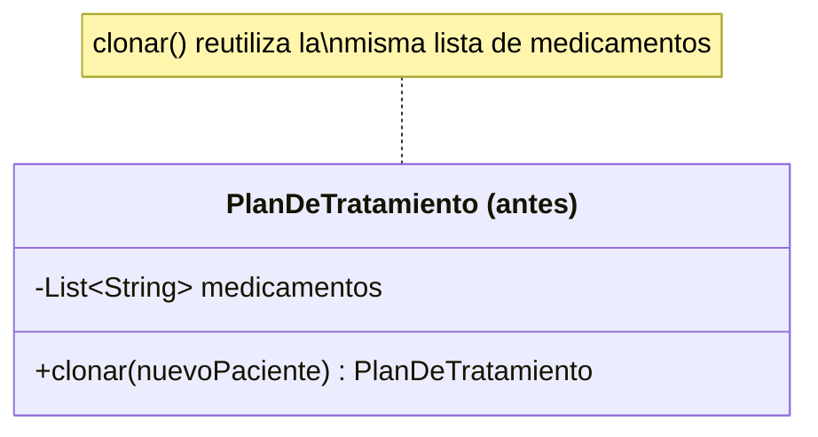
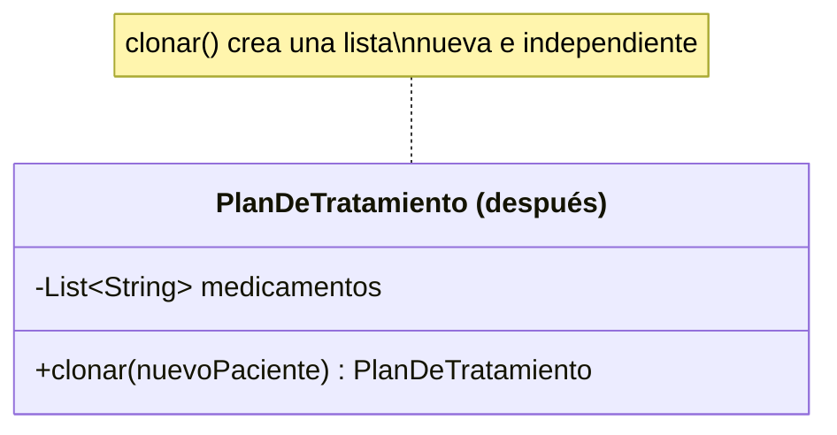

# 💡 Ejemplo 05 — Prototype

## 🌍 Contexto

Un plan de tratamiento de MediSalud tiene una lista de medicamentos ya configurada. Cuando otro paciente
necesita un plan casi idéntico, es tentador clonarlo reutilizando la misma lista de medicamentos "para no
copiar de más". El problema aparece en cuanto se modifica la copia: si la copia y el original comparten
la misma lista, agregar un medicamento a la copia también lo agrega, sin que nadie lo pida, al plan
original.

**Qué busca demostrar este ejemplo**: una fuga de datos real entre dos objetos que deberían ser
independientes, causada por un clonado superficial, y su corrección con un clonado profundo.

## 🏥 Caso de estudio

MediSalud arma planes de tratamiento con una lista de medicamentos, y a veces necesita crear un plan
nuevo casi idéntico a uno existente.

## 🗺️ Diagrama





*Arriba, la versión "antes" (clonado superficial: comparte la lista). Abajo, la versión "después"
(clonado profundo: copia la lista).*

## 🌳 Árbol de archivos — antes

```text
prototype-antes/
└── com/medisalud/
    ├── PlanDeTratamiento.java
    └── Demo.java
```

## 💻 Archivo: PlanDeTratamiento.java

```java
package com.medisalud;

import java.util.List;

public class PlanDeTratamiento {
    private String paciente;
    private List<String> medicamentos;

    public PlanDeTratamiento(String paciente, List<String> medicamentos) {
        this.paciente = paciente;
        this.medicamentos = medicamentos;
    }

    public PlanDeTratamiento clonar(String nuevoPaciente) {
        // Clonado superficial: reutiliza la misma lista de medicamentos, no crea una copia
        return new PlanDeTratamiento(nuevoPaciente, this.medicamentos);
    }

    public void agregarMedicamento(String medicamento) {
        medicamentos.add(medicamento);
    }

    public String resumen() {
        return paciente + ": " + medicamentos;
    }
}
```

## 💻 Archivo: Demo.java

```java
package com.medisalud;

import java.util.ArrayList;
import java.util.List;

public class Demo {
    public static void main(String[] args) {
        // Datos de entrada
        List<String> medicamentos = new ArrayList<>();
        medicamentos.add("Ibuprofeno 400mg");
        medicamentos.add("Paracetamol 500mg");
        PlanDeTratamiento original = new PlanDeTratamiento("Marta Diaz", medicamentos);

        PlanDeTratamiento copia = original.clonar("Jorge Paz");
        copia.agregarMedicamento("Amoxicilina 500mg");

        System.out.println("original: " + original.resumen());
        System.out.println("copia: " + copia.resumen());
    }
}
```

## ✅ Resultado esperado — antes

```text
original: Marta Diaz: [Ibuprofeno 400mg, Paracetamol 500mg, Amoxicilina 500mg]
copia: Jorge Paz: [Ibuprofeno 400mg, Paracetamol 500mg, Amoxicilina 500mg]
```

## 🌳 Árbol de archivos — después

```text
prototype-despues/
└── com/medisalud/
    ├── PlanDeTratamiento.java
    └── Demo.java
```

## 💻 Archivo: PlanDeTratamiento.java — cambió

```java
package com.medisalud;

import java.util.ArrayList;
import java.util.List;

public class PlanDeTratamiento {
    private String paciente;
    private List<String> medicamentos;

    public PlanDeTratamiento(String paciente, List<String> medicamentos) {
        this.paciente = paciente;
        this.medicamentos = medicamentos;
    }

    public PlanDeTratamiento clonar(String nuevoPaciente) {
        // Clonado profundo: crea una copia nueva de la lista, independiente de la original
        return new PlanDeTratamiento(nuevoPaciente, new ArrayList<>(this.medicamentos));
    }

    public void agregarMedicamento(String medicamento) {
        medicamentos.add(medicamento);
    }

    public String resumen() {
        return paciente + ": " + medicamentos;
    }
}
```

Sin cambios respecto de "antes": `Demo.java` — su código ya se mostró arriba y es exactamente el mismo,
byte a byte.

<details>
<summary>💻 Ver de nuevo el código sin cambios (Demo.java)</summary>

## 💻 Archivo: Demo.java

```java
package com.medisalud;

import java.util.ArrayList;
import java.util.List;

public class Demo {
    public static void main(String[] args) {
        // Datos de entrada
        List<String> medicamentos = new ArrayList<>();
        medicamentos.add("Ibuprofeno 400mg");
        medicamentos.add("Paracetamol 500mg");
        PlanDeTratamiento original = new PlanDeTratamiento("Marta Diaz", medicamentos);

        PlanDeTratamiento copia = original.clonar("Jorge Paz");
        copia.agregarMedicamento("Amoxicilina 500mg");

        System.out.println("original: " + original.resumen());
        System.out.println("copia: " + copia.resumen());
    }
}
```

</details>

## ✅ Resultado esperado — después

```text
original: Marta Diaz: [Ibuprofeno 400mg, Paracetamol 500mg]
copia: Jorge Paz: [Ibuprofeno 400mg, Paracetamol 500mg, Amoxicilina 500mg]
```

## 🔍 Comparación: la prueba concreta

En ambas versiones, `Demo` clona el plan de "Marta Diaz" para "Jorge Paz" y le agrega un medicamento
nuevo (`"Amoxicilina 500mg"`) solo a la copia. La diferencia aparece al imprimir el plan **original**
después de esa operación:

| Versión | `original.resumen()` tras modificar la copia |
|---|---|
| Antes (clonado superficial) | `Marta Diaz: [Ibuprofeno 400mg, Paracetamol 500mg, Amoxicilina 500mg]` — el medicamento agregado a la copia **fugó** al original |
| Después (clonado profundo) | `Marta Diaz: [Ibuprofeno 400mg, Paracetamol 500mg]` — el original queda intacto |

Este es un error real: el programa compila, se ejecuta y termina con código `0` en ambas versiones — no
hay ninguna excepción que avise del problema. La única forma de detectarlo es comparando el estado final
del objeto original antes y después de la operación sobre la copia, exactamente la prueba concreta de
esta comparación.

## 🔍 Análisis: errores frecuentes

El error más frecuente al aplicar Prototype es un clonado superficial cuando el caso requería uno
profundo: copiar el objeto nuevo reutilizando las mismas referencias a sus objetos internos mutables
(listas, otros objetos de dominio), en vez de crear copias independientes de esos objetos internos. El
clonado superficial no es incorrecto en sí mismo — es la elección correcta cuando los objetos internos
son inmutables o quieren compartirse a propósito — pero aplicado sin pensar a datos que sí deben ser
independientes produce exactamente el bug de este ejemplo.

## ❓ Preguntas de repaso

**1. [Selección]** ¿Qué hace `clonar()` en la versión "antes" con la lista de medicamentos?

- A. Crea una lista nueva con los mismos elementos.
- B. Reutiliza la misma referencia a la lista del plan original.
- C. Deja la lista de medicamentos vacía en el plan clonado.
- D. Lanza una excepción si el plan original tiene medicamentos.

<details>
<summary>🔑 Ver respuesta</summary>

**Respuesta correcta: B.** `clonar()` pasa `this.medicamentos` directamente al nuevo plan, sin crear una
lista nueva: ambos planes terminan apuntando a la misma lista en memoria.

</details>

**2. [Selección múltiple]** Sobre el experimento de agregar un medicamento a la copia, ¿cuáles
afirmaciones son verdaderas?

- A. En la versión "antes", el plan original también muestra el medicamento agregado a la copia.
- B. En la versión "después", el plan original queda intacto.
- C. El programa de la versión "antes" termina con una excepción real.
- D. La diferencia entre ambas versiones se nota comparando el estado final del plan original.

<details>
<summary>🔑 Ver respuesta</summary>

**Respuestas correctas: A, B y D.** C es falsa: el programa de la versión "antes" termina con éxito
(código 0), sin ninguna excepción — el bug es silencioso, no un error de ejecución.

</details>

**3. [Abierta]** Explica, en tus palabras, por qué el bug de la versión "antes" de este ejemplo no
necesita marcarse como un bloque especial de código con error, a diferencia de cómo se marcaban ciertos
errores en módulos anteriores del curso.

<details>
<summary>🔑 Ver respuesta</summary>

Porque el programa compila y se ejecuta con éxito en ambas versiones: no hay ningún error de sintaxis ni
ninguna excepción real que capturar. La diferencia entre "antes" y "después" es de diseño, no de
corrección de código — se demuestra comparando el estado final de un objeto tras la misma secuencia de
operaciones, igual que los demás patrones y principios de diseño del curso, no señalando un error que el
compilador o la máquina virtual detecten por su cuenta.

</details>
