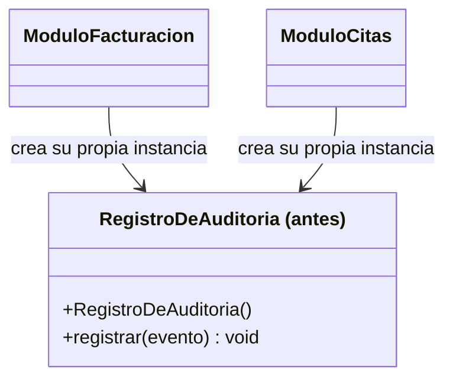
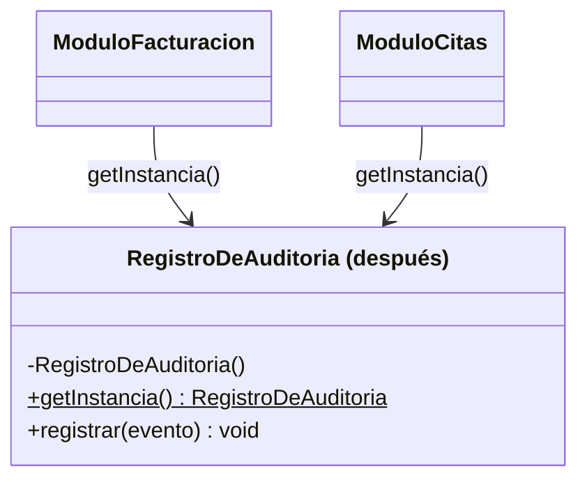

# 💡 Ejemplo 06 — Singleton

## 🌍 Contexto

MediSalud quiere un registro de auditoría que reciba eventos desde distintos módulos (facturación,
citas) y los concentre todos en un único lugar consultable. Si `RegistroDeAuditoria` tiene un
constructor público normal, cada módulo que lo necesite puede crear su propia instancia — y entonces cada
uno termina viendo solo una parte de los eventos, no el total.

**Qué busca demostrar este ejemplo**: que dos instancias "independientes" de una clase que debería ser
única reparten el estado entre sí, y cómo garantizar una única instancia compartida lo evita.

## 🏥 Caso de estudio

MediSalud necesita un registro de auditoría único, consultado desde varios módulos del sistema.

## 🗺️ Diagrama





*Arriba, la versión "antes" (cada módulo crea su propia instancia). Abajo, la versión "después" (ambos
módulos acceden a la misma instancia única).*

## 🌳 Árbol de archivos — antes

```text
singleton-antes/
└── com/medisalud/
    ├── RegistroDeAuditoria.java
    ├── ModuloFacturacion.java
    ├── ModuloCitas.java
    └── Demo.java
```

## 💻 Archivo: RegistroDeAuditoria.java

```java
package com.medisalud;

import java.util.ArrayList;
import java.util.List;

public class RegistroDeAuditoria {
    private List<String> eventos = new ArrayList<>();

    public void registrar(String evento) {
        eventos.add(evento);
    }

    public int totalEventos() {
        return eventos.size();
    }
}
```

## 💻 Archivo: ModuloFacturacion.java

```java
package com.medisalud;

public class ModuloFacturacion {
    private RegistroDeAuditoria registro = new RegistroDeAuditoria();

    public void facturar(String paciente) {
        registro.registrar("Factura emitida a " + paciente);
    }

    public RegistroDeAuditoria getRegistro() {
        return registro;
    }
}
```

## 💻 Archivo: ModuloCitas.java

```java
package com.medisalud;

public class ModuloCitas {
    private RegistroDeAuditoria registro = new RegistroDeAuditoria();

    public void agendar(String paciente) {
        registro.registrar("Cita agendada para " + paciente);
    }

    public RegistroDeAuditoria getRegistro() {
        return registro;
    }
}
```

## 💻 Archivo: Demo.java

```java
package com.medisalud;

public class Demo {
    public static void main(String[] args) {
        // Datos de entrada
        ModuloFacturacion facturacion = new ModuloFacturacion();
        ModuloCitas citas = new ModuloCitas();

        facturacion.facturar("Marta Diaz");
        citas.agendar("Jorge Paz");
        citas.agendar("Lucia Fernandez");

        boolean mismaInstancia = facturacion.getRegistro() == citas.getRegistro();
        System.out.println("mismaInstancia=" + mismaInstancia);
        System.out.println("eventos en facturacion=" + facturacion.getRegistro().totalEventos());
        System.out.println("eventos en citas=" + citas.getRegistro().totalEventos());
    }
}
```

## ✅ Resultado esperado — antes

```text
mismaInstancia=false
eventos en facturacion=1
eventos en citas=2
```

## 🌳 Árbol de archivos — después

```text
singleton-despues/
└── com/medisalud/
    ├── RegistroDeAuditoria.java   (cambió: constructor privado, instancia estática)
    ├── ModuloFacturacion.java     (cambió: usa getInstancia())
    ├── ModuloCitas.java           (cambió: usa getInstancia())
    └── Demo.java                  (cambió)
```

## 💻 Archivo: RegistroDeAuditoria.java

```java
package com.medisalud;

import java.util.ArrayList;
import java.util.List;

public class RegistroDeAuditoria {
    private static final RegistroDeAuditoria instancia = new RegistroDeAuditoria();

    private List<String> eventos = new ArrayList<>();

    private RegistroDeAuditoria() {
    }

    public static RegistroDeAuditoria getInstancia() {
        return instancia;
    }

    public void registrar(String evento) {
        eventos.add(evento);
    }

    public int totalEventos() {
        return eventos.size();
    }
}
```

## 💻 Archivo: ModuloFacturacion.java

```java
package com.medisalud;

public class ModuloFacturacion {
    public void facturar(String paciente) {
        RegistroDeAuditoria.getInstancia().registrar("Factura emitida a " + paciente);
    }
}
```

## 💻 Archivo: ModuloCitas.java

```java
package com.medisalud;

public class ModuloCitas {
    public void agendar(String paciente) {
        RegistroDeAuditoria.getInstancia().registrar("Cita agendada para " + paciente);
    }
}
```

## 💻 Archivo: Demo.java

```java
package com.medisalud;

public class Demo {
    public static void main(String[] args) {
        // Datos de entrada
        ModuloFacturacion facturacion = new ModuloFacturacion();
        ModuloCitas citas = new ModuloCitas();

        facturacion.facturar("Marta Diaz");
        citas.agendar("Jorge Paz");
        citas.agendar("Lucia Fernandez");

        RegistroDeAuditoria registroDesdeFacturacion = RegistroDeAuditoria.getInstancia();
        RegistroDeAuditoria registroDesdeCitas = RegistroDeAuditoria.getInstancia();

        boolean mismaInstancia = registroDesdeFacturacion == registroDesdeCitas;
        System.out.println("mismaInstancia=" + mismaInstancia);
        System.out.println("eventos totales=" + registroDesdeFacturacion.totalEventos());
    }
}
```

## ✅ Resultado esperado — después

```text
mismaInstancia=true
eventos totales=3
```

## 🔍 Comparación: la prueba concreta

En la versión "antes", `ModuloFacturacion` y `ModuloCitas` crean cada uno su propia instancia de
`RegistroDeAuditoria`. Comparadas con `==`, esas dos instancias son **distintas**
(`mismaInstancia=false`), y los eventos quedan repartidos: la instancia de facturación reporta 1 evento,
la de citas reporta 2 — ningún reporte que consulte una sola de las dos ve el total real.

En la versión "después", ambos módulos llaman a `RegistroDeAuditoria.getInstancia()`. Comparadas con
`==`, las dos referencias obtenidas son la **misma** (`mismaInstancia=true`), y el total de eventos es 3
—la suma real de lo registrado por ambos módulos, concentrado en un único objeto.

## 🔍 Análisis: errores frecuentes

El error más frecuente con Singleton no es de implementación, sino de criterio: usarlo como reemplazo
general de recibir una dependencia por constructor (DIP, Módulo 11), "porque es más simple no tener que
pasar el objeto". Eso acopla cualquier clase que use el Singleton a un estado global oculto, difícil de
sustituir y de aislar al probar. Singleton se justifica cuando de verdad debe existir una única instancia
compartida por razones del propio dominio (como un registro de auditoría central) — no como atajo para
evitar pasar parámetros.

## ❓ Preguntas de repaso

**1. [Selección]** En la versión "antes", ¿por qué `ModuloFacturacion.getRegistro()` y
`ModuloCitas.getRegistro()` devuelven objetos distintos?

- A. Porque `RegistroDeAuditoria` tiene un constructor público, y cada módulo crea su propia instancia.
- B. Porque `registrar()` crea una copia nueva cada vez que se llama.
- C. Porque Java no permite compartir objetos entre clases distintas.
- D. No son distintos: `mismaInstancia` da `true` en la versión "antes".

<details>
<summary>🔑 Ver respuesta</summary>

**Respuesta correcta: A.** El constructor público permite que cualquier clase cree su propia instancia
de `RegistroDeAuditoria`; como cada módulo hace `new RegistroDeAuditoria()` por su cuenta, terminan con
objetos distintos.

</details>

**2. [Selección múltiple]** Sobre la versión "después", ¿cuáles afirmaciones son verdaderas?

- A. El constructor de `RegistroDeAuditoria` es `private`.
- B. `getInstancia()` siempre devuelve el mismo objeto.
- C. `ModuloFacturacion` y `ModuloCitas` pueden seguir creando su propia instancia con `new` si lo
  necesitan.
- D. El total de eventos registrados por ambos módulos se puede consultar desde una sola instancia.

<details>
<summary>🔑 Ver respuesta</summary>

**Respuestas correctas: A, B y D.** C es falsa: justamente porque el constructor es `private`, ninguna
otra clase puede invocar `new RegistroDeAuditoria()` desde fuera — la única forma de obtener la instancia
es a través de `getInstancia()`.

</details>

**3. [Abierta]** Un compañero propone usar Singleton para el `GestorCitas` del taller del Módulo 11, "así
cualquier clase puede acceder a él sin que se lo pasen por constructor". ¿Es una buena idea? Justifica tu
respuesta.

<details>
<summary>🔑 Ver respuesta</summary>

No necesariamente. Reemplazar el paso de dependencias por constructor (DIP) con un Singleton "porque es
más cómodo" acopla a cualquier clase que lo use a un estado global oculto, y dificulta sustituirlo o
aislarlo al probar — exactamente lo que DIP buscaba evitar. Singleton se justifica cuando el propio
dominio exige que exista una única instancia compartida (como un registro de auditoría central, donde dos
instancias distintas romperían el propósito del registro), no como un atajo general para no pasar
parámetros.

</details>
