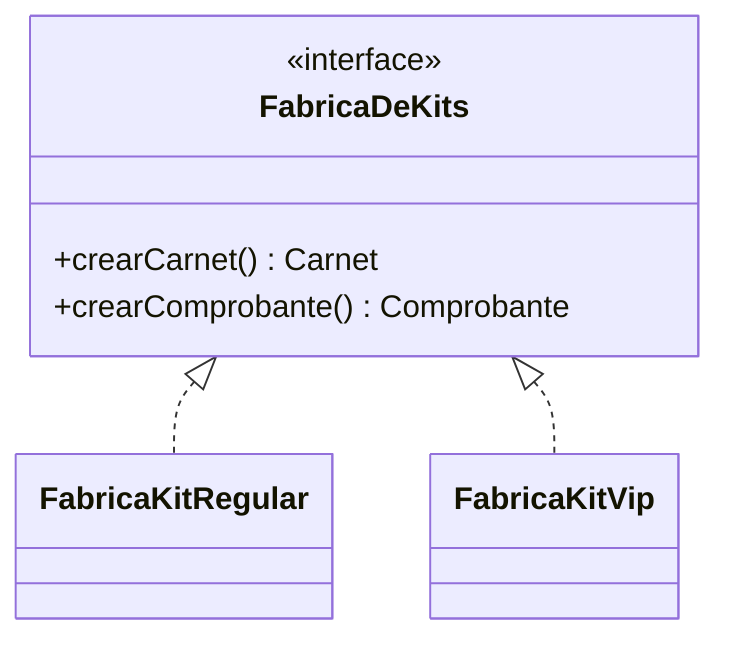

# 🟡 Intermedio 02 — Aplicar Abstract Factory

## 🧩 Problema

Tienes el mismo armador de kits de la Biblioteca Universitaria del ejercicio Básico 02:

## 💻 Código o contexto de partida

```java
package com.biblioteca;

public interface Carnet {
    String describir();
}
```

```java
package com.biblioteca;

public class CarnetRegular implements Carnet {
    public String describir() {
        return "Carnet linea REGULAR";
    }
}
```

```java
package com.biblioteca;

public class CarnetVip implements Carnet {
    public String describir() {
        return "Carnet linea VIP";
    }
}
```

```java
package com.biblioteca;

public interface Comprobante {
    String describir();
}
```

```java
package com.biblioteca;

public class ComprobanteRegular implements Comprobante {
    public String describir() {
        return "Comprobante linea REGULAR";
    }
}
```

```java
package com.biblioteca;

public class ComprobanteVip implements Comprobante {
    public String describir() {
        return "Comprobante linea VIP";
    }
}
```

```java
package com.biblioteca;

public class ArmadorDeKits {
    public String armarKit(String lineaCarnet, String lineaComprobante) {
        Carnet carnet = lineaCarnet.equals("VIP") ? new CarnetVip() : new CarnetRegular();
        Comprobante comprobante = lineaComprobante.equals("VIP") ? new ComprobanteVip() : new ComprobanteRegular();
        return carnet.describir() + " + " + comprobante.describir();
    }
}
```

```java
package com.biblioteca;

public class Demo {
    public static void main(String[] args) {
        // Datos de entrada
        ArmadorDeKits armador = new ArmadorDeKits();

        System.out.println("kit1=" + armador.armarKit("REGULAR", "REGULAR"));
        // Error de un lugar del codigo que arma el kit con lineas mezcladas por accidente:
        System.out.println("kit2 (mezclado por error)=" + armador.armarKit("VIP", "REGULAR"));
    }
}
```

Rediséñalo para que respete Abstract Factory: declara una interfaz que cree toda la familia de insumos
del kit, con una implementación por línea, de forma que sea imposible mezclar líneas.

## 🗺️ Diagrama



## 🧪 Casos de prueba

| Entrada | Verificación | Resultado esperado |
|---|---|---|
| `armarKit(new FabricaKitRegular())` | Línea del carnet y del comprobante | Ambas `REGULAR` |
| `armarKit(new FabricaKitVip())` | Línea del carnet y del comprobante | Ambas `VIP` |
| Cualquier invocación de `armarKit` | Consistencia entre carnet y comprobante | Siempre de la misma línea; no existe forma de mezclarlas |

## 📏 Criterios de evaluación de la solución

- Declara una interfaz `FabricaDeKits` con un método por insumo del kit.
- Declara una implementación por línea existente.
- `ArmadorDeKits.armarKit` recibe una única `FabricaDeKits` y le pide todos los insumos a esa misma
  instancia.

## 🚧 Restricciones

- No se usan anotaciones ni un framework de inyección de dependencias.

## 📊 Dificultad

Intermedio

## 🎓 Resultados de aprendizaje

- **RA-7**: implementar Abstract Factory para un caso dado.
