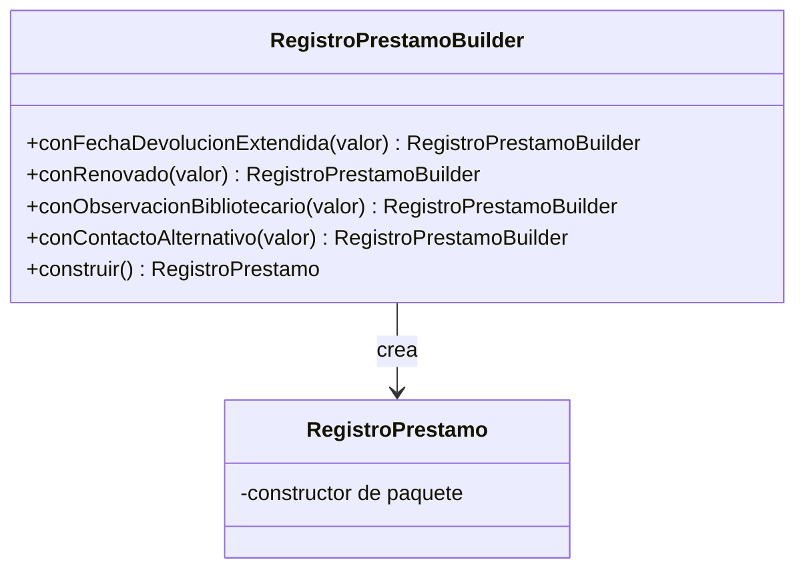

# 🟡 Intermedio 03 — Aplicar Builder

## 🧩 Problema

Tienes la misma clase de la Biblioteca Universitaria del ejercicio Básico 03:

## 💻 Código o contexto de partida

```java
package com.biblioteca;

public class RegistroPrestamo {
    private String usuario;
    private String material;
    private String fechaDevolucionExtendida;
    private boolean renovado;
    private String observacionBibliotecario;
    private String contactoAlternativo;

    public RegistroPrestamo(String usuario, String material, String fechaDevolucionExtendida,
                             boolean renovado, String observacionBibliotecario, String contactoAlternativo) {
        this.usuario = usuario;
        this.material = material;
        this.fechaDevolucionExtendida = fechaDevolucionExtendida;
        this.renovado = renovado;
        this.observacionBibliotecario = observacionBibliotecario;
        this.contactoAlternativo = contactoAlternativo;
    }

    public String resumen() {
        return usuario + " - " + material
            + ", fecha extendida: " + (fechaDevolucionExtendida == null ? "-" : fechaDevolucionExtendida)
            + ", renovado: " + renovado
            + ", observacion: " + (observacionBibliotecario == null ? "-" : observacionBibliotecario)
            + ", contacto alternativo: " + (contactoAlternativo == null ? "-" : contactoAlternativo);
    }
}
```

```java
package com.biblioteca;

public class Demo {
    public static void main(String[] args) {
        // Datos de entrada
        RegistroPrestamo correcto = new RegistroPrestamo(
            "Elena Ruiz", "Cien anios de soledad", "2026-10-15", true, "Ninguna", "Pablo Ruiz - 555-1111"
        );
        System.out.println("correcto: " + correcto.resumen());

        // Error facil de cometer: observacion y contacto alternativo intercambiados por accidente
        // (el compilador no puede detectarlo: ambos son String)
        RegistroPrestamo confundido = new RegistroPrestamo(
            "Pablo Sosa", "Rayuela", null, false, "Ana Sosa - 555-2222", "Sin observaciones"
        );
        System.out.println("confundido: " + confundido.resumen());
    }
}
```

Rediséñala para que respete Builder: declara una clase que arme el registro paso a paso, con un método
nombrado por cada dato opcional, de forma que ya no sea posible confundir el orden de los datos.

## 🗺️ Diagrama



## 🧪 Casos de prueba

| Entrada | Verificación | Resultado esperado |
|---|---|---|
| Builder con todos los datos, en cualquier orden de llamada a los métodos `con...` | Resumen final | Cada dato en el campo correcto, sin importar el orden de las llamadas |
| Builder con solo los datos obligatorios | `resumen()` | Los datos opcionales no informados aparecen como `-` |

## 📏 Criterios de evaluación de la solución

- Declara una clase `RegistroPrestamoBuilder`, sin clase anidada.
- Recibe los datos obligatorios (`usuario`, `material`) en su propio constructor.
- Cada dato opcional se agrega con un método nombrado que devuelve el propio builder.
- `RegistroPrestamo` ya no puede construirse con un orden de argumentos confuso.

## 🚧 Restricciones

- No se usa una clase anidada para el builder.

## 📊 Dificultad

Intermedio

## 🎓 Resultados de aprendizaje

- **RA-10**: implementar Builder para un caso dado.
