# Módulo 12 — Patrones de Diseño (Patrones Creacionales)

Curso de Java

---

## 🎯 Objetivos del módulo

- Explicar qué es un patrón de diseño y qué distingue a los patrones creacionales.
- Explicar el problema de creación que resuelve cada uno de los cinco patrones: Factory Method, Abstract
  Factory, Builder, Prototype y Singleton.
- Identificar cuál de los cinco patrones resuelve un problema de creación dado.
- Implementar cada patrón en Java para un caso real.

---

## 🗺️ Ruta de la sesión

1. Qué son los patrones de diseño.
2. Factory Method.
3. Abstract Factory.
4. Builder.
5. Prototype.
6. Singleton.

---

## 🧠 ¿Qué es un patrón de diseño?

Una solución reutilizable y ya probada, con nombre propio, a un problema de diseño que se repite en
proyectos distintos. El catálogo GoF los agrupa en tres categorías: creacionales, estructurales y de
comportamiento.

---

## 🗺️ Diagrama: las tres categorías y los cinco patrones de este módulo

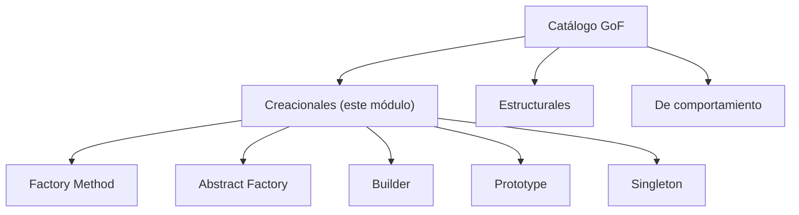

---

## 🔗 De SOLID a los patrones de diseño

En el Módulo 11, el diseño que resolvía OCP —una interfaz con una implementación por caso— coincidía,
sin nombrarlo, con el patrón Strategy. Este módulo formaliza ese vocabulario: los mismos principios que
ya conocés (una interfaz, una abstracción recibida por constructor) son la base de varios de estos cinco
patrones.

---

## 🏭 Factory Method

Delega la creación de un objeto a un método dedicado, en vez de que el cliente invoque `new`
directamente sobre un tipo concreto. Todo el código de este módulo, "antes" y "después", **compila y se
ejecuta correctamente**: el problema es de diseño, no de sintaxis ni de ejecución.

---

## 🗺️ Diagrama: Factory Method antes/después

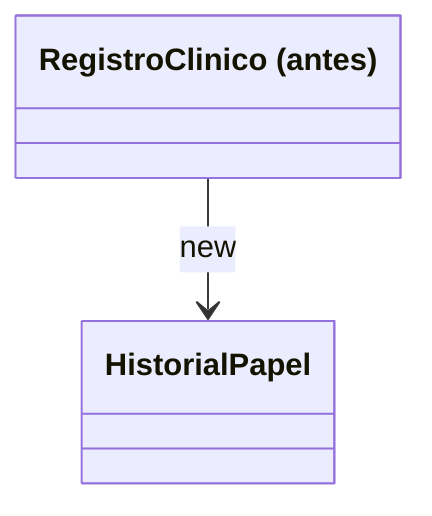

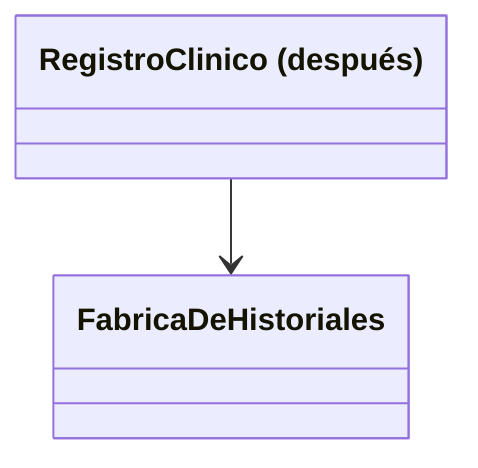

---

## 💻 Factory Method — antes

```java
public Historial abrirHistorialConsulta(String tipo) {
    if (tipo.equals("PAPEL")) {
        return new HistorialPapel();
    }
    throw new IllegalArgumentException("Tipo desconocido: " + tipo);
}
```

---

## 💻 Factory Method — después

```java
public Historial abrirHistorialConsulta(String tipo) {
    return FabricaDeHistoriales.crear(tipo);
}
```

---

## 🔍 Factory Method — la prueba concreta

Agregar un tipo nuevo (`HistorialDigital`): el cliente de la versión "antes" se modifica en dos lugares.
El cliente de la versión "después" queda **idéntico, byte a byte** — solo se agrega una clase y una rama
en la fábrica.

---

## 🏗️ Abstract Factory

Una interfaz para crear familias completas de objetos relacionados, sin que el cliente conozca sus
clases concretas — evita mezclar por error miembros de familias distintas.

---

## 🗺️ Diagrama: Abstract Factory antes/después

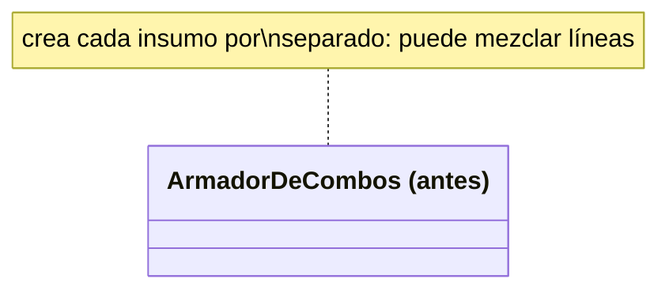

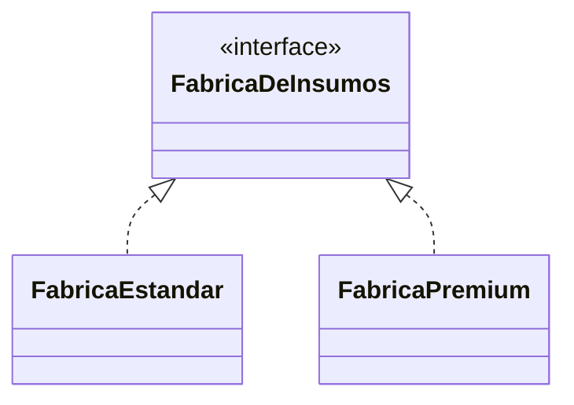

---

## 💻 Abstract Factory — antes

```java
Guante guante = lineaGuante.equals("PREMIUM") ? new GuantePremium() : new GuanteEstandar();
Mascarilla mascarilla = lineaMascarilla.equals("PREMIUM") ? new MascarillaPremium() : new MascarillaEstandar();
```

---

## 💻 Abstract Factory — después

```java
interface FabricaDeInsumos {
    Guante crearGuante();
    Mascarilla crearMascarilla();
}
```

---

## 🔍 Abstract Factory — la prueba concreta

En la versión "antes", `armarCombo("PREMIUM", "ESTANDAR")` produce un combo mezclado. En la versión
"después", ambos insumos salen siempre de la misma fábrica concreta: mezclar líneas es imposible por
construcción.

---

## 🧱 Builder

Construye un objeto complejo paso a paso, separando la construcción de su representación final — evita
un constructor con demasiados parámetros.

---

## 🗺️ Diagrama: Builder antes/después

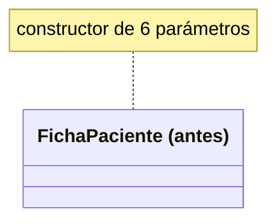

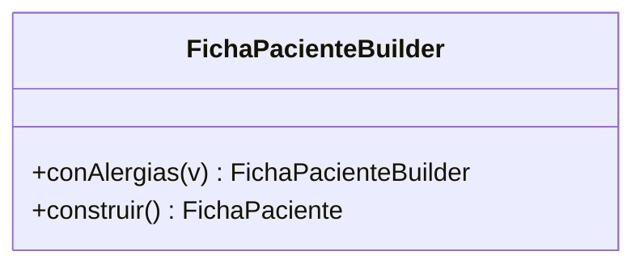

---

## 💻 Builder — antes

```java
FichaPaciente confundida = new FichaPaciente(
    "Pablo Sosa", 41, "Swiss Medical", "Ana Sosa - 555-5678", "Ninguna conocida", "-"
);
```

---

## 💻 Builder — después

```java
FichaPaciente parcial = new FichaPacienteBuilder("Pablo Sosa", 41)
    .conObraSocial("Swiss Medical")
    .conContactoEmergencia("Ana Sosa - 555-5678")
    .construir();
```

---

## 🔍 Builder — la prueba concreta

En la versión "antes", dos parámetros `String` consecutivos (alergias, contacto de emergencia) se
confunden: el programa compila y el dato queda mal ubicado, sin ningún error. En la versión "después",
cada dato se identifica por el nombre del método — el error deja de ser posible.

---

## 🧬 Prototype

Crea un objeto nuevo copiando (clonando) una instancia existente, en vez de construirlo desde cero.

---

## 🗺️ Diagrama: Prototype antes/después

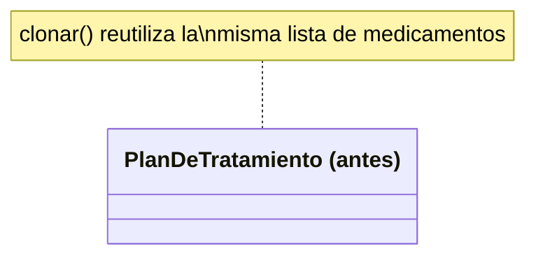

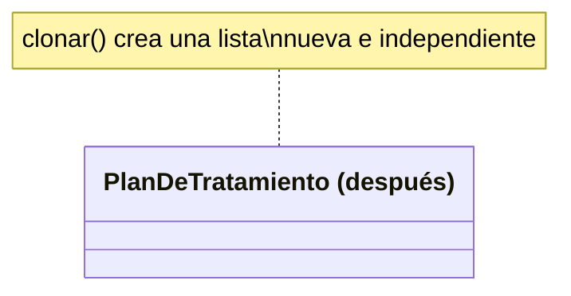

---

## 💻 Prototype — antes (clonado superficial)

```java
public PlanDeTratamiento clonar(String nuevoPaciente) {
    return new PlanDeTratamiento(nuevoPaciente, this.medicamentos);
}
```

---

## 💻 Prototype — después (clonado profundo)

```java
public PlanDeTratamiento clonar(String nuevoPaciente) {
    return new PlanDeTratamiento(nuevoPaciente, new ArrayList<>(this.medicamentos));
}
```

---

## 🔍 Prototype — superficial vs. profundo

Agregar un medicamento a la copia: en la versión "antes", el plan **original** también lo muestra — una
fuga real de datos, sin ninguna excepción. En la versión "después", el original queda intacto.

---

## 🔍 Prototype — la prueba concreta

```text
original: Marta Diaz: [Ibuprofeno 400mg, Paracetamol 500mg, Amoxicilina 500mg]   ← antes (bug)
original: Marta Diaz: [Ibuprofeno 400mg, Paracetamol 500mg]                     ← después (correcto)
```

Ambas versiones compilan y terminan con éxito: la diferencia se nota comparando el estado final.

---

## 🔒 Singleton

Garantiza que una clase tenga una única instancia en toda la aplicación, con un punto de acceso global.

---

## 🗺️ Diagrama: Singleton antes/después

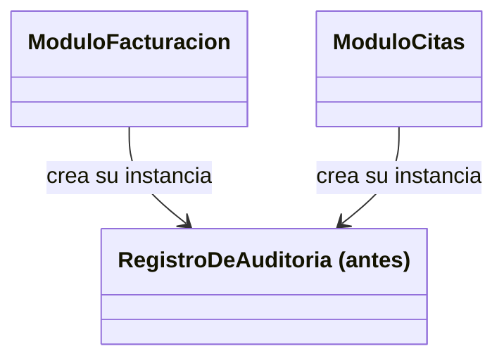

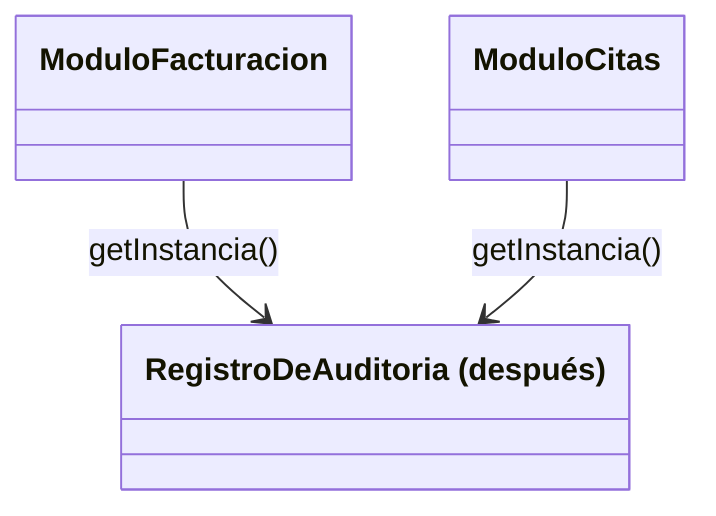

---

## 💻 Singleton — antes

```java
class RegistroDeAuditoria {
    public RegistroDeAuditoria() { }
}
```

---

## 💻 Singleton — después

```java
class RegistroDeAuditoria {
    private static final RegistroDeAuditoria instancia = new RegistroDeAuditoria();
    private RegistroDeAuditoria() { }
    public static RegistroDeAuditoria getInstancia() { return instancia; }
}
```

---

## 🔍 Singleton — la prueba concreta

Antes: `mismaInstancia=false`, eventos repartidos entre dos instancias. Después: `mismaInstancia=true`,
todos los eventos concentrados en una sola.

---

## ⚠️ Errores frecuentes, uno por patrón

- **Factory Method**: un método que hace `new` pero no aporta ningún beneficio real de extensión.
- **Abstract Factory**: usarlo cuando Factory Method alcanza (una sola familia de un objeto).
- **Builder**: permitir `construir()` en un estado inválido o incompleto.
- **Prototype**: un clonado superficial cuando el caso requería uno profundo.
- **Singleton**: reemplazar toda dependencia por un Singleton, acoplando a un estado global oculto.

---

## 📋 Resumen de los cinco patrones creacionales

| Patrón | Qué resuelve |
|---|---|
| Factory Method | Acoplamiento a clases concretas mediante `new` |
| Abstract Factory | Familias de objetos que deben ser consistentes entre sí |
| Builder | Constructor con demasiados parámetros |
| Prototype | Reconstruir un objeto casi idéntico a uno existente |
| Singleton | Dos instancias de algo que debería ser único |

---

## 🛠️ Taller: Sistema de Admisión de Pacientes de MediSalud

Vas a diseñar, desde cero, un sistema de admisión que combine cuatro de los cinco patrones: Factory
Method para el tipo de admisión, Abstract Factory para el kit de bienvenida, Builder para la ficha, y
Singleton para el registro central.

---

## 🧪 Ejercicios: Biblioteca Universitaria

12 ejercicios, del 🟢 Básico al 🏆 Desafío: identificar patrones ausentes, implementarlos, corregir un
diseño con dos patrones ausentes a la vez, y elegir el patrón adecuado para un caso nuevo.

---

## ❓ Quiz 01

17 preguntas en formato entrevista técnica: una por cada resultado de aprendizaje, desde "qué es un
patrón de diseño" hasta "elegir el patrón creacional adecuado para un problema nuevo".

---

## 📚 Repaso: la pregunta clave de cada patrón

- Factory Method: ¿el cliente crea el tipo concreto directamente?
- Abstract Factory: ¿hay una familia de objetos que deben ser consistentes entre sí?
- Builder: ¿el constructor tiene demasiados parámetros opcionales?
- Prototype: ¿conviene copiar un objeto existente en vez de construirlo desde cero?
- Singleton: ¿debe existir una única instancia compartida?

---

## ✅ Checklist de cierre

- Puedo nombrar los cinco patrones creacionales y qué problema de creación resuelve cada uno.
- Puedo identificar cuál aplica dado un problema de diseño nuevo.
- Puedo implementarlo en Java, con una prueba concreta de que resuelve el problema.

---

## 🎓 Cierre

Con los patrones creacionales completás el primer bloque del catálogo GoF: en el próximo módulo, esas
mismas clases e interfaces se combinan con patrones estructurales para resolver otro tipo de problema de
diseño.
