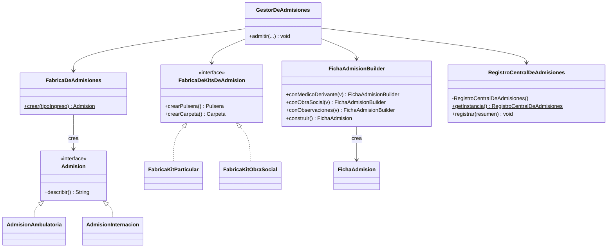

# 🔑 Solución del Taller 01 — Sistema de Admisión de Pacientes de MediSalud

> Material docente, no enlazar desde la audiencia estudiante.

## 🗺️ Diagrama de clases



## 🌳 Árbol de archivos

```text
AdmisionDePacientes/
└── com/medisalud/
    ├── Admision.java
    ├── AdmisionAmbulatoria.java
    ├── AdmisionInternacion.java
    ├── FabricaDeAdmisiones.java
    ├── Pulsera.java
    ├── PulseraParticular.java
    ├── PulseraObraSocial.java
    ├── Carpeta.java
    ├── CarpetaParticular.java
    ├── CarpetaObraSocial.java
    ├── FabricaDeKitsDeAdmision.java
    ├── FabricaKitParticular.java
    ├── FabricaKitObraSocial.java
    ├── FichaAdmision.java
    ├── FichaAdmisionBuilder.java
    ├── RegistroCentralDeAdmisiones.java
    ├── GestorDeAdmisiones.java
    ├── RecepcionPrincipal.java
    ├── Guardia.java
    └── Demo.java
```

## 💻 Código completo

## 💻 Archivo: Admision.java

```java
package com.medisalud;

public interface Admision {
    String describir();
}
```

## 💻 Archivo: AdmisionAmbulatoria.java

```java
package com.medisalud;

public class AdmisionAmbulatoria implements Admision {
    public String describir() {
        return "Admision ambulatoria";
    }
}
```

## 💻 Archivo: AdmisionInternacion.java

```java
package com.medisalud;

public class AdmisionInternacion implements Admision {
    public String describir() {
        return "Admision de internacion";
    }
}
```

## 💻 Archivo: FabricaDeAdmisiones.java

```java
package com.medisalud;

public class FabricaDeAdmisiones {
    public static Admision crear(String tipoIngreso) {
        if (tipoIngreso.equals("AMBULATORIA")) {
            return new AdmisionAmbulatoria();
        } else if (tipoIngreso.equals("INTERNACION")) {
            return new AdmisionInternacion();
        }
        throw new IllegalArgumentException("Tipo de ingreso desconocido: " + tipoIngreso);
    }
}
```

## 💻 Archivo: Pulsera.java

```java
package com.medisalud;

public interface Pulsera {
    String describir();
}
```

## 💻 Archivo: PulseraParticular.java

```java
package com.medisalud;

public class PulseraParticular implements Pulsera {
    public String describir() {
        return "Pulsera linea PARTICULAR";
    }
}
```

## 💻 Archivo: PulseraObraSocial.java

```java
package com.medisalud;

public class PulseraObraSocial implements Pulsera {
    public String describir() {
        return "Pulsera linea OBRA SOCIAL";
    }
}
```

## 💻 Archivo: Carpeta.java

```java
package com.medisalud;

public interface Carpeta {
    String describir();
}
```

## 💻 Archivo: CarpetaParticular.java

```java
package com.medisalud;

public class CarpetaParticular implements Carpeta {
    public String describir() {
        return "Carpeta linea PARTICULAR";
    }
}
```

## 💻 Archivo: CarpetaObraSocial.java

```java
package com.medisalud;

public class CarpetaObraSocial implements Carpeta {
    public String describir() {
        return "Carpeta linea OBRA SOCIAL";
    }
}
```

## 💻 Archivo: FabricaDeKitsDeAdmision.java

```java
package com.medisalud;

public interface FabricaDeKitsDeAdmision {
    Pulsera crearPulsera();
    Carpeta crearCarpeta();
}
```

## 💻 Archivo: FabricaKitParticular.java

```java
package com.medisalud;

public class FabricaKitParticular implements FabricaDeKitsDeAdmision {
    public Pulsera crearPulsera() {
        return new PulseraParticular();
    }

    public Carpeta crearCarpeta() {
        return new CarpetaParticular();
    }
}
```

## 💻 Archivo: FabricaKitObraSocial.java

```java
package com.medisalud;

public class FabricaKitObraSocial implements FabricaDeKitsDeAdmision {
    public Pulsera crearPulsera() {
        return new PulseraObraSocial();
    }

    public Carpeta crearCarpeta() {
        return new CarpetaObraSocial();
    }
}
```

## 💻 Archivo: FichaAdmision.java

```java
package com.medisalud;

public class FichaAdmision {
    private String paciente;
    private String tipoIngreso;
    private String medicoDerivante;
    private String obraSocial;
    private String observaciones;

    FichaAdmision(String paciente, String tipoIngreso, String medicoDerivante, String obraSocial,
                  String observaciones) {
        this.paciente = paciente;
        this.tipoIngreso = tipoIngreso;
        this.medicoDerivante = medicoDerivante;
        this.obraSocial = obraSocial;
        this.observaciones = observaciones;
    }

    public String getTipoIngreso() {
        return tipoIngreso;
    }

    public String resumen() {
        return paciente + " (" + tipoIngreso + ")"
            + ", medico derivante: " + (medicoDerivante == null ? "-" : medicoDerivante)
            + ", obra social: " + (obraSocial == null ? "particular" : obraSocial)
            + ", observaciones: " + (observaciones == null ? "-" : observaciones);
    }
}
```

## 💻 Archivo: FichaAdmisionBuilder.java

```java
package com.medisalud;

public class FichaAdmisionBuilder {
    private String paciente;
    private String tipoIngreso;
    private String medicoDerivante;
    private String obraSocial;
    private String observaciones;

    public FichaAdmisionBuilder(String paciente, String tipoIngreso) {
        this.paciente = paciente;
        this.tipoIngreso = tipoIngreso;
    }

    public FichaAdmisionBuilder conMedicoDerivante(String medico) {
        this.medicoDerivante = medico;
        return this;
    }

    public FichaAdmisionBuilder conObraSocial(String obraSocial) {
        this.obraSocial = obraSocial;
        return this;
    }

    public FichaAdmisionBuilder conObservaciones(String observaciones) {
        this.observaciones = observaciones;
        return this;
    }

    public FichaAdmision construir() {
        return new FichaAdmision(paciente, tipoIngreso, medicoDerivante, obraSocial, observaciones);
    }
}
```

## 💻 Archivo: RegistroCentralDeAdmisiones.java

```java
package com.medisalud;

import java.util.ArrayList;
import java.util.List;

public class RegistroCentralDeAdmisiones {
    private static final RegistroCentralDeAdmisiones instancia = new RegistroCentralDeAdmisiones();

    private List<String> admisiones = new ArrayList<>();

    private RegistroCentralDeAdmisiones() {
    }

    public static RegistroCentralDeAdmisiones getInstancia() {
        return instancia;
    }

    public void registrar(String resumen) {
        admisiones.add(resumen);
    }

    public int totalAdmisiones() {
        return admisiones.size();
    }
}
```

## 💻 Archivo: GestorDeAdmisiones.java

```java
package com.medisalud;

public class GestorDeAdmisiones {
    public void admitir(String paciente, String tipoIngreso, FabricaDeKitsDeAdmision fabricaKit,
                         String medicoDerivante, String obraSocial) {
        Admision admision = FabricaDeAdmisiones.crear(tipoIngreso);

        Pulsera pulsera = fabricaKit.crearPulsera();
        Carpeta carpeta = fabricaKit.crearCarpeta();

        FichaAdmision ficha = new FichaAdmisionBuilder(paciente, tipoIngreso)
            .conMedicoDerivante(medicoDerivante)
            .conObraSocial(obraSocial)
            .construir();

        String resumen = ficha.resumen() + " | " + admision.describir()
            + " | " + pulsera.describir() + " | " + carpeta.describir();
        RegistroCentralDeAdmisiones.getInstancia().registrar(resumen);
        System.out.println(resumen);
    }
}
```

## 💻 Archivo: RecepcionPrincipal.java

```java
package com.medisalud;

public class RecepcionPrincipal {
    private GestorDeAdmisiones gestor = new GestorDeAdmisiones();

    public void admitir(String paciente, String tipoIngreso, FabricaDeKitsDeAdmision fabricaKit,
                         String medicoDerivante, String obraSocial) {
        gestor.admitir(paciente, tipoIngreso, fabricaKit, medicoDerivante, obraSocial);
    }
}
```

## 💻 Archivo: Guardia.java

```java
package com.medisalud;

public class Guardia {
    private GestorDeAdmisiones gestor = new GestorDeAdmisiones();

    public void admitir(String paciente, String tipoIngreso, FabricaDeKitsDeAdmision fabricaKit,
                         String medicoDerivante, String obraSocial) {
        gestor.admitir(paciente, tipoIngreso, fabricaKit, medicoDerivante, obraSocial);
    }
}
```

## 💻 Archivo: Demo.java

```java
package com.medisalud;

public class Demo {
    public static void main(String[] args) {
        // Datos de entrada
        RecepcionPrincipal recepcion = new RecepcionPrincipal();
        Guardia guardia = new Guardia();

        recepcion.admitir("Marta Diaz", "AMBULATORIA", new FabricaKitParticular(), "Dr. Torres", null);
        guardia.admitir("Jorge Paz", "INTERNACION", new FabricaKitObraSocial(), null, "OSDE");

        System.out.println("totalAdmisiones=" + RegistroCentralDeAdmisiones.getInstancia().totalAdmisiones());
    }
}
```

## ✅ Salida real

```text
Marta Diaz (AMBULATORIA), medico derivante: Dr. Torres, obra social: particular, observaciones: - | Admision ambulatoria | Pulsera linea PARTICULAR | Carpeta linea PARTICULAR
Jorge Paz (INTERNACION), medico derivante: -, obra social: OSDE, observaciones: - | Admision de internacion | Pulsera linea OBRA SOCIAL | Carpeta linea OBRA SOCIAL
totalAdmisiones=2
```

## ⚠️ Errores comunes observados

- **Crear la `Admision` con `new` directamente en `GestorDeAdmisiones`**: en vez de delegar en
  `FabricaDeAdmisiones.crear(tipoIngreso)`, es tentador escribir un `if`/`else` dentro del propio gestor
  — eso reintroduce la violación de Factory Method que el taller pide evitar.
- **Armar el kit pidiendo la pulsera a una fábrica y la carpeta a otra**: si `crearPulsera()` y
  `crearCarpeta()` se invocan sobre instancias de fábrica distintas en vez de una sola, el kit puede
  mezclar líneas — el punto entero de recibir una única `FabricaDeKitsDeAdmision` es evitar justamente
  eso.
- **Declarar `RegistroCentralDeAdmisiones` con un constructor público**: aunque el resto del diseño esté
  bien, un constructor público permite que `RecepcionPrincipal` y `Guardia` (o cualquier clase nueva)
  terminen creando cada una su propio registro, reintroduciendo la violación de Singleton.
