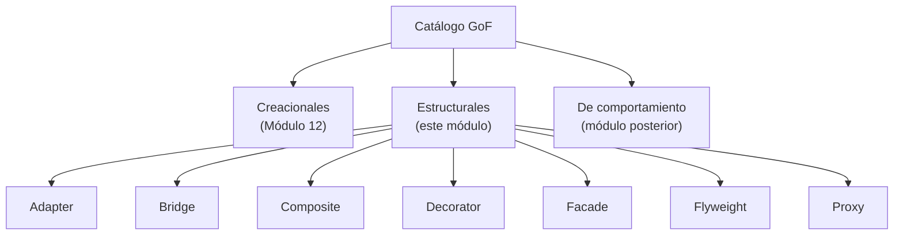

# 💡 Ejemplo 01 — Qué son los patrones estructurales

## 🌍 Contexto

En el Módulo 12 aprendiste los cinco patrones creacionales: soluciones a problemas de **cómo se crean**
los objetos. Este módulo cubre la segunda categoría del catálogo GoF: los patrones **estructurales**,
que resuelven problemas de **cómo se componen** clases y objetos ya creados para formar estructuras más
grandes — sin que esa composición se vuelva rígida (difícil de extender), redundante (código repetido) o
ineficiente (memoria desperdiciada).

## 🗺️ Diagrama

## 🧭 Explicación paso a paso

1. **Creacionales** (Módulo 12): controlan cómo se crean los objetos.
2. **Estructurales** (este módulo): controlan cómo se componen clases y objetos para formar estructuras
   más grandes.
3. **De comportamiento** (módulo posterior): controlan cómo se comunican y reparten responsabilidades
   los objetos entre sí.
4. Cada uno de los siete patrones estructurales resuelve un problema de composición distinto: una
   interfaz incompatible (Adapter), dos dimensiones de variación mezcladas (Bridge), una estructura de
   árbol tratada con condicionales (Composite), combinaciones de extras resueltas con herencia
   (Decorator), un subsistema complejo expuesto sin simplificar (Facade), muchos objetos casi idénticos
   desperdiciando memoria (Flyweight), y un objeto costoso o sensible sin ningún control intermedio
   (Proxy).
5. Como con los patrones creacionales, ninguno se aplica "porque es lo correcto": cada uno se justifica
   por el problema concreto de composición que resuelve.

## ✅ Resultado esperado

Después de este ejemplo, el estudiante puede explicar:

- Qué es un patrón estructural y en qué se distingue de los creacionales y de los de comportamiento.
- Que los siete patrones de este módulo resuelven problemas de composición distintos entre sí.
- Que aplicar un patrón estructural a un problema que no lo necesita agrega complejidad sin beneficio.

## ❓ Preguntas de repaso

❓ 1. ¿Qué es un patrón estructural?

🔑 Ver respuesta

Un patrón que resuelve un problema de cómo se componen clases y objetos para formar estructuras más
grandes, sin que esa composición se vuelva rígida, redundante o ineficiente.

❓ 2. ¿En qué se diferencian los patrones estructurales de los creacionales?

🔑 Ver respuesta

Los creacionales (Módulo 12) controlan cómo se crean los objetos; los estructurales controlan cómo se
componen objetos ya creados para formar estructuras más grandes.

❓ 3. ¿Es correcto aplicar un patrón estructural a cualquier problema de composición, "porque
es una buena práctica"?

🔑 Ver respuesta

No. Cada patrón se justifica por el problema concreto que resuelve; aplicarlo donde no hace falta agrega
una interfaz y clases adicionales sin ningún beneficio real.

