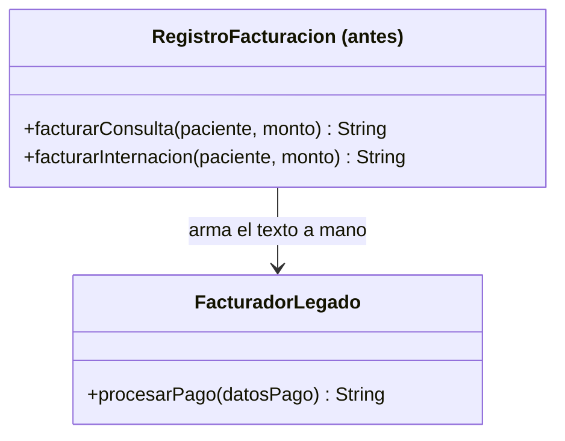
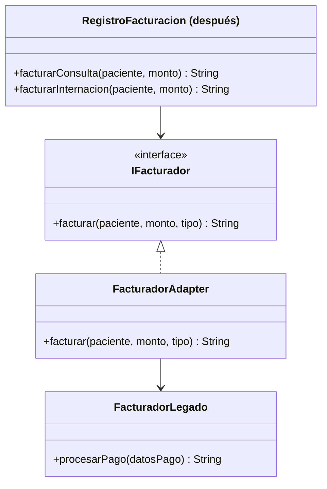

# 💡 Ejemplo 02 — Adapter

## 🌍 Contexto

MediSalud usa un sistema de facturación externo (`FacturadorLegado`) que ya existe y no se puede
modificar. Su único método, `procesarPago(String datosPago)`, espera un formato de texto propio. El
código que registra facturas arma ese texto a mano cada vez que necesita facturar — en más de un lugar.

**Qué busca demostrar este ejemplo**: cómo una traducción de formato duplicada en el código cliente se
centraliza en una única clase adaptadora, sin modificar el sistema externo ni el código cliente que ya
funciona.

## 🏥 Caso de estudio

MediSalud factura consultas e internaciones a través de un sistema de facturación externo con un
formato de datos propio.

## 🗺️ Diagrama





*Arriba, la versión "antes" (el cliente traduce a mano en cada método). Abajo, la versión "después" (el
adaptador traduce una sola vez).*

## 🌳 Árbol de archivos — antes

```text
adapter-antes/
└── com/medisalud/
    ├── FacturadorLegado.java
    ├── RegistroFacturacion.java
    └── Demo.java
```

## 💻 Archivo: FacturadorLegado.java

```java
package com.medisalud;

public class FacturadorLegado {
    public String procesarPago(String datosPago) {
        return "Pago procesado (legado): " + datosPago;
    }
}
```

## 💻 Archivo: RegistroFacturacion.java

```java
package com.medisalud;

public class RegistroFacturacion {
    private FacturadorLegado facturador = new FacturadorLegado();

    public String facturarConsulta(String paciente, double monto) {
        // Traduccion manual al formato de texto que espera el facturador legado
        String datosPago = "PACIENTE=" + paciente + ";MONTO=" + monto + ";TIPO=CONSULTA";
        return facturador.procesarPago(datosPago);
    }

    public String facturarInternacion(String paciente, double monto) {
        // Misma traduccion repetida en otro lugar del codigo
        String datosPago = "PACIENTE=" + paciente + ";MONTO=" + monto + ";TIPO=INTERNACION";
        return facturador.procesarPago(datosPago);
    }
}
```

## 💻 Archivo: Demo.java

```java
package com.medisalud;

public class Demo {
    public static void main(String[] args) {
        // Datos de entrada
        RegistroFacturacion registro = new RegistroFacturacion();

        System.out.println(registro.facturarConsulta("Marta Diaz", 5000.0));
        System.out.println(registro.facturarInternacion("Jorge Paz", 20000.0));
    }
}
```

## ✅ Resultado esperado — antes

```text
Pago procesado (legado): PACIENTE=Marta Diaz;MONTO=5000.0;TIPO=CONSULTA
Pago procesado (legado): PACIENTE=Jorge Paz;MONTO=20000.0;TIPO=INTERNACION
```

## 🌳 Árbol de archivos — después

```text
adapter-despues/
└── com/medisalud/
    ├── FacturadorLegado.java     (sin cambios)
    ├── IFacturador.java          (nuevo)
    ├── FacturadorAdapter.java    (nuevo)
    ├── RegistroFacturacion.java  (cambió)
    └── Demo.java                 (cambió)
```

Sin cambios respecto de "antes": `FacturadorLegado.java` — su código ya se mostró arriba y es
exactamente el mismo, byte a byte.

<details>
<summary>💻 Ver de nuevo el código sin cambios (FacturadorLegado.java)</summary>

## 💻 Archivo: FacturadorLegado.java

```java
package com.medisalud;

public class FacturadorLegado {
    public String procesarPago(String datosPago) {
        return "Pago procesado (legado): " + datosPago;
    }
}
```

</details>

## 💻 Archivo: IFacturador.java — nuevo

```java
package com.medisalud;

public interface IFacturador {
    String facturar(String paciente, double monto, String tipo);
}
```

## 💻 Archivo: FacturadorAdapter.java — nuevo

```java
package com.medisalud;

public class FacturadorAdapter implements IFacturador {
    private FacturadorLegado facturadorLegado;

    public FacturadorAdapter(FacturadorLegado facturadorLegado) {
        this.facturadorLegado = facturadorLegado;
    }

    public String facturar(String paciente, double monto, String tipo) {
        String datosPago = "PACIENTE=" + paciente + ";MONTO=" + monto + ";TIPO=" + tipo;
        return facturadorLegado.procesarPago(datosPago);
    }
}
```

## 💻 Archivo: RegistroFacturacion.java — cambió

```java
package com.medisalud;

public class RegistroFacturacion {
    private IFacturador facturador;

    public RegistroFacturacion(IFacturador facturador) {
        this.facturador = facturador;
    }

    public String facturarConsulta(String paciente, double monto) {
        return facturador.facturar(paciente, monto, "CONSULTA");
    }

    public String facturarInternacion(String paciente, double monto) {
        return facturador.facturar(paciente, monto, "INTERNACION");
    }
}
```

## 💻 Archivo: Demo.java — cambió

```java
package com.medisalud;

public class Demo {
    public static void main(String[] args) {
        // Datos de entrada
        RegistroFacturacion registro = new RegistroFacturacion(new FacturadorAdapter(new FacturadorLegado()));

        System.out.println(registro.facturarConsulta("Marta Diaz", 5000.0));
        System.out.println(registro.facturarInternacion("Jorge Paz", 20000.0));
    }
}
```

## ✅ Resultado esperado — después

```text
Pago procesado (legado): PACIENTE=Marta Diaz;MONTO=5000.0;TIPO=CONSULTA
Pago procesado (legado): PACIENTE=Jorge Paz;MONTO=20000.0;TIPO=INTERNACION
```

## 🔍 Comparación: la prueba concreta

Ambas versiones producen la misma salida. En la versión "antes", la traducción al formato de
`FacturadorLegado` (`"PACIENTE=...;MONTO=...;TIPO=..."`) está escrita dos veces, dentro de
`facturarConsulta` y `facturarInternacion`. En la versión "después", esa misma traducción vive en un
único lugar: `FacturadorAdapter.facturar(...)`. `RegistroFacturacion` ya no conoce el formato interno de
`FacturadorLegado`: solo conoce la interfaz `IFacturador`, y `FacturadorLegado.java` no se modificó en
absoluto.

## 🔍 Análisis: errores frecuentes

El error más frecuente al aplicar Adapter es escribir la clase adaptadora pero seguir dejando que el
cliente reciba o construya la clase legada directamente en algunos lugares (mezclando el uso de
`FacturadorLegado` y de `IFacturador`). El beneficio real de Adapter solo aparece cuando **todo** el
código cliente depende únicamente de la interfaz esperada, nunca de la clase concreta que se está
adaptando.

## ❓ Preguntas de repaso

**1. [Selección]** En la versión "antes", ¿dónde vive la traducción al formato de `FacturadorLegado`?

- A. Dentro de `FacturadorLegado.procesarPago`.
- B. Duplicada, dentro de `facturarConsulta` y de `facturarInternacion`.
- C. No existe ninguna traducción: `FacturadorLegado` ya entiende los datos originales.
- D. Dentro de una clase adaptadora separada.

<details>
<summary>🔑 Ver respuesta</summary>

**Respuesta correcta: B.** Cada método de `RegistroFacturacion` arma el texto del formato esperado por
separado, duplicando la misma lógica de traducción.

</details>

**2. [Selección múltiple]** Sobre la versión "después", ¿cuáles afirmaciones son verdaderas?

- A. `RegistroFacturacion` depende de la interfaz `IFacturador`, no de `FacturadorLegado` directamente.
- B. `FacturadorAdapter` es el único lugar que conoce el formato de texto de `FacturadorLegado`.
- C. `FacturadorLegado.java` se modificó para implementar `IFacturador`.
- D. La salida del programa es la misma que en la versión "antes".

<details>
<summary>🔑 Ver respuesta</summary>

**Respuestas correctas: A, B y D.** C es falsa: `FacturadorLegado.java` queda exactamente igual — el
adaptador lo envuelve desde afuera, sin modificarlo.

</details>

**3. [Abierta]** Un compañero dice: "para usar Adapter, alcanza con que `FacturadorAdapter` tenga un
método `facturar`, sin importar si `RegistroFacturacion` sigue recibiendo un `FacturadorLegado` en
algunos lugares". ¿Estás de acuerdo? Justifica tu respuesta.

<details>
<summary>🔑 Ver respuesta</summary>

No completamente. Si `RegistroFacturacion` sigue recibiendo o creando `FacturadorLegado` directamente en
algunos lugares, la traducción manual seguiría existiendo ahí, mezclada con el uso del adaptador en
otros. El beneficio real de Adapter aparece cuando el cliente depende únicamente de la interfaz
(`IFacturador`), nunca de la clase concreta que se está adaptando — de lo contrario, el problema original
solo se reduce, no se elimina.

</details>
