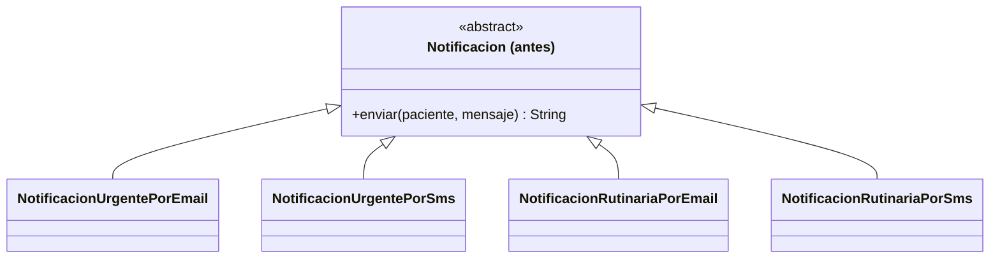
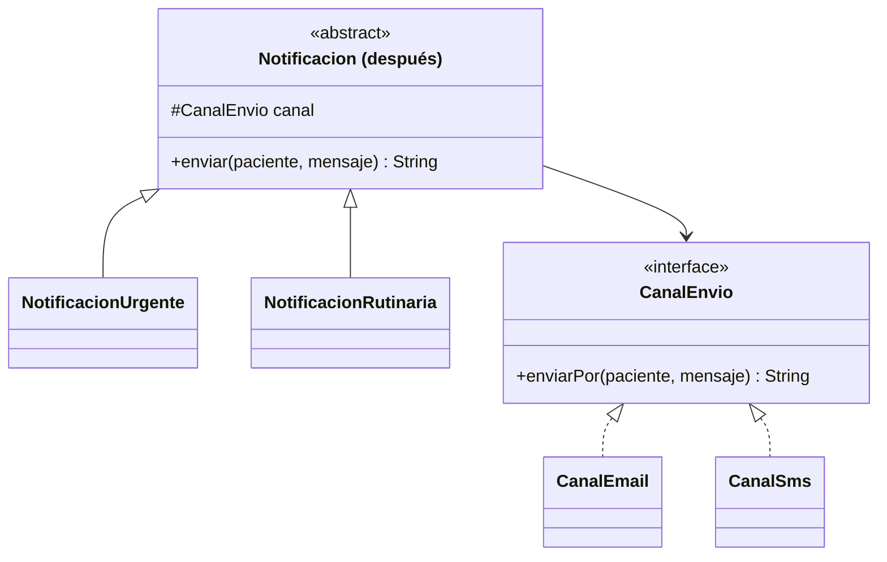

# 💡 Ejemplo 03 — Bridge

## 🌍 Contexto

MediSalud envía notificaciones de dos tipos (urgente, rutinaria) por dos canales (email, SMS). Es
tentador crear una subclase por cada combinación. El problema aparece al agregar un canal nuevo: hay que
crear una subclase más por cada tipo existente, porque ambas dimensiones (tipo y canal) están mezcladas
en la misma jerarquía de herencia.

**Qué busca demostrar este ejemplo**: cuántas clases hay que agregar para un canal nuevo, comparado entre
mezclar dos dimensiones en una jerarquía y separarlas con Bridge.

## 🏥 Caso de estudio

MediSalud notifica a sus pacientes con distintos niveles de urgencia, por distintos canales de envío.

## 🗺️ Diagrama





*Arriba, la versión "antes" (una subclase por combinación). Abajo, la versión "después" (dos jerarquías
independientes combinadas por composición).*

## 🌳 Árbol de archivos — antes

```text
bridge-antes/
└── com/medisalud/
    ├── Notificacion.java
    ├── NotificacionUrgentePorEmail.java
    ├── NotificacionUrgentePorSms.java
    ├── NotificacionRutinariaPorEmail.java
    ├── NotificacionRutinariaPorSms.java
    └── Demo.java
```

## 💻 Archivo: Notificacion.java

```java
package com.medisalud;

public abstract class Notificacion {
    public abstract String enviar(String paciente, String mensaje);
}
```

## 💻 Archivo: NotificacionUrgentePorEmail.java

```java
package com.medisalud;

public class NotificacionUrgentePorEmail extends Notificacion {
    public String enviar(String paciente, String mensaje) {
        return "[URGENTE por Email a " + paciente + "] " + mensaje;
    }
}
```

## 💻 Archivo: NotificacionUrgentePorSms.java

```java
package com.medisalud;

public class NotificacionUrgentePorSms extends Notificacion {
    public String enviar(String paciente, String mensaje) {
        return "[URGENTE por SMS a " + paciente + "] " + mensaje;
    }
}
```

## 💻 Archivo: NotificacionRutinariaPorEmail.java

```java
package com.medisalud;

public class NotificacionRutinariaPorEmail extends Notificacion {
    public String enviar(String paciente, String mensaje) {
        return "[Rutinaria por Email a " + paciente + "] " + mensaje;
    }
}
```

## 💻 Archivo: NotificacionRutinariaPorSms.java

```java
package com.medisalud;

public class NotificacionRutinariaPorSms extends Notificacion {
    public String enviar(String paciente, String mensaje) {
        return "[Rutinaria por SMS a " + paciente + "] " + mensaje;
    }
}
```

## 💻 Archivo: Demo.java

```java
package com.medisalud;

public class Demo {
    public static void main(String[] args) {
        // Datos de entrada
        Notificacion n1 = new NotificacionUrgentePorEmail();
        Notificacion n2 = new NotificacionUrgentePorSms();
        Notificacion n3 = new NotificacionRutinariaPorEmail();
        Notificacion n4 = new NotificacionRutinariaPorSms();

        System.out.println(n1.enviar("Marta Diaz", "Resultado disponible"));
        System.out.println(n2.enviar("Marta Diaz", "Resultado disponible"));
        System.out.println(n3.enviar("Jorge Paz", "Recordatorio de control"));
        System.out.println(n4.enviar("Jorge Paz", "Recordatorio de control"));
    }
}
```

## ✅ Resultado esperado — antes

```text
[URGENTE por Email a Marta Diaz] Resultado disponible
[URGENTE por SMS a Marta Diaz] Resultado disponible
[Rutinaria por Email a Jorge Paz] Recordatorio de control
[Rutinaria por SMS a Jorge Paz] Recordatorio de control
```

## 🌳 Árbol de archivos — después

```text
bridge-despues/
└── com/medisalud/
    ├── CanalEnvio.java          (nuevo)
    ├── CanalEmail.java          (nuevo)
    ├── CanalSms.java            (nuevo)
    ├── Notificacion.java        (cambió)
    ├── NotificacionUrgente.java (nuevo)
    ├── NotificacionRutinaria.java (nuevo)
    └── Demo.java                (cambió)
```

## 💻 Archivo: CanalEnvio.java — nuevo

```java
package com.medisalud;

public interface CanalEnvio {
    String enviarPor(String paciente, String mensaje);
}
```

## 💻 Archivo: CanalEmail.java — nuevo

```java
package com.medisalud;

public class CanalEmail implements CanalEnvio {
    public String enviarPor(String paciente, String mensaje) {
        return "por Email a " + paciente + "] " + mensaje;
    }
}
```

## 💻 Archivo: CanalSms.java — nuevo

```java
package com.medisalud;

public class CanalSms implements CanalEnvio {
    public String enviarPor(String paciente, String mensaje) {
        return "por SMS a " + paciente + "] " + mensaje;
    }
}
```

## 💻 Archivo: Notificacion.java — cambió

```java
package com.medisalud;

public abstract class Notificacion {
    protected CanalEnvio canal;

    protected Notificacion(CanalEnvio canal) {
        this.canal = canal;
    }

    public abstract String enviar(String paciente, String mensaje);
}
```

## 💻 Archivo: NotificacionUrgente.java — nuevo

```java
package com.medisalud;

public class NotificacionUrgente extends Notificacion {
    public NotificacionUrgente(CanalEnvio canal) {
        super(canal);
    }

    public String enviar(String paciente, String mensaje) {
        return "[URGENTE " + canal.enviarPor(paciente, mensaje);
    }
}
```

## 💻 Archivo: NotificacionRutinaria.java — nuevo

```java
package com.medisalud;

public class NotificacionRutinaria extends Notificacion {
    public NotificacionRutinaria(CanalEnvio canal) {
        super(canal);
    }

    public String enviar(String paciente, String mensaje) {
        return "[Rutinaria " + canal.enviarPor(paciente, mensaje);
    }
}
```

## 💻 Archivo: Demo.java — cambió

```java
package com.medisalud;

public class Demo {
    public static void main(String[] args) {
        // Datos de entrada
        Notificacion n1 = new NotificacionUrgente(new CanalEmail());
        Notificacion n2 = new NotificacionUrgente(new CanalSms());
        Notificacion n3 = new NotificacionRutinaria(new CanalEmail());
        Notificacion n4 = new NotificacionRutinaria(new CanalSms());

        System.out.println(n1.enviar("Marta Diaz", "Resultado disponible"));
        System.out.println(n2.enviar("Marta Diaz", "Resultado disponible"));
        System.out.println(n3.enviar("Jorge Paz", "Recordatorio de control"));
        System.out.println(n4.enviar("Jorge Paz", "Recordatorio de control"));
    }
}
```

## ✅ Resultado esperado — después

```text
[URGENTE por Email a Marta Diaz] Resultado disponible
[URGENTE por SMS a Marta Diaz] Resultado disponible
[Rutinaria por Email a Jorge Paz] Recordatorio de control
[Rutinaria por SMS a Jorge Paz] Recordatorio de control
```

## 🔍 Comparación: la prueba concreta

Ambas versiones producen la misma salida para las cuatro combinaciones existentes. La diferencia real
aparece al agregar un canal nuevo, "Push", a cada una:

| Comparación | Resultado |
|---|---|
| Agregar `"Push"` a la versión "antes" | Dos clases nuevas: `NotificacionUrgentePorPush`, `NotificacionRutinariaPorPush` — una por cada tipo existente |
| `CanalEnvio.java`, `CanalEmail.java`, `CanalSms.java`, `Notificacion.java`, `NotificacionUrgente.java`, `NotificacionRutinaria.java` de la versión "después" agregando `"Push"` | **Idénticos, byte a byte** (`diff` sin salida) — el canal nuevo se agrega con una sola clase (`CanalPush.java`) |

En la versión "antes", cada canal nuevo cuesta tantas clases como tipos de notificación existan. En la
versión "después", agregar un canal nuevo cuesta siempre una sola clase, sin importar cuántos tipos de
notificación existan — y ninguna de las clases existentes se modifica. Así queda el proyecto completo
con el canal nuevo ya agregado:

## 🌳 Árbol de archivos — después (ampliado con CanalPush)

```text
bridge-despues-ampliado/
└── com/medisalud/
    ├── CanalEnvio.java            (sin cambios)
    ├── CanalEmail.java            (sin cambios)
    ├── CanalSms.java              (sin cambios)
    ├── CanalPush.java             (nuevo)
    ├── Notificacion.java          (sin cambios)
    ├── NotificacionUrgente.java   (sin cambios)
    ├── NotificacionRutinaria.java (sin cambios)
    └── Demo.java                  (cambió: agrega dos llamadas nuevas)
```

Sin cambios respecto de "después": `CanalEnvio.java`, `CanalEmail.java`, `CanalSms.java`,
`Notificacion.java`, `NotificacionUrgente.java` y `NotificacionRutinaria.java` — exactamente el mismo
código ya mostrado arriba.

<details>
<summary>💻 Ver de nuevo el código sin cambios (CanalEnvio, CanalEmail, CanalSms, Notificacion,
NotificacionUrgente, NotificacionRutinaria)</summary>

## 💻 Archivo: CanalEnvio.java

```java
package com.medisalud;

public interface CanalEnvio {
    String enviarPor(String paciente, String mensaje);
}
```

## 💻 Archivo: CanalEmail.java

```java
package com.medisalud;

public class CanalEmail implements CanalEnvio {
    public String enviarPor(String paciente, String mensaje) {
        return "por Email a " + paciente + "] " + mensaje;
    }
}
```

## 💻 Archivo: CanalSms.java

```java
package com.medisalud;

public class CanalSms implements CanalEnvio {
    public String enviarPor(String paciente, String mensaje) {
        return "por SMS a " + paciente + "] " + mensaje;
    }
}
```

## 💻 Archivo: Notificacion.java

```java
package com.medisalud;

public abstract class Notificacion {
    protected CanalEnvio canal;

    protected Notificacion(CanalEnvio canal) {
        this.canal = canal;
    }

    public abstract String enviar(String paciente, String mensaje);
}
```

## 💻 Archivo: NotificacionUrgente.java

```java
package com.medisalud;

public class NotificacionUrgente extends Notificacion {
    public NotificacionUrgente(CanalEnvio canal) {
        super(canal);
    }

    public String enviar(String paciente, String mensaje) {
        return "[URGENTE " + canal.enviarPor(paciente, mensaje);
    }
}
```

## 💻 Archivo: NotificacionRutinaria.java

```java
package com.medisalud;

public class NotificacionRutinaria extends Notificacion {
    public NotificacionRutinaria(CanalEnvio canal) {
        super(canal);
    }

    public String enviar(String paciente, String mensaje) {
        return "[Rutinaria " + canal.enviarPor(paciente, mensaje);
    }
}
```

</details>

## 💻 Archivo nuevo: CanalPush.java

```java
package com.medisalud;

public class CanalPush implements CanalEnvio {
    public String enviarPor(String paciente, String mensaje) {
        return "por Push a " + paciente + "] " + mensaje;
    }
}
```

## 💻 Archivo: Demo.java — agrega dos llamadas nuevas

```java
package com.medisalud;

public class Demo {
    public static void main(String[] args) {
        // Datos de entrada
        Notificacion n1 = new NotificacionUrgente(new CanalEmail());
        Notificacion n2 = new NotificacionUrgente(new CanalSms());
        Notificacion n3 = new NotificacionRutinaria(new CanalEmail());
        Notificacion n4 = new NotificacionRutinaria(new CanalSms());
        Notificacion n5 = new NotificacionUrgente(new CanalPush());
        Notificacion n6 = new NotificacionRutinaria(new CanalPush());

        System.out.println(n1.enviar("Marta Diaz", "Resultado disponible"));
        System.out.println(n2.enviar("Marta Diaz", "Resultado disponible"));
        System.out.println(n3.enviar("Jorge Paz", "Recordatorio de control"));
        System.out.println(n4.enviar("Jorge Paz", "Recordatorio de control"));
        System.out.println(n5.enviar("Lucia Fernandez", "Turno confirmado"));
        System.out.println(n6.enviar("Lucia Fernandez", "Turno confirmado"));
    }
}
```

## ✅ Resultado esperado tras extender — después

```text
[URGENTE por Email a Marta Diaz] Resultado disponible
[URGENTE por SMS a Marta Diaz] Resultado disponible
[Rutinaria por Email a Jorge Paz] Recordatorio de control
[Rutinaria por SMS a Jorge Paz] Recordatorio de control
[URGENTE por Push a Lucia Fernandez] Turno confirmado
[Rutinaria por Push a Lucia Fernandez] Turno confirmado
```

## 🔍 Análisis: errores frecuentes

El error más frecuente al aplicar Bridge es usarlo cuando en realidad solo hay una dimensión de
variación: si todas las notificaciones urgentes siempre se enviaran por el mismo canal fijo, separar
"tipo" de "canal" en dos jerarquías agregaría una interfaz y clases sin ningún beneficio real. Bridge se
justifica quando existen genuinamente dos (o más) dimensiones de variación independientes entre sí.

## ❓ Preguntas de repaso

**1. [Selección]** En la versión "antes", ¿cuántas clases hacen falta para agregar un canal nuevo?

- A. Ninguna: los canales ya están cubiertos.
- B. Una, sin importar cuántos tipos de notificación existan.
- C. Una por cada tipo de notificación existente.
- D. Una por cada canal existente.

<details>
<summary>🔑 Ver respuesta</summary>

**Respuesta correcta: C.** Como cada combinación de tipo y canal es una subclase, un canal nuevo exige
una subclase por cada tipo de notificación ya existente.

</details>

**2. [Selección múltiple]** Sobre la versión "después", ¿cuáles afirmaciones son verdaderas?

- A. `Notificacion` recibe un `CanalEnvio` por composición, no por herencia.
- B. Agregar un canal nuevo exige una sola clase nueva.
- C. Las clases `NotificacionUrgente` y `NotificacionRutinaria` cambian al agregar un canal nuevo.
- D. `CanalEnvio` es una interfaz implementada por cada canal concreto.

<details>
<summary>🔑 Ver respuesta</summary>

**Respuestas correctas: A, B y D.** C es falsa: ninguna de las dos clases de notificación se modifica al
agregar un canal — esa es la prueba de que Bridge separó correctamente las dos dimensiones.

</details>

**3. [Abierta]** Un compañero dice: "Bridge es lo mismo que tener una superclase con un método
abstracto". ¿Estás de acuerdo? Justifica tu respuesta.

<details>
<summary>🔑 Ver respuesta</summary>

No. Una superclase con un método abstracto sigue mezclando la variación en una sola jerarquía de
herencia — cada combinación nueva de "qué" varía sigue exigiendo una subclase. Bridge separa
explícitamente **dos** jerarquías independientes (abstracción e implementación) y las combina por
composición, no por herencia: eso es lo que permite que una dimensión varíe sin afectar a la otra, algo
que una sola jerarquía con métodos abstractos no logra por sí sola.

</details>
