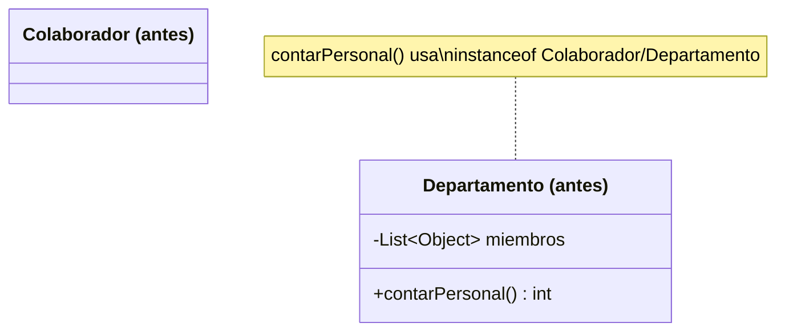
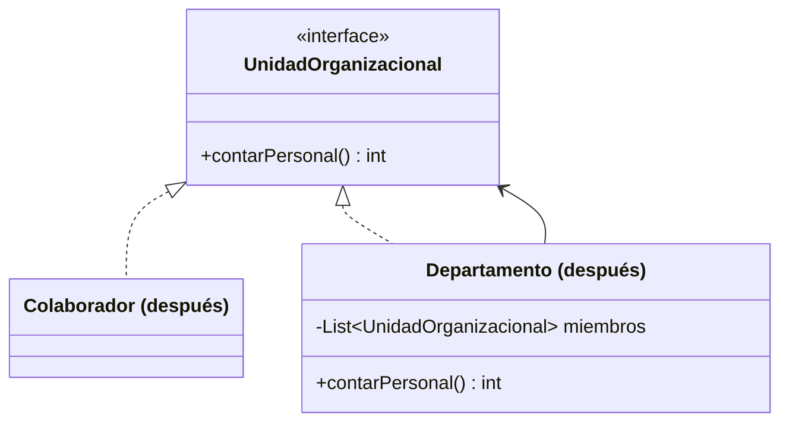

# 💡 Ejemplo 04 — Composite

## 🌍 Contexto

MediSalud organiza su personal en departamentos, que a su vez pueden contener otros departamentos
anidados (por ejemplo, "Clínica Médica" contiene "Cardiología" y "Consultorio Externo"). Contar el
personal total de una unidad exige distinguir, con un condicional, si cada miembro es un empleado
individual o un departamento con sus propios miembros.

**Qué busca demostrar este ejemplo**: que tratar hojas y compuestos con una interfaz común elimina la
necesidad de `instanceof`, para cualquier nivel de anidamiento.

## 🏥 Caso de estudio

MediSalud organiza su personal en una jerarquía de departamentos que pueden anidarse entre sí.

## 🗺️ Diagrama





*Arriba, la versión "antes" (distingue con `instanceof`). Abajo, la versión "después" (interfaz común,
tratamiento uniforme).*

## 🌳 Árbol de archivos — antes

```text
composite-antes/
└── com/medisalud/
    ├── Colaborador.java
    ├── Departamento.java
    └── Demo.java
```

## 💻 Archivo: Colaborador.java

```java
package com.medisalud;

public class Colaborador {
    private String nombre;

    public Colaborador(String nombre) {
        this.nombre = nombre;
    }

    public String getNombre() {
        return nombre;
    }
}
```

## 💻 Archivo: Departamento.java

```java
package com.medisalud;

import java.util.ArrayList;
import java.util.List;

public class Departamento {
    private String nombre;
    private List<Object> miembros = new ArrayList<>();

    public Departamento(String nombre) {
        this.nombre = nombre;
    }

    public void agregar(Object miembro) {
        miembros.add(miembro);
    }

    public String getNombre() {
        return nombre;
    }

    public int contarPersonal() {
        int total = 0;
        for (Object miembro : miembros) {
            if (miembro instanceof Departamento) {
                total = total + ((Departamento) miembro).contarPersonal();
            } else if (miembro instanceof Colaborador) {
                total = total + 1;
            }
        }
        return total;
    }
}
```

## 💻 Archivo: Demo.java

```java
package com.medisalud;

public class Demo {
    public static void main(String[] args) {
        // Datos de entrada
        Departamento cardiologia = new Departamento("Cardiologia");
        cardiologia.agregar(new Colaborador("Ana Torres"));
        cardiologia.agregar(new Colaborador("Carlos Ruiz"));

        Departamento consultorioExterno = new Departamento("Consultorio Externo");
        consultorioExterno.agregar(new Colaborador("Lucia Fernandez"));

        Departamento clinicaMedica = new Departamento("Clinica Medica");
        clinicaMedica.agregar(cardiologia);
        clinicaMedica.agregar(consultorioExterno);
        clinicaMedica.agregar(new Colaborador("Pablo Sosa"));

        System.out.println("personal en Clinica Medica=" + clinicaMedica.contarPersonal());
    }
}
```

## ✅ Resultado esperado — antes

```text
personal en Clinica Medica=4
```

## 🌳 Árbol de archivos — después

```text
composite-despues/
└── com/medisalud/
    ├── UnidadOrganizacional.java  (nuevo)
    ├── Colaborador.java              (cambió)
    ├── Departamento.java          (cambió)
    └── Demo.java                  (sin cambios)
```

## 💻 Archivo: UnidadOrganizacional.java — nuevo

```java
package com.medisalud;

public interface UnidadOrganizacional {
    String getNombre();
    int contarPersonal();
}
```

## 💻 Archivo: Colaborador.java — cambió

```java
package com.medisalud;

public class Colaborador implements UnidadOrganizacional {
    private String nombre;

    public Colaborador(String nombre) {
        this.nombre = nombre;
    }

    public String getNombre() {
        return nombre;
    }

    public int contarPersonal() {
        return 1;
    }
}
```

## 💻 Archivo: Departamento.java — cambió

```java
package com.medisalud;

import java.util.ArrayList;
import java.util.List;

public class Departamento implements UnidadOrganizacional {
    private String nombre;
    private List<UnidadOrganizacional> miembros = new ArrayList<>();

    public Departamento(String nombre) {
        this.nombre = nombre;
    }

    public void agregar(UnidadOrganizacional miembro) {
        miembros.add(miembro);
    }

    public String getNombre() {
        return nombre;
    }

    public int contarPersonal() {
        int total = 0;
        for (UnidadOrganizacional miembro : miembros) {
            total = total + miembro.contarPersonal();
        }
        return total;
    }
}
```

Sin cambios respecto de "antes": `Demo.java` — su código ya se mostró arriba y es exactamente el mismo,
byte a byte.

<details>
<summary>💻 Ver de nuevo el código sin cambios (Demo.java)</summary>

## 💻 Archivo: Demo.java

```java
package com.medisalud;

public class Demo {
    public static void main(String[] args) {
        // Datos de entrada
        Departamento cardiologia = new Departamento("Cardiologia");
        cardiologia.agregar(new Colaborador("Ana Torres"));
        cardiologia.agregar(new Colaborador("Carlos Ruiz"));

        Departamento consultorioExterno = new Departamento("Consultorio Externo");
        consultorioExterno.agregar(new Colaborador("Lucia Fernandez"));

        Departamento clinicaMedica = new Departamento("Clinica Medica");
        clinicaMedica.agregar(cardiologia);
        clinicaMedica.agregar(consultorioExterno);
        clinicaMedica.agregar(new Colaborador("Pablo Sosa"));

        System.out.println("personal en Clinica Medica=" + clinicaMedica.contarPersonal());
    }
}
```

</details>

## ✅ Resultado esperado — después

```text
personal en Clinica Medica=4
```

## 🔍 Comparación: la prueba concreta

Con la misma estructura (dos departamentos anidados dentro de un tercero, más un empleado suelto), ambas
versiones dan `personal en Clinica Medica=4`. La diferencia está en `contarPersonal()`: en la versión
"antes", el método pregunta `instanceof Departamento`/`instanceof Colaborador` en cada llamada; en la
versión "después", simplemente llama `miembro.contarPersonal()` sobre cada elemento de una
`List<UnidadOrganizacional>`, sin ningún `instanceof` — el polimorfismo decide qué implementación
ejecutar.

## 🔍 Análisis: errores frecuentes

El error más frecuente al aplicar Composite es declarar la interfaz común pero seguir guardando los
miembros como `List<Object>` (o cualquier tipo genérico que no sea la interfaz), obligando a seguir
usando `instanceof` para poder llamar al método de la interfaz. El beneficio real de Composite exige que
la colección de miembros esté tipada con la interfaz común, no con un tipo más general.

## ❓ Preguntas de repaso

**1. [Selección]** En la versión "antes", ¿qué necesita `Departamento.contarPersonal()` para saber si
un miembro es un empleado individual o un departamento?

- A. Nada: el polimorfismo lo resuelve automáticamente.
- B. Un condicional `instanceof` por cada posible tipo de miembro.
- C. Una lista separada para cada tipo de miembro.
- D. Un método `esDepartamento()` en cada miembro.

<details>
<summary>🔑 Ver respuesta</summary>

**Respuesta correcta: B.** El método recorre la lista y pregunta `instanceof Departamento` o
`instanceof Colaborador` para decidir cómo contar cada miembro.

</details>

**2. [Selección múltiple]** Sobre la versión "después", ¿cuáles afirmaciones son verdaderas?

- A. `Colaborador` y `Departamento` implementan la misma interfaz `UnidadOrganizacional`.
- B. `Departamento.contarPersonal()` no usa ningún `instanceof`.
- C. El resultado de `contarPersonal()` sobre la misma estructura es distinto al de la versión "antes".
- D. La lista de miembros de `Departamento` está tipada como `List<UnidadOrganizacional>`.

<details>
<summary>🔑 Ver respuesta</summary>

**Respuestas correctas: A, B y D.** C es falsa: ambas versiones dan el mismo resultado (4) sobre la
misma estructura — lo que cambia es cómo se calcula, no el resultado.

</details>

**3. [Abierta]** Un compañero propone resolver el problema de la versión "antes" agregando un tercer
`else if` para un nuevo tipo de miembro (por ejemplo, `Contratista`), en vez de declarar la interfaz
común. ¿Esa solución escala igual de bien que Composite? Justifica tu respuesta.

<details>
<summary>🔑 Ver respuesta</summary>

No escala igual. Cada tipo de miembro nuevo exigiría agregar una rama más al condicional de
`contarPersonal()` — y a cualquier otro método futuro que necesite recorrer la misma estructura (por
ejemplo, `listarNombres()`). Con Composite, un tipo de miembro nuevo solo necesita implementar
`UnidadOrganizacional`: ningún método existente que ya recorra la estructura necesita modificarse para
reconocerlo.

</details>
