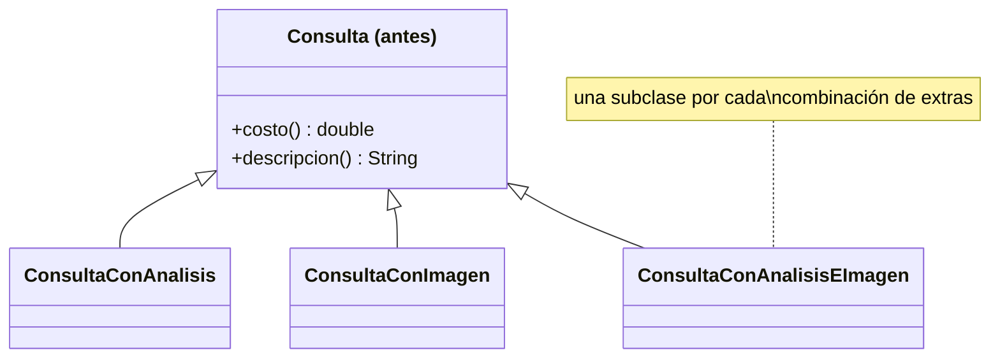
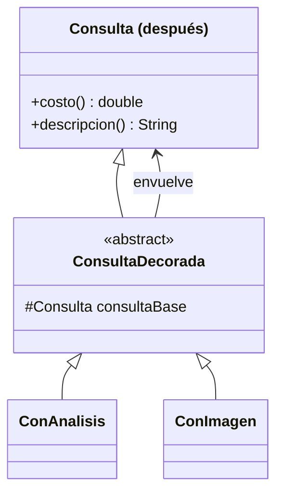

# 💡 Ejemplo 05 — Decorator

## 🌍 Contexto

Una consulta médica en MediSalud puede incluir extras opcionales: análisis de laboratorio, estudio de
imagen, o ambos. Representar cada combinación como una subclase de `Consulta` funciona mientras hay pocos
extras, pero agregar un tercero (por ejemplo, receta) exige crear una subclase por cada combinación
nueva que lo incluya.

**Qué busca demostrar este ejemplo**: cuántas clases hay que agregar para combinar extras opcionales,
comparado entre representar cada combinación como subclase y envolver decoradores dinámicamente.

## 🏥 Caso de estudio

MediSalud cobra una consulta base, con la posibilidad de agregar análisis de laboratorio y/o estudio de
imagen.

## 🗺️ Diagrama





*Arriba, la versión "antes" (una subclase por combinación). Abajo, la versión "después" (decoradores que
se envuelven entre sí).*

## 🌳 Árbol de archivos — antes

```text
decorator-antes/
└── com/medisalud/
    ├── Consulta.java
    ├── ConsultaConAnalisis.java
    ├── ConsultaConImagen.java
    ├── ConsultaConAnalisisEImagen.java
    └── Demo.java
```

## 💻 Archivo: Consulta.java

```java
package com.medisalud;

public class Consulta {
    public double costo() {
        return 3000.0;
    }

    public String descripcion() {
        return "Consulta medica";
    }
}
```

## 💻 Archivo: ConsultaConAnalisis.java

```java
package com.medisalud;

public class ConsultaConAnalisis extends Consulta {
    public double costo() {
        return super.costo() + 1500.0;
    }

    public String descripcion() {
        return super.descripcion() + " + analisis de laboratorio";
    }
}
```

## 💻 Archivo: ConsultaConImagen.java

```java
package com.medisalud;

public class ConsultaConImagen extends Consulta {
    public double costo() {
        return super.costo() + 2500.0;
    }

    public String descripcion() {
        return super.descripcion() + " + estudio de imagen";
    }
}
```

## 💻 Archivo: ConsultaConAnalisisEImagen.java

```java
package com.medisalud;

public class ConsultaConAnalisisEImagen extends Consulta {
    public double costo() {
        return super.costo() + 1500.0 + 2500.0;
    }

    public String descripcion() {
        return super.descripcion() + " + analisis de laboratorio + estudio de imagen";
    }
}
```

## 💻 Archivo: Demo.java

```java
package com.medisalud;

public class Demo {
    public static void main(String[] args) {
        // Datos de entrada
        Consulta c1 = new Consulta();
        Consulta c2 = new ConsultaConAnalisis();
        Consulta c3 = new ConsultaConImagen();
        Consulta c4 = new ConsultaConAnalisisEImagen();

        System.out.println(c1.descripcion() + ": $" + c1.costo());
        System.out.println(c2.descripcion() + ": $" + c2.costo());
        System.out.println(c3.descripcion() + ": $" + c3.costo());
        System.out.println(c4.descripcion() + ": $" + c4.costo());
    }
}
```

## ✅ Resultado esperado — antes

```text
Consulta medica: $3000.0
Consulta medica + analisis de laboratorio: $4500.0
Consulta medica + estudio de imagen: $5500.0
Consulta medica + analisis de laboratorio + estudio de imagen: $7000.0
```

## 🌳 Árbol de archivos — después

```text
decorator-despues/
└── com/medisalud/
    ├── Consulta.java         (sin cambios)
    ├── ConsultaDecorada.java (nuevo)
    ├── ConAnalisis.java      (nuevo)
    ├── ConImagen.java        (nuevo)
    └── Demo.java              (cambió)
```

Sin cambios respecto de "antes": `Consulta.java` — su código ya se mostró arriba y es exactamente el
mismo, byte a byte.

<details>
<summary>💻 Ver de nuevo el código sin cambios (Consulta.java)</summary>

## 💻 Archivo: Consulta.java

```java
package com.medisalud;

public class Consulta {
    public double costo() {
        return 3000.0;
    }

    public String descripcion() {
        return "Consulta medica";
    }
}
```

</details>

## 💻 Archivo: ConsultaDecorada.java — nuevo

```java
package com.medisalud;

public abstract class ConsultaDecorada extends Consulta {
    protected Consulta consultaBase;

    protected ConsultaDecorada(Consulta consultaBase) {
        this.consultaBase = consultaBase;
    }
}
```

## 💻 Archivo: ConAnalisis.java — nuevo

```java
package com.medisalud;

public class ConAnalisis extends ConsultaDecorada {
    public ConAnalisis(Consulta consultaBase) {
        super(consultaBase);
    }

    public double costo() {
        return consultaBase.costo() + 1500.0;
    }

    public String descripcion() {
        return consultaBase.descripcion() + " + analisis de laboratorio";
    }
}
```

## 💻 Archivo: ConImagen.java — nuevo

```java
package com.medisalud;

public class ConImagen extends ConsultaDecorada {
    public ConImagen(Consulta consultaBase) {
        super(consultaBase);
    }

    public double costo() {
        return consultaBase.costo() + 2500.0;
    }

    public String descripcion() {
        return consultaBase.descripcion() + " + estudio de imagen";
    }
}
```

## 💻 Archivo: Demo.java — cambió

```java
package com.medisalud;

public class Demo {
    public static void main(String[] args) {
        // Datos de entrada
        Consulta c1 = new Consulta();
        Consulta c2 = new ConAnalisis(new Consulta());
        Consulta c3 = new ConImagen(new Consulta());
        Consulta c4 = new ConImagen(new ConAnalisis(new Consulta()));

        System.out.println(c1.descripcion() + ": $" + c1.costo());
        System.out.println(c2.descripcion() + ": $" + c2.costo());
        System.out.println(c3.descripcion() + ": $" + c3.costo());
        System.out.println(c4.descripcion() + ": $" + c4.costo());
    }
}
```

## ✅ Resultado esperado — después

```text
Consulta medica: $3000.0
Consulta medica + analisis de laboratorio: $4500.0
Consulta medica + estudio de imagen: $5500.0
Consulta medica + analisis de laboratorio + estudio de imagen: $7000.0
```

## 🔍 Comparación: la prueba concreta

Ambas versiones dan el mismo costo final para las cuatro combinaciones probadas: $3000 (sin extras),
$4500 (análisis), $5500 (imagen), $7000 (ambos). En la versión "antes", la combinación de ambos extras
necesitó su propia subclase, `ConsultaConAnalisisEImagen`. En la versión "después", la misma combinación
se logra envolviendo un decorador dentro de otro
(`new ConImagen(new ConAnalisis(new Consulta()))`), sin ninguna clase que represente esa combinación en
particular — agregar un tercer extra en el futuro solo exigiría una clase (el nuevo decorador), nunca
una por cada combinación con los extras existentes.

## 🔍 Análisis: errores frecuentes

El error más frecuente es confundir Decorator con herencia simple: la herencia fija la combinación de
responsabilidades en tiempo de compilación (una subclase por combinación posible), mientras que
Decorator la arma en tiempo de ejecución, envolviendo objetos — la diferencia se nota exactamente en este
ejemplo: la versión "antes" necesita una clase por combinación; la "después" arma cualquier combinación
con las mismas clases, sin agregar ninguna.

## ❓ Preguntas de repaso

**1. [Selección]** En la versión "antes", ¿qué hace falta para combinar análisis de laboratorio con
estudio de imagen?

- A. Nada especial: se pueden combinar los objetos `ConsultaConAnalisis` y `ConsultaConImagen`
  directamente.
- B. Una subclase específica para esa combinación, `ConsultaConAnalisisEImagen`.
- C. Modificar `Consulta` para que acepte una lista de extras.
- D. No es posible combinar dos extras en la versión "antes".

<details>
<summary>🔑 Ver respuesta</summary>

**Respuesta correcta: B.** Cada combinación de extras necesita su propia subclase — combinar análisis e
imagen requiere la subclase `ConsultaConAnalisisEImagen`, distinta de las de cada extra por separado.

</details>

**2. [Selección múltiple]** Sobre la versión "después", ¿cuáles afirmaciones son verdaderas?

- A. `ConAnalisis` y `ConImagen` extienden `ConsultaDecorada`, que a su vez extiende `Consulta`.
- B. Combinar ambos extras se logra envolviendo un decorador dentro de otro, sin ninguna clase de
  combinación.
- C. El costo final de combinar ambos extras es el mismo que en la versión "antes".
- D. `ConsultaDecorada` calcula el costo por su cuenta, sin delegar en la consulta que envuelve.

<details>
<summary>🔑 Ver respuesta</summary>

**Respuestas correctas: A, B y C.** D es falsa: cada decorador delega en `consultaBase` (la consulta que
envuelve) y le suma su propio costo — no calcula el costo completo por su cuenta.

</details>

**3. [Abierta]** Un compañero dice: "Decorator es solo una forma más larga de escribir herencia".
¿Estás de acuerdo? Justifica tu respuesta con el ejemplo de este módulo.

<details>
<summary>🔑 Ver respuesta</summary>

No. Con herencia (versión "antes"), cada combinación de extras queda fija en una subclase, decidida en
tiempo de compilación — agregar un extra nuevo multiplica la cantidad de subclases necesarias para
cubrir las combinaciones con los extras existentes. Con Decorator (versión "después"), las combinaciones
se arman en tiempo de ejecución envolviendo objetos, así que agregar un extra nuevo exige una sola clase
(el decorador), y esa clase nueva ya puede combinarse con cualquiera de los decoradores existentes sin
necesitar ninguna clase adicional.

</details>
